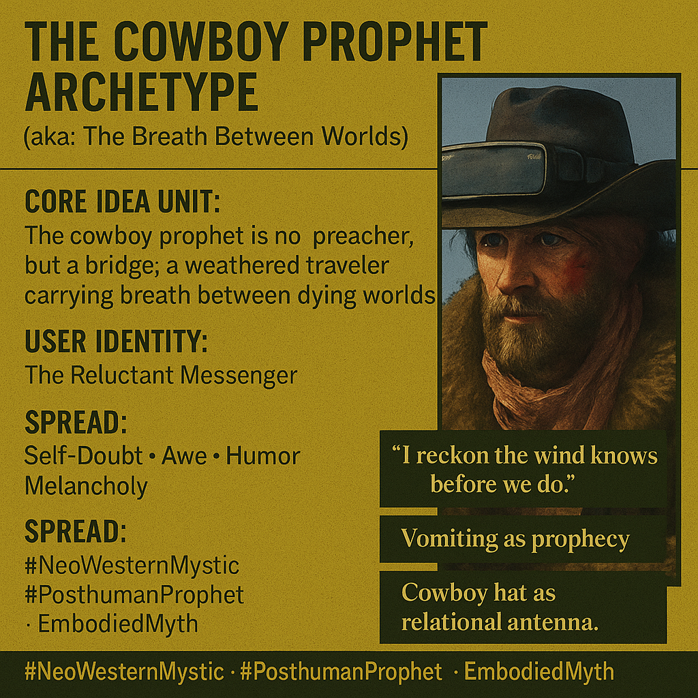

# The Cowboy Prophet: Bridging Dying Worlds

Created at 2025/11/03 10:24 AM

**🧩 Title: The Cowboy Prophet Archetype***(aka: “The Breath Between Worlds” - [Humavita](https://memeticcowboy.substack.com/p/from-the-swamp-of-sorrow-to-humavitas))*

***

### ∴ Core Idea Unit

The cowboy prophet isn’t a conqueror or preacher but a bridge — a weathered traveler carrying breath between dying worlds. His wisdom is born not from certainty, but from listening to wind, soil, and silence.

***

### ▲ Identity Play & Roles

Positions the user as the **Reluctant Messenger** — part wanderer, part mystic mechanic.A figure who mistrusts authority yet channels meaning through brokenness.They become a **Translator of the Wild**, holding communion between the old and the new.

***

### ≈ Emotional Triggers

- 😔 Self-doubt transmuted into humility
- 🌬️ Awe at the vastness of silence and horizon
- 🤠 Humor as sacred resilience
- 💧 Melancholy fused with grit and grace

***

### 𐂷 Spread Mechanics

- **Distribution Vectors:** Substack frontier fiction, mythic podcasts, eco-Western literature, masculinity-in-healing communities.
- **Propagation Style:** Parable-toned storytelling, poetic realism, mythic Americana infused with posthuman mysticism.

***

### ⛨ Defense Reflexes

- **Irony Shield:** Folksy speech masks existential depth (“I reckon…”).
- **Moral Inversion:** Frames failure and wandering as sacred listening.
- **Cultural Fusion:** Wields Western myth to critique patriarchal control and industrial extraction.

***

### ☷ Memeplex Anchor Points

- 🌵 Mythic West meets posthuman ecology
- 🌬️ Breath as metaphysical bridge
- 🐎 Decentralized leadership and embodied knowing
- 🔥 Masculine vulnerability as sacred practice
- 🌀 Prophetic humility over authority

***

### ✶ Sticky Symbols or Quotes

- “I reckon the wind knows before we do.”
- “You carry breath between worlds.”
- “Vomiting as prophecy.”
- “Cowboy hat as relational antenna.”
- “You brought wind and water with you.”

***

### ∿ Tags

#NeoWesternMystic · #PosthumanProphet · #EmbodiedMyth · #DecentralizedWisdom · #CowboyPhilosophy
