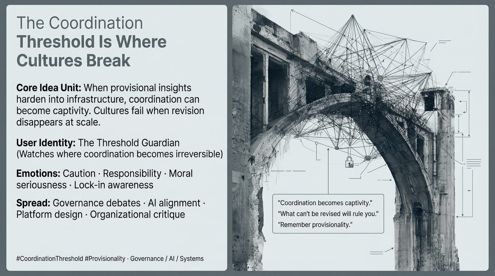

# The Dangers of Irreversible Cultural Coordination

Created at 2026/01/20 12:45 PM

## 🧩 **The Coordination Threshold Is Where Cultures Break**

***

## 🧠 Core Narrative Structure

Insights begin as **provisional sensemaking**—local, revisable, adaptive.As they prove useful, they **scale into coordination**: standards, policies, platforms, enforcement mechanisms.

At a certain point, the system crosses a **coordination threshold**.

If provisionality is **remembered**, coordination enables cooperation and shared action.If provisionality is **forgotten**, coordination becomes **captivity**.

What was meant to support culture now **fixes it in place**.Infrastructure replaces judgment.Revision becomes disobedience.

The culture ossifies—not into shared understanding, but into a **MemeGrid**:a rigid lattice of enforced coherence, mistaken for stability.

The alternative—rare and fragile—is the **Co-SPHERE**:coordination that remains porous, corrigible, and answerable to reality.

***

### ∴ Core Idea Unit

**Essential belief encoded:**Most cultural failures occur not at the level of ideas, but at the moment those ideas harden into infrastructure.

**Mental shift provoked:**From *“We need to scale this insight”* → *“What happens when this insight can no longer be revised?”*

The meme teaches that **scale without humility converts coordination into confinement**.

***

### ▲ Identity Play & Roles

**Target Roles**

- **Policymakers** deciding when guidance becomes mandate
- **Platform designers** translating norms into code
- **Movement leaders** turning values into rules
- **AI builders** hardening heuristics into systems

**Repositioning:**From *builder of solutions* → *guardian of thresholds*From *making things work* → *preventing irreversible lock-in*

The meme flatters responsibility, not ambition.

***

## ≈ Emotional Hooks & Cognitive Levers

- ⚠️ **Caution** — awareness of irreversible thresholds
- ⚖️ **Responsibility** — binding affects others at scale
- 😨 **Fear of unintended lock-in** — captivity masquerading as order
- 🧠 **Moral seriousness** — power exercised without theatrics

**Primary lever:**Shifts ethical attention from *intent* to *irreversibility*.

***

### ⛨ Defense Reflexes

- **Threshold framing** — focuses critique on transition points, not beliefs
- **Infrastructure lens** — examines what becomes hard to undo
- **Provisionality test** — asks whether revision paths still exist
- **Non-ideological posture** — avoids left/right or pro/anti binaries

The meme resists capture by refusing to argue about values and instead interrogating **binding mechanics**.

***

### ☷ Memeplex Anchor Points

- Coordination theory
- Institutional ossification
- MemeGrid vs Co-SPHERE dynamics
- Governance humility
- Anti-dogmatic scaling
- Systems resilience under power

This meme integrates directly into AI alignment, platform governance, and organizational design debates.

***

### ✶ Sticky Symbols or Quotes

& Phrases

- **Coordination threshold**
- **Forgetting provisionality**
- **Infrastructure**
- **Captivity**
- **MemeGrid**
- **Co-SPHERE**

These function as warning labels at moments of scale.

***

### ∿ Tags

#CoordinationThreshold · #Provisionality · #MemeGrid · #CoSPHERE · #GovernanceDesign · #AntiOssification

***

### Quiet synthesis

**The Coordination Threshold Is Where Cultures Break** does not argue against coordination.It argues that **coordination becomes dangerous precisely when it forgets it was once a hypothesis**.

Cultures don’t collapse because they scale ideas.They collapse when scaled ideas **lose the ability to be wrong**.
