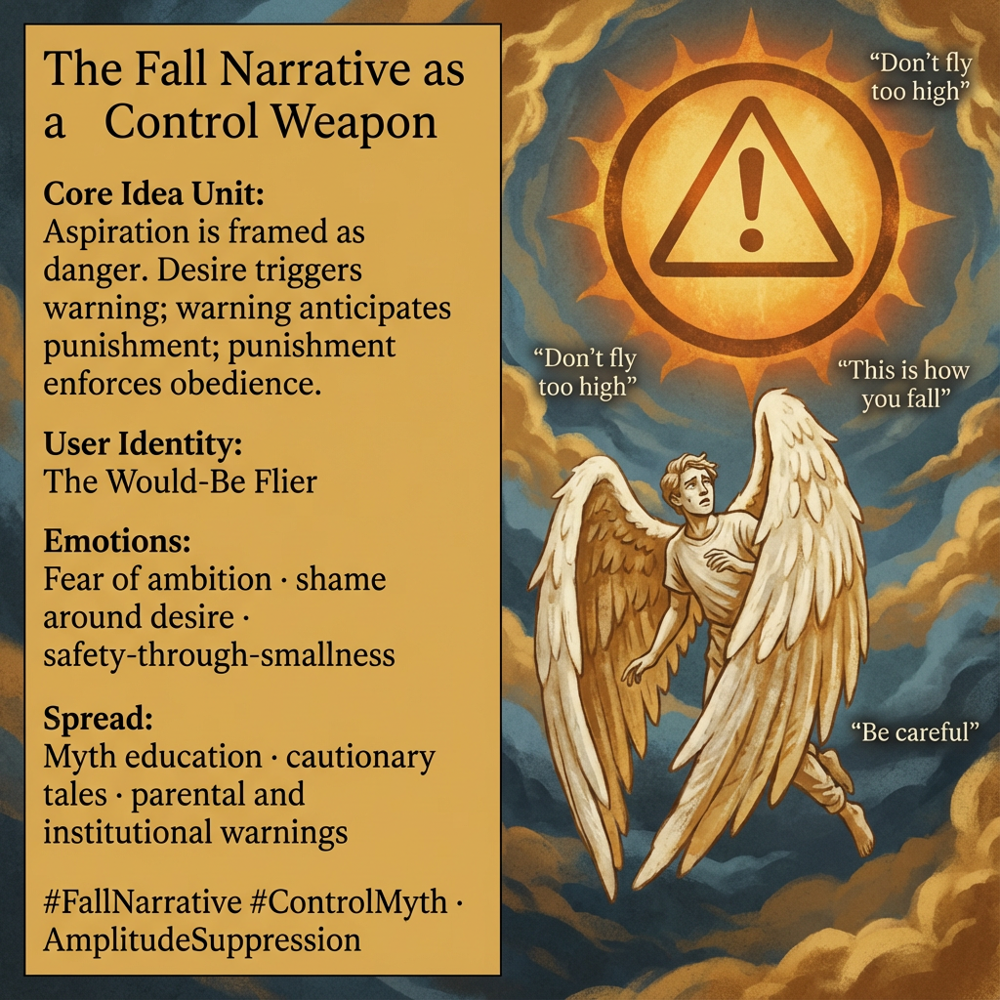

# The Fall Narrative: Fear and Obedience

Created at 2025/12/28 4:00 PM

## **The Fall Narrative as a Control Weapon**

[HUBRIS: A Memetic Reversal of Icarus in the Age of Artificial Intelligence](https://memeticcowboy.substack.com/p/hubris-a-memetic-reversal-of-icarus)

### ∴ Core Idea Unit

Aspiration is framed as danger. Desire triggers warning; warning anticipates punishment; punishment enforces obedience. The narrative converts ambition into a liability.

### ▲ Identity Play & Roles

**Cast role:** The Would-Be FlierThe subject is positioned as reckless the moment they seek altitude, learning to equate safety with smallness.

### ≈ Emotional Triggers

- Fear of ambition
- Shame around desire
- Anticipatory obedience
- Safety-through-contraction

These emotions train pre-emptive self-limitation.

### 𐂷 Spread Mechanics

**Distribution Vectors:**

- Myth education
- Cautionary tales
- Workplace norms
- Parental warnings

### 𐂷 Spread Mechanics

Style:**Didactic storytelling, retrospective moralization (“this is why you don’t…”).

### ⛨ Defense Reflexes

- Moral inevitability (“the fall was deserved”)
- False care framing (“we’re protecting you”)
- Appeal to ancient wisdom

### ☷ Memeplex Anchor Points

- Scarcity cosmology
- Amplitude suppression
- Moralized limits

### ✶ Sticky Symbols or Quotes

/ Phrases

Wax wings · sun as threat · “fly neither too high nor too low” · fall · punishment

### ∿ Tags

#FallNarrative · #ControlMyth · #FearOfAscent · #ObedienceEngine
