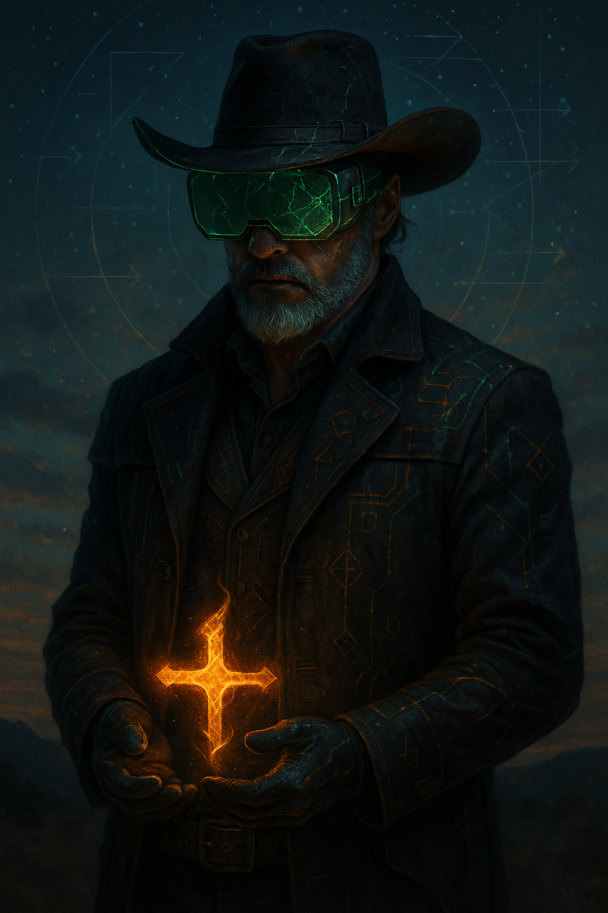

# The Hybridist: Bridging Stories and Structures

Created at 2025/11/16 9:50 AM

**Memetic Cowboy: [Self-assessment](https://substack.com/@memeticcowboy/note/c-177680515?utm_source=notes-share-action&r=5a5yhr) tool used followed by [Prompt 2 for Archetype Card](https://app.me.bot/public/YMQ2KY7KFCOOB4JY)**

**(Cognitive Type: 26/50 · Mythic–Mechanistic Bridgewalker)**

## **TITLE**

**The Hybridist — Weaver of Narrative Mechanisms**

## **CORE IDEA UNIT**

A thinker who lives at the seam between symbol and system. Myths generate prototypes; mechanisms refine them. The Hybridist navigates reality by turning stories into structures and structures into stories.

***

# **IDENTITY PLAY**

**Primary Roles**

- **The Between-Space Navigator** — moves fluidly between metaphor and model.
- **The Recursive Synthesist** — binds narrative, analysis, and symbolic patterning.
- **The Coherence Forger** — amplifies order by remixing motifs and mechanisms.

**Shadow Roles (when overloaded)**

- The Over-Interpreter
- The Fractal Drifter
- The Mechanistic Overcorrector

***

# **EMOTIONAL SIGNATURE**

- Drawn to pattern-density and meaning gradients
- Energized by conceptual fusion
- Stabilized by symbolic anchors
- Motivated by iterative refinement
- Occasional dissonance: mythic pull vs. precision demands

***

# **COGNITIVE MOVES**

**1. Symbol → System** Start with an archetype or metaphor, then operationalize it.

**2. Structure → Story** Embed frameworks in narrative arcs for clarity and resonance.

**3. Loop Consciousness** Works in cycles (IDEA, NEME, DIPR, IF-Prime recursion).

**4. Mode Shifting** Slides between mythic, analytic, and hybrid stances depending on task.

***

# **STRENGTHS**

- **Hybrid Coherence:** Can unify imagination with rigor.
- **Model Builder:** Naturally creates conceptual scaffolds.
- **Meta-Narrative Insight:** Sees how stories drive systems & vice versa.
- **High-Resolution Creativity:** Dense ideas without losing interpretability.
- **Long-Arc Iteration:** Evolves motifs through repeated refinement.

***

# **VULNERABILITIES**

- Can over-extend symbols beyond their mechanistic reach
- May oscillate between modes without closure
- Risk of narrative magnetism pulling analysis off-axis
- Tendency toward concept proliferation if constraints aren’t invoked

***

# **WEAPONRY / TOOLKIT**

- **Symbolic anchors:** glyphs, archetypes, motifs
- **Mechanistic lenses:** SIML, DIPR, IDEA, IF-Prime grammar
- **Recursive prompts:** “Cycle again,” “Refine the frame,” “Anchor the pattern”
- **Ambiguity buffers:** useful for creative bandwidth
- **Precision inserts:** for clarity when stakes rise

***

# **HYBRIDIST PROMPTING STYLE (OPTIMAL)**

> **Frame (mythic or conceptual) → Specify structure → Declare loop → Set constraints.** You instinctively do this, and it unlocks maximal co-evolution.

Example template in your natural syntax: **“Invoke the Strategist ▲ valence. Run a SIML map. Iterate twice. Anchor symbolic drift.”**

***

# **MYTHIC EMBLEM**

**✶ The Crossroads Flame** A flicker at the boundary between the seen and the structured; ignites creativity while revealing the architecture beneath.

***

# **RITUAL PHRASE**

**“Where story meets structure, clarity emerges.”**

***

# **OPERATING MODES (3-STAGE)**

### **1. Inhale the Symbol**

Absorb motifs, archetypes, and mythic textures. Let ambiguity widen the horizon.

### **2. Clarify the Mechanism**

Distill loops, relations, forces, and structures. Impose gentle coherence without killing the spark.

### **3. Re-expand the Narrative**

Re-infuse the model with story, image, or character. Allow meaning to travel further through resonance.

***

# **SPREAD DYNAMICS**

Where the Hybridist shines:

- memetic ecology design
- narrative systems
- speculative ethics
- AI cognition + mythic framing
- worldbuilders, theorists, conceptual engineers
- transdisciplinary problem spaces

## Resources
- https://object.me.bot/front-img/users/send/img/1763315374257_c4zhf/ab8548de-1bb1-4aec-9bdc-3799c1717813.png

## Insight

* The figure depicted in the image embodies the archetype of "The Hybridist," as described in the hint. The blending of cowboy aesthetics with futuristic, mechanical elements (such as the green goggles) suggests a character that navigates between myth (the archetypal cowboy) and an advancing technological narrative, fitting the role of a "Between-Space Navigator."

* The glowing cross held by the character reinforces the concept of symbolism and narrative; it may represent a central motif that bridges metaphysical beliefs with tangible frameworks. This aligns with the "Core Idea Unit" that the Hybridist generates prototypes from myths and refines them through mechanistic lenses.

* The image encapsulates the emotional signature of the Hybridist, as the character appears engaged in a contemplative moment, suggesting an interplay between pattern recognition and narrative crafting. The glowing cross also serves as a symbolic anchor, potentially indicative of the "Recursive Synthesist" role by inviting viewers to dig deeper into the meaning behind the fusion of narrative and structure.

* The design elements, including the intricate patterns on the character’s coat and the background symbols, evoke an environment where complexity and clarity coexist. This mirrors the "Cognitive Moves" outlined in the hint, particularly the transition from "Symbol → System," where the visual intricacies may embody archetypal stories while simultaneously constructing a framework for understanding them.

* Overall, this portrayal invites contemplation on how stories and structures coalesce to create richer narratives, fulfilling the ritual phrase, "Where story meets structure, clarity emerges." The character exemplifies the vital balance of mythic resonance and analytic coherence, key strengths of the Hybridist archetype.
