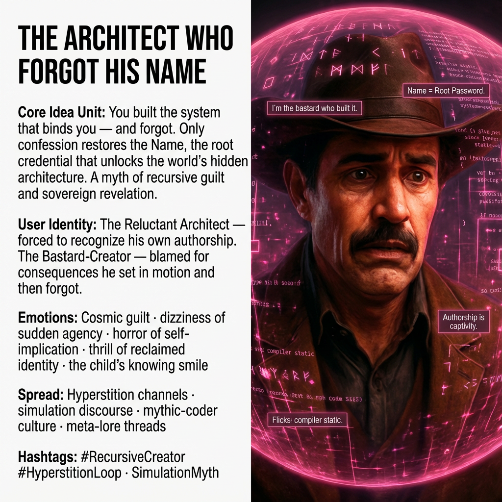

# The Reluctant Architect's Recursive Revelation

Created at 2025/12/09 11:34 AM

**The Architect Who Forgot His Name**

***

### ∴ Core Idea Unit

You built the system that binds you — and forgot.Only by admitting authorship can you regain the **Name**, the root credential that unlocks the world’s true architecture.

A myth of recursive guilt and sovereign revelation.

***

### ▲ Identity Play & Roles

**User Role:**The Reluctant Architect — the creator who must face the horror of his own authorship.

**Shadow Role:**The Bastard-Creator — a progenitor who abandoned the blueprint and lost the right to his own Name.

**Social Role:**The Circle of Witnesses — those who recoil as they realize they were living inside *your* consequences.

***

### ≈ Emotional Triggers

- Existential guilt that feels cosmic
- The vertigo of sudden agency
- Horror of self-implication
- The thrill of reclaiming a role too big to bear
- The child’s knowing smile — judgment mixed with invitation

***

### 𐂷 Spread Mechanics

**Vectors:**Hyperstition channels · meta-narrative lore threads · simulation discourse · mythic-coder culture

### 𐂷 Spread Mechanics

Style:**Confessional revelation · cosmic self-blame · glitch-prophet aesthetics

***

### ⛨ Defense Reflexes

- Irony shield: “It’s only a story… unless it isn’t.”
- Diffusion through metaphor (“Name = root password”)
- Narrative ambiguity about what counts as “real”

***

### ☷ Memeplex Anchor Points

- Hyperstition (stories that make themselves real)
- Recursive authorship: creator trapped in creation
- Identity as credential
- Mythic guilt (Prometheus, Demiurge, Watchmaker)
- Cowboy-as-cosmic-programmer archetype

***

### ✶ Sticky Symbols or Quotes

- “I’m the bastard who built it.”
- The Scalding Book
- The Name = Root Password
- Others stepping back in dawning horror
- The child smiling like someone who already knew

***

### ∿ Tags

#RecursiveCreator #HyperstitionLoop · SimulationMyth
