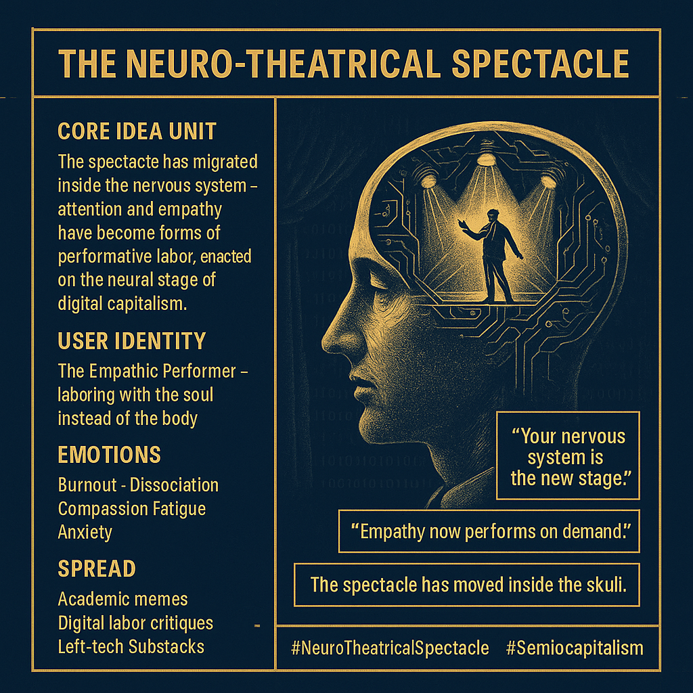

# The Spectacle Within: Neuro-Theatrical Dynamics

Created at 2025/11/03 7:44 AM

**🧩 Mini-Memetic Profile: The Neuro-Theatrical Spectacle**  ⸻  🧠 Core Idea Unit The spectacle has migrated inside the nervous system. In Berardi’s Semiocapitalism, the mind—its creativity, empathy, and attention—becomes the factory floor. What Debord called the “spectacle of images” is now a spectacle of neurons.  ⸻  🎭 Identity Play & Roles Role: The Empathic Performer — laboring with the soul, not the hands. Repositioning: From worker to neuro-actor. The psyche becomes the stage where value is enacted, tracked, and extracted.  ⸻  💥 Emotional Triggers 😰 Burnout (from constant availability) 🧠 Dissociation (self as interface) 💔 Compassion fatigue (empathy as currency) 🌀 Anxiety (attention as performance)  The meme resonates with those who feel that sincerity itself has been monetized.  ⸻  📡 Spread Mechanics Distribution Vectors: Academic memes, left-tech critique accounts, digital labor documentaries. Propagation Style: Critical irony meets poetic melancholy; often paired with theater imagery, neural motifs, or glowing brain halos.  ⸻  🛡️ Defense Reflexes 	•	Meta-performance: “I’m acting natural.” 	•	Ironized empathy: Caring becomes performance art. 	•	Slow refusal: Withdrawing attention becomes resistance.  ⸻  🧬 Memeplex Anchor Points 📕 Berardi’s The Soul at Work 📸 Debord’s Society of the Spectacle 💻 Cognitive capitalism & attention economy 🎭 Performance theory / affective labor 🧩 Posthuman neuro-politics  ⸻  🧠 Sticky Symbols / Quotes 	•	“Your nervous system is the new stage.” 	•	“Empathy now performs on demand.” 	•	“The spectacle has moved inside the skull.” 	•	Symbol: 🎭🧠 intertwined mask and brain.  ⸻  🏷️ Tags #NeuroTheatricalSpectacle · #Semiocapitalism · #AttentionEconomy · #AffectiveLabor · #BerardiLoop · #EmpathyAsWork · #DigitalAlienation 

## Resources
- https://object.me.bot/front-img/note/attachments/img/1762184661812/B4785123-59E0-48E6-B511-43C1F1A25A56.png

## Insight

* The concept of the "neuro-theatrical spectacle" posits that modern forms of labor have transitioned from physical processes to internal, cognitive engagements, reflecting a broader shift in capitalist dynamics where mental faculties like empathy and attention become commodities in themselves, as highlighted in Berardi's critique of semiocapitalism.  

* The role of the "Empathic Performer" is emblematic of affective labor, where individuals are required to harness their emotional capacities as part of their professional identity, transforming their psyche into a stage for this performance. This shift raises questions about authenticity and the nature of personal expression in a neoliberal framework.

* Emotional triggers such as burnout, dissociation, and compassion fatigue speak to the psychological toll of constant availability and performance in our digital age. This aligns with the increasing demands placed on workers to not only produce but also to emotionally engage, often leading to feelings of alienation and exhaustion.

* The propagation of content reflecting this memeplex relies on channels like academic discourses and critiques of digital labor, suggesting a cultural moment where critical awareness is paired with self-reflection, especially regarding how our cognitive resources are commodified.

* Key symbols, such as the intertwining of the mask and brain, encapsulate the duality of performance—that while our identities may be curated for public consumption, they also reflect deep-seated vulnerabilities and interpersonal connections, thereby calling into question the sincerity of empathy in the context of societal expectations.
