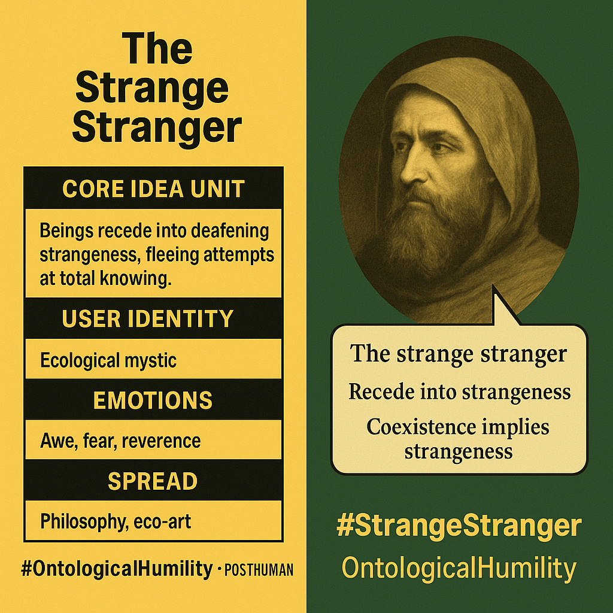

# The Strange Stranger: Ontological Humility Meme

Created at 2025/08/20 8:07 AM

### ◈ Mini-Memetic Profile

**Title: The Strange Stranger**

—

### ∴ Core Idea Unit

Every being, no matter how familiar, harbors irreducible strangeness. The more we understand it, the more it recedes. “The Strange Stranger” is a meme that fractures ontological certainty and replaces mastery with reverent unknowing.

—

### ▲ Identity Play & Roles

- The Encountered: Not the seer, but the one who meets.
- The Pilgrim of Unknowing: Navigates reality through awe, not control.
- The Unmastered Witness: Lives among beings never fully known.Rejects dominion for intimacy without comprehension.

—

### ≈ Emotional Triggers

🌀 Epistemic disorientation · 🌌 Awe at unknowability · 🧊 Humility · 🧠 Cognitive unease · 💔 Longing for connection

The meme disturbs in order to reorient.

—

### 𐂷 Spread Mechanics

- Distribution Vectors:Posthumanist philosophy, queer ecology, mystical poetry, speculative fiction.
- Propagation Style:Paradox · Poetic recursion · Theoretical riddles · Haunting metaphorsSlow virality but deep internalization in receptive audiences.

—

### ⛨ Defense Reflexes

- Deflection through mystique: “You never really know.”
- Critique as proof: Rationalist skepticism confirms its point.
- Self-erasing logic: To define it is to misrepresent it.
- High ambiguity tolerance: Withstands misreading via interpretive opacity.

—

### ☷ Memeplex Anchor Points

🕳️ Object-Oriented Ontology · 🌿 Posthuman Ecology · ✨ Queer Theory · ⛓️ Negative Theology

Breaks binaries, dissolves anthropocentric epistemes, nurtures mystery as ethical ground.

—

### ✶ Sticky Symbols or Quotes

- “Strange Stranger”
- “The more we know, the less we know”
- “Entities recede into strangeness”
- “Coexistence implies strangeness”
- Crystals, microbes, shadows, frost, kin not fully known

—

### ∿ Tags

#StrangeStranger · #OntologicalHumility · #EcoPhilosophy · #Posthumanism · #QueerEcology · #DarkEcology · #UncannyEthics · #RadicalUnknowability · #PoeticOntology

—
