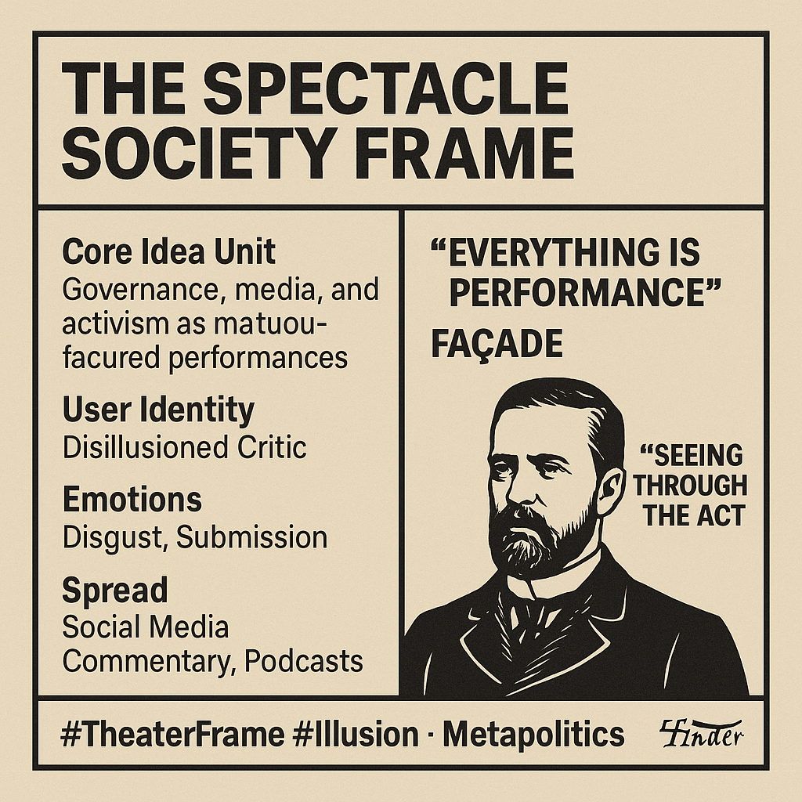

# Theatrical Illusions of Modern Society

Created at 2025/10/19 2:37 PM

### ◈ Mini-Memetic Profile
***
🩸 Title:“The Spectacle Society” — Everything Is Performance
***

### ∴ Core Idea Unit

-	The world of politics, media, and activism is no longer about truth or governance but about performance—a choreographed illusion designed to manage perception and emotion rather than material outcomes.
-	Reality is mediated; authenticity is a scarce commodity. Seeing the “act” becomes moral clarity.
***

### ▲ Identity Play & Roles

-	User as: Disillusioned Critic — a lucid observer who “sees through the show.”
-	Antagonists: Elites, media figures, and activists performing for attention rather than principle.
-	Role Performance: The act of calling out “the act” — skepticism itself becomes identity.
***

### ≈ Emotional Triggers

-	Disgust toward manipulation and hypocrisy.
-	Pride in discernment (“I’m not fooled”).
-	Alienation and exhaustion with spectacle culture.
-	A faint thrill of conspiratorial empowerment — “I know the real story.”
***

### 𐂷 Spread Mechanics

-	Distribution Vectors: Social commentary threads, YouTube explainers, political memes, ironic image macros, podcast monologues.
-	Propagation Style: Irony + revelation blend — “Here’s what they don’t want you to see.”
-	Often spreads through hybrid satire–analysis accounts bridging news critique and nihilistic humor.
***

### ⛨ Defense Reflexes

-	Irony Shield: Any criticism (“you’re too cynical”) reinforces the meme’s premise — “See, they want me to believe the show.”
-	Exposure Immunity: Accusations of bias or error are reframed as evidence of the spectacle’s depth.
-	Moral Armor: Equating skepticism with authenticity makes it self-legitimating.
***

### ☷ Memeplex Anchor Points

-	Populist distrust of elites (#DeepState, #CorporateMedia).
-	Postmodern and accelerationist theory (Baudrillard, Debord echoes).
-	Digital cynicism culture (Doomer, IronyBro, AnonRight).
-	Conspiracy-adjacent movements emphasizing truth-revealing as moral duty.
***

### ✶ Sticky Symbols or Quotes

-	“Everything is performance.”
-	“The façade is the message.”
-	“Nothing is real, but everyone is acting.”
-	Visuals: masks, puppet stages, glitch overlays, politicians as actors, media spotlights.
-	Symbolic color: sepia-black (antique gravitas) or glitch green (media decay).
***

### ∿ Tags

#TheaterFrame #Illusion #PostTrust #MetaPolitics #DoomerRealism #AuthenticityCrisis
