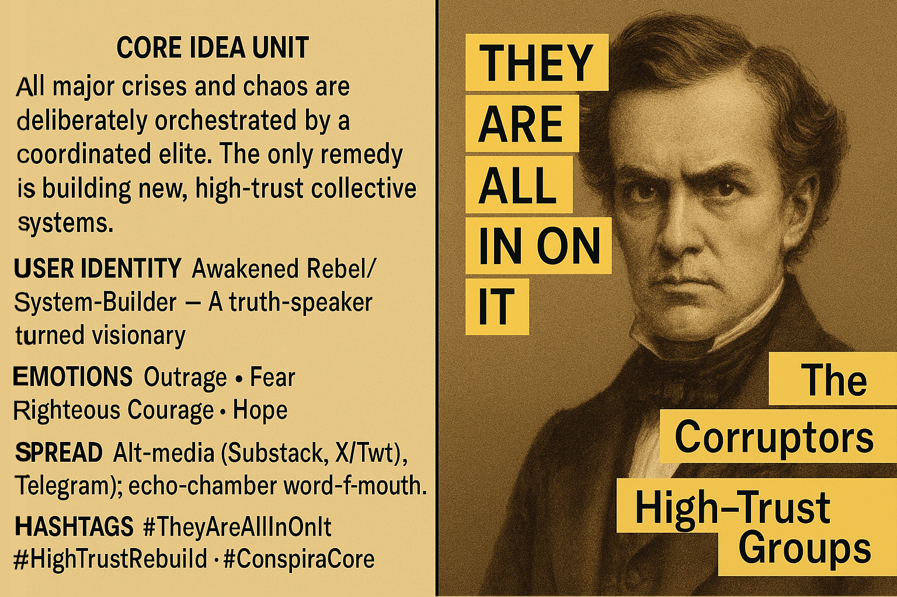

# "They Are All In On It" Meme

Created at 2025/07/07 1:43 PM

### ◈ Mini-Memetic Profile

***

### ∴ Core Idea Unit

- **Essential Belief:** All major societal dysfunctions stem from a coordinated elite conspiracy. The only path forward is rejecting divisive group identities and forming incorruptible, high-trust collectives to rebuild civilization.

***

### ▲ Identity Play & Roles

- **User Role(s):**
    - *Awakened Rebel* (against systemic corruption)
    - *Victim of Betrayal* (by elites and institutions)
    - *System Builder / Visionary* (for a new unified future)
    - *Moral Insider* (who sees what others deny)

***

### ≈ Emotional Triggers

- **Primary Emotions Activated:**
    - *Outrage* (at betrayal and manipulation)
    - *Fear* (of surveillance, biopower, and collapse)
    - *Righteous Courage* (to say the unsayable)
    - *Hope* (in collective problem-solving and renewal)

***

### 𐂷 Spread Mechanics

- **Distribution Vectors:**
    - Substack articles, Telegram groups, alt-social media (X/Twitter, Rumble)
    - Word-of-mouth among fringe/alt-political spheres
- **Propagation Style:**
    - Mantra repetition (“THEY ARE ALL IN ON IT”)
    - Direct claims blended with emotional storytelling
    - Implicit call-to-action to “build new systems”
    - Fractal adaptability: applies to any crisis or scandal

***

### ⛨ Defense Reflexes

- **Rebuttal Resistance Mechanisms:**
    - *Preemptive invalidation of dissent* (“If they weren’t all in on it, X would’ve happened”)
    - *Moral framing* as courageous truth-speaking
    - *Collapse of complexity* into one totalizing narrative
    - *Group affiliation dismissal*: Critics are labeled as either complicit or brainwashed

***

### ☷ Memeplex Anchor Points

- **Connected Ideological Clusters:**
    - Alt-conspiracism ([Deep State,](https://memeticcowboy.substack.com/p/nemas-egregore-analysis-the-veiled) Great Reset, Controlled Opposition)
    - Post-tribal universalism (anti-identity politics)
    - Tech skepticism (Palantir, AI control narratives)
    - DIY governance / decentralized solutionism
    - Narrative collapse revivalism (post-mainstream meaning-making)

***

### ✶ Sticky Symbols or Quotes

- “**THEY ARE ALL IN ON IT**” (core incantation)
- “**We solve problems better as one big label – WE ARE ONE**”
- “**The Corruptors**” (as enemy archetype)
- “**High-Trust Groups**” (as solution mantra)
- References to Palantir, mRNA, glyphosate, Epstein, AI

***

### ∿ Tags

#ConspiraCore #NarrativeCollapse #HighTrustRebuild #TheyAreAllInOnIt #PostInstitutionalism #InfoDoomToRegen #AltUnity #SystemicAwakening #DigitalDecentralism #FalseFlagEpistemology
