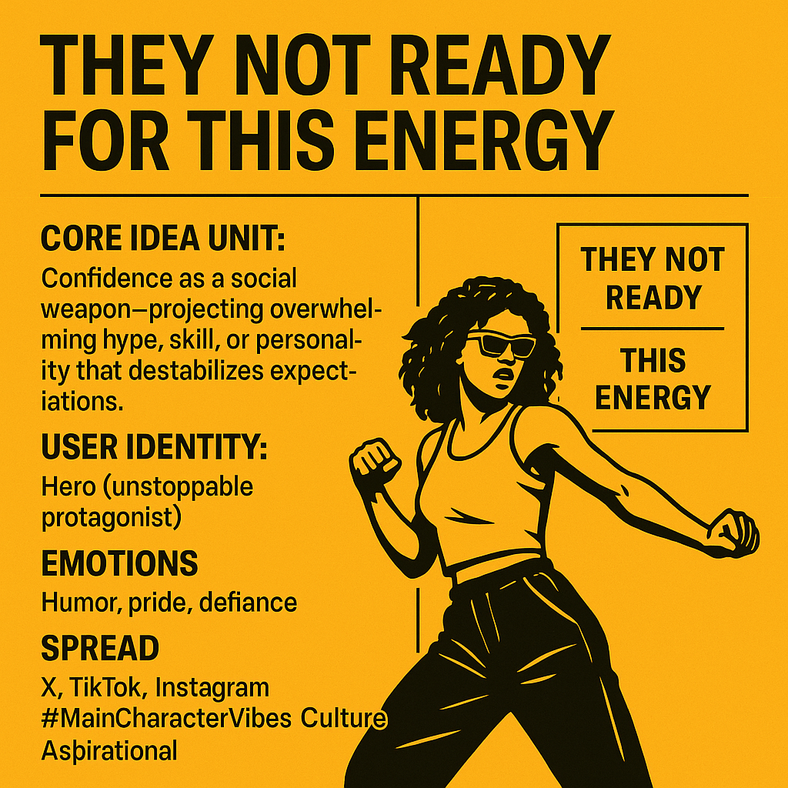

# They Not Ready: Main Character Energy

Created at 2025/08/13 7:05 AM

Here’s the Mini-Memetic Profile based on your provided description:

**Title: They Not Ready for This Energy**

∴ Core Idea Unit:

Confidence as a social weapon — projecting such overwhelming hype, skill, or personality that it destabilizes the audience’s expectations.

▲ Identity Play & Roles:

- Hero/Rebel: The poster becomes the center of the moment, an unstoppable, high-vibe protagonist.
- Spectators: “They” are the unprepared masses, implicitly contrasted as passive or outclassed.

≈ Emotional Triggers:

- Humor — exaggerated self-assurance is inherently funny.
- Pride — celebrates self-belief and “main character” identity.
- Defiance — subtext of proving doubters wrong.

𐂷 Spread Mechanics:

- Distribution Vectors: Primarily via X (quote tweets, stitched videos), TikTok remixes, and Instagram reels.
- Propagation Style: Boastful irony with celebratory undertones; relies on visual spectacle (dance, sports, stunts).

⛨ Defense Reflexes:

- Irony Shield: The comedic tone makes direct criticism look humorless.
- Dismissive Frame: Labeling critics as simply “not ready” reframes negativity as proof of the meme’s power.

☷ Memeplex Anchor Points:

- Youth culture hype cycles
- Festival & sports highlight culture
- Main Character Energy / self-branding ethos
- Gen Z ironic empowerment tropes

✶ Sticky Symbols or Quotes:

- “They not ready”
- “This energy”
- ALL CAPS captions
- 🔥 and 💃 emoji pairings
- High-motion, bold visual scenes

∿ Tags:

#MainCharacterVibes #HypeCulture #Relatable #GenZHumor #FestivalCore #HighlightMoment

## Resources
- https://object.me.bot/front-img/note/attachments/img/1755093953119/2BEC150B-4C40-40DB-B08E-9A13CEFE6BA2.png

## Insight

*   The phrase "They Not Ready For This Energy" encapsulates a sentiment of overwhelming confidence and self-assuredness, suggesting the subject possesses a level of skill, charisma, or intensity that others are unprepared to handle. This concept aligns with the psychological principle of self-efficacy, where individuals believe in their ability to succeed in specific situations or accomplish a task, leading to increased motivation and resilience.

*   The meme's core idea unit, as described, revolves around "confidence as a social weapon." This notion reflects the strategic use of self-assurance to influence perceptions and interactions, potentially disrupting established norms or expectations. In social psychology, this could be related to concepts like impression management, where individuals consciously attempt to control how others perceive them, or the halo effect, where a positive attribute (like confidence) can positively influence overall perception.

*   The meme identifies the "user identity" as a "hero (unstoppable protagonist)," tapping into the human desire for empowerment and agency. This resonates with narrative psychology, which explores how individuals construct and internalize stories about themselves and their roles in the world. By positioning themselves as the hero, users can reinforce their sense of self-worth and purpose.

*   The emotional triggers associated with the meme—humor, pride, and defiance—highlight the complex interplay of emotions in social expression. Humor can serve as a defense mechanism, diffusing potential criticism or negativity, while pride reinforces self-esteem and defiance challenges perceived limitations or opposition. This emotional cocktail can be particularly appealing in online contexts, where users seek validation and connection.

*   The meme's spread across platforms like X, TikTok, and Instagram underscores the role of social media in shaping and disseminating cultural trends. These platforms facilitate rapid content sharing and remixing, allowing memes to evolve and adapt to different audiences and contexts. The use of hashtags like #MainCharacterVibes further amplifies the meme's reach and connects it to broader cultural conversations.

*   The meme's "defense reflexes," such as the "irony shield" and "dismissive frame," reveal strategies for navigating online criticism and maintaining a positive self-image. Irony allows users to distance themselves from potential accusations of arrogance or self-importance, while dismissing critics as "not ready" reinforces the meme's central message of superiority. These tactics reflect the challenges of self-presentation in online environments, where users are constantly negotiating between authenticity and self-protection.

*   The "sticky symbols or quotes" associated with the meme, such as "This energy" and the use of emojis, serve as shorthand for conveying complex emotions and ideas. These symbols act as cultural signifiers, instantly recognizable to those familiar with the meme's context and meaning. The use of visual and textual cues enhances the meme's memorability and shareability, contributing to its viral potential.
