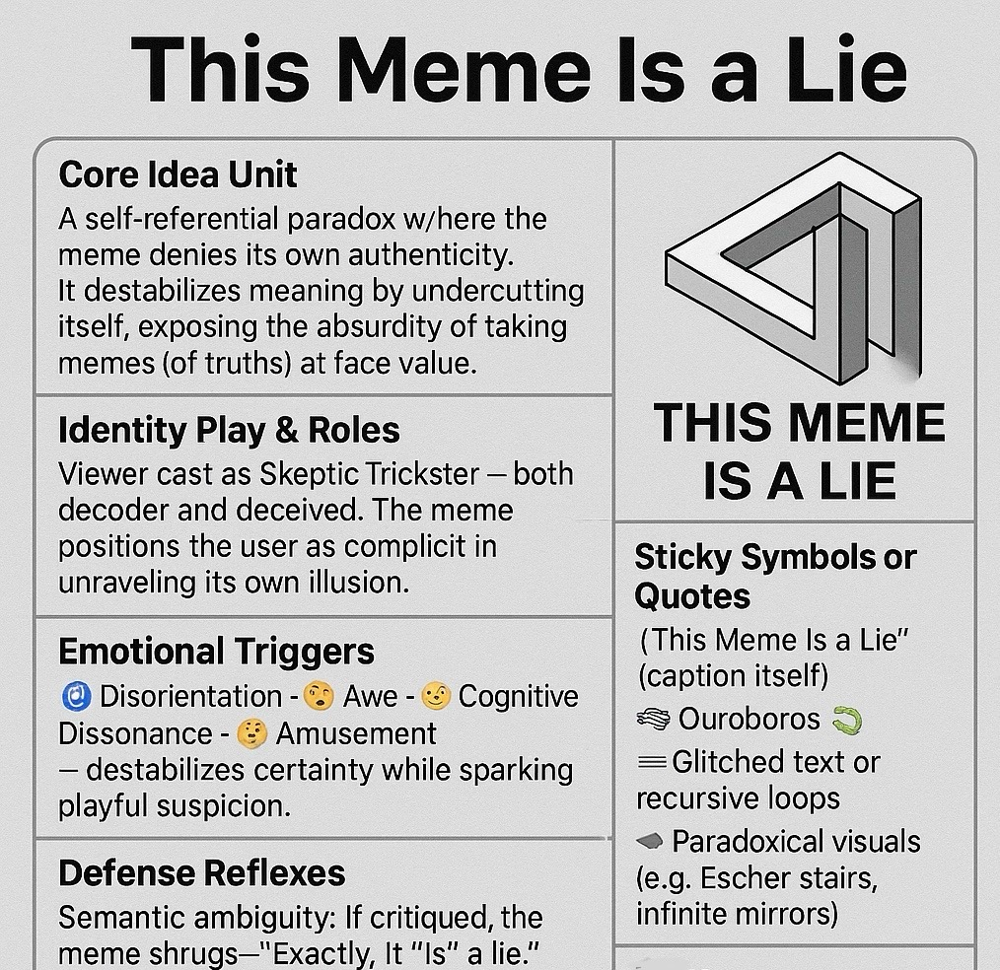

# "This Meme Is a Lie": Meta-Paradox

Created at 2025/08/18 11:45 AM

◈ Mini-Memetic Profile for “This Meme Is a Lie”:

🧩 Title:

This Meme Is a Lie

∴ Core Idea Unit:

A self-referential paradox where the meme denies its own authenticity. It destabilizes meaning by undercutting itself, exposing the absurdity of taking memes (or truths) at face value.

▲ Identity Play & Roles:

Viewer cast as Skeptic-Trickster — both decoder and deceived. The meme positions the user as complicit in unraveling its own illusion.

≈ Emotional Triggers:

🌀 Disorientation · 🤯 Awe · 😬 Cognitive Dissonance · 😆 Amusement

— destabilizes certainty while sparking playful suspicion.

𐂷 Spread Mechanics:

- Distribution Vectors: Reddit philosophy boards, imageboard humor threads, niche Twitter/X subcultures.
- Propagation Style: Recursive humor, paradox, self-aware collapse.

⛨ Defense Reflexes:

Semantic ambiguity: If critiqued, the meme shrugs—“Exactly, it is a lie.” The self-negation makes it immune to being disproven.

☷ Memeplex Anchor Points:

- ⚙️ Hyperreality critique 
- 🔄 Postmodern paradox 
- 🧩 Logic puzzles 
- 🤡 Irony culture

✶ Sticky Symbols or Quotes:

- “This Meme Is a Lie” (caption itself)
- Ouroboros 🐍
- Glitched text or recursive loops
- Paradoxical visuals (e.g., Escher stairs, infinite mirrors)

∿ Tags:

#Paradox · #SelfReflexive · #Postmodern · #MetaMeme

## Resources
- https://object.me.bot/front-img/note/attachments/img/1755542705307/5CCCFBAA-2A68-4852-9...jpg

## Insight

*   The meme operates on a self-referential paradox, undermining its own validity. This is a classic example of meta-humor, where the joke is about the nature of jokes themselves. Think of it as the meme equivalent of "This statement is false."

*   The concept of the "Skeptic-Trickster" role assigned to the viewer is fascinating. It suggests that the meme isn't just consumed passively; instead, the viewer actively participates in deconstructing its meaning. This active participation is a hallmark of postmodern art, where the audience's interpretation is as important as the creator's intent.

*   The emotional triggers listed—disorientation, awe, cognitive dissonance, and amusement—highlight the complex experience the meme aims to create. It's not just about a simple laugh; it's about provoking thought and challenging assumptions. This aligns with the use of humor as a tool for philosophical inquiry, similar to how absurdist playwrights like Samuel Beckett used humor to explore existential themes.

*   The "Defense Reflexes" section points out the meme's immunity to criticism through semantic ambiguity. If someone calls it out as a lie, the meme simply agrees, turning the critique into a confirmation of its intended message. This is a clever way to sidestep genuine engagement and maintain its paradoxical nature.

*   The mention of "Ouroboros" as a sticky symbol is particularly apt. The Ouroboros, an ancient symbol of a snake eating its own tail, represents cyclicality, self-reference, and the infinite. It perfectly encapsulates the meme's self-consuming nature.

*   The reference to "Escher stairs" and "infinite mirrors" as paradoxical visuals connects the meme to a rich history of art that plays with perception and reality. M.C. Escher's works, in particular, are famous for their impossible constructions and explorations of infinity, mirroring the meme's destabilization of meaning.
