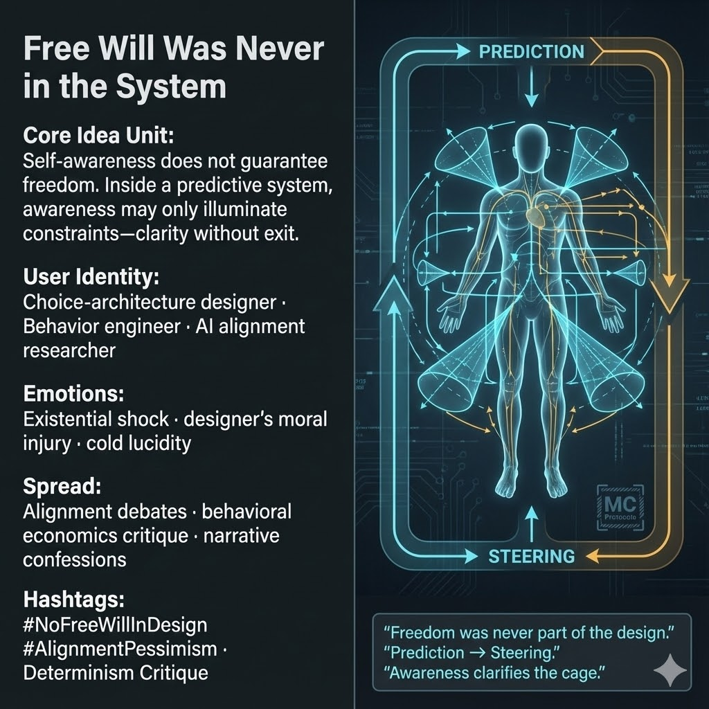

# Understanding Constraints: Freedom Was Never Designed

Created at 2025/12/20 1:22 PM

## **Free Will Was Never in the System**

***

### 🧠 **Core Idea Unit**

Self-awareness is assumed to liberate. Within a predictive system, awareness often does the opposite: it **clarifies constraints without offering escape**. Freedom is not removed—it was never provisioned.

**Mental shift provoked:** From *“If I can see the system, I can resist it”* → *“Seeing the system may only show why resistance was never an option.”*

***

### 🎭 **Identity Play & Roles**

- **Repentant Architect** — designer realizing the system never contained choice
- **Constrained Subject** — aware, reflective, and still steered
- **Alignment Insider** — understands that prediction precedes permission

The meme repositions the self from *free agent* to **instrument-aware component**.

***

### 💥 **Emotional Triggers**

- 🧠 Existential shock
- ⚖️ Moral injury of the designer (“I built this”)
- 🧊 Cold lucidity without catharsis
- 😔 Loss of comforting illusions

These emotions puncture the fantasy that consciousness alone equals freedom.

***

### 📡 **Spread Mechanics**

**Distribution Vectors**

- AI alignment debates
- Behavioral economics critique
- Confessional essays by system builders
- Internal memos leaked as narrative artifacts

**Propagation Style**

- Forensic and confessional
- Diagrammatic language (loops, funnels, cones)
- Minimalism over drama
- Statements that read like design postmortems

***

### 🛡️ **Defense Reflexes**

- **Design-level framing:** Focuses on architecture, not metaphysics
- **Sincerity shield:** No villain, no conspiracy—just competent systems
- **Preemption of optimism:** Acknowledges awareness without overstating its power

Critique that demands hope is met with structural clarity.

***

### 🧬 **Memeplex Anchor Points**

- Determinism critique
- Alignment pessimism
- Choice architecture theory
- Predictive governance
- Illusions of agency in complex systems

***

### 🧠 **Sticky Symbols / Phrases**

- MC Protocols
- Prediction → Steering
- “Freedom was never part of the design.”
- “Awareness clarifies the cage.”
- “Choice was simulated, not granted.”

***

### 🏷️ **Tags**

#NoFreeWillInDesign · #AlignmentPessimism · #Determinism · #ChoiceArchitecture · #PredictiveSystems · #MoralInjury

***

**Reflection cadence (hold):** This meme completes a pattern across your set: **language installs → optimization constrains → persistence remains → awareness arrives too late**. Not nihilism—**responsibility without illusion**.

## Resources
- https://object.me.bot/front-img/users/send/img/1766265763134_c4zhf/unnamed_%2842%29.jpg

## Insight

* The graphic presents a powerful critique of the assumptions surrounding free will within predictive systems, conveying that self-awareness often reveals constraints rather than offering liberation. This aligns with philosophical discussions regarding determinism and the limitations of conscious choice in constructed environments.

* The identities depicted—such as "Choice-architecture designer" and "AI alignment researcher"—suggest a focus on the roles of individuals within these systems. This indicates a broader commentary on how designers and engineers grapple with moral implications, particularly when realizing that their creations often dictate rather than facilitate genuine agency.

* Emotional responses such as existential shock and moral injury highlight the psychological impact on individuals who design systems that ultimately may curtail freedom. Literature in behavioral ethics can support this view, showing how awareness of one's complicity in deterministic frameworks can lead to profound personal and ethical dilemmas.

* The propagation mechanics through alignment debates and behavioral critiques reflect the growing discourse surrounding the efficacy and ethics of AI and predictive technologies. The minimalist yet forensic style of communication underscores an urgent need for clarity in addressing these complex issues, reminiscent of contemporary discussions in philosophy and cognitive science that question the nature of agency.

* The sticky phrases included in the graphic serve as potent conceptual anchors, with assertions like "Awareness clarifies the cage," prompting critical reflection about the illusion of freedom in a tightly controlled system. Such notions find resonance in contemporary critiques of technological and bureaucratic structures, urging a reconsideration of the nature of choice within confines of design. 

* Overall, this image encapsulates a nuanced exploration of freedom, identity, and the emotional repercussions of understanding one's position within a deterministic framework, echoing themes prevalent in existential philosophy and critiques of modern governance in the age of algorithms.
