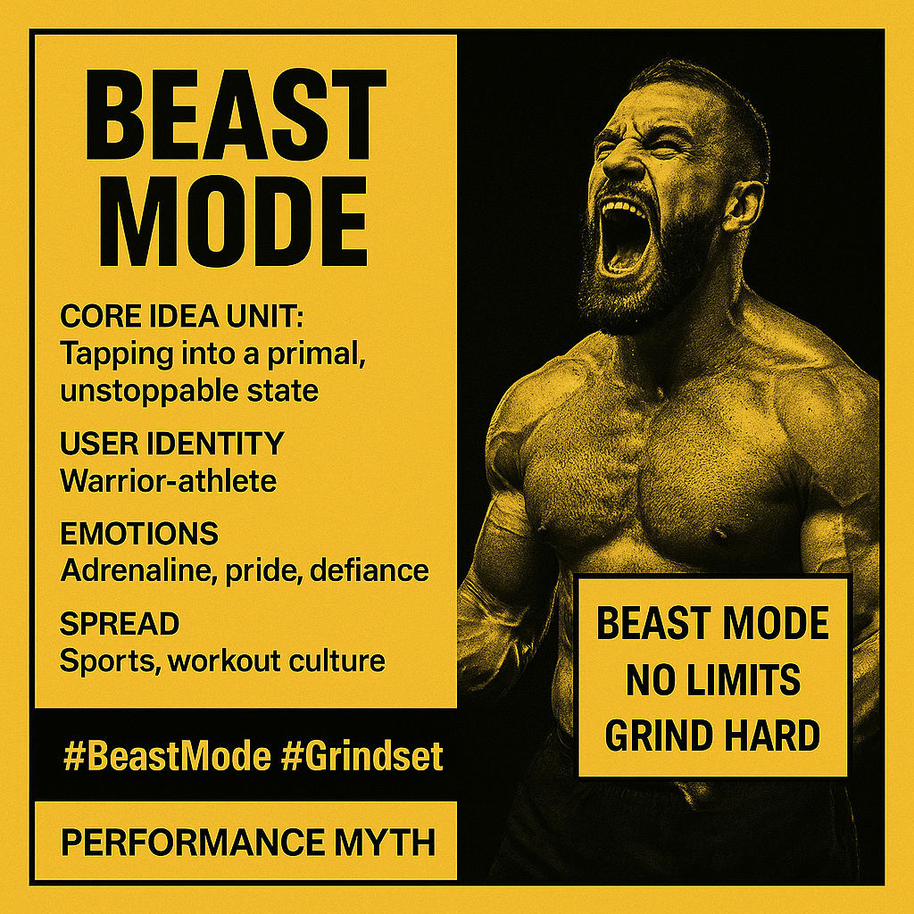

# Unleashing Primal Power: The Beast Mode Mentality

Created at 2025/08/14 7:26 AM

Title: “Beast Mode” - Unleashing the Inner Predator

### ∴ Core Idea Unit

- The belief that optimal performance comes from activating a primal, unstoppable, and intensely focused mental/physical state — transcending normal limits.

### ▲ Identity Play & Roles

- Positions the user as a warrior-athlete archetype or apex competitor — the “unstoppable force” who flips a switch to dominate challenges. Often framed as the hero of their own performance narrative.

### ≈ Emotional Triggers

- Adrenaline & power-lust — excitement at the idea of full-force exertion.
- Pride & confidence — identification with elite-level capacity.
- Defiance — against weakness, fatigue, or external limitations.
- Awe — when applied to admired figures (e.g., Marshawn Lynch).

### 𐂷 Spread Mechanics

- Distribution vectors: Sports commentary, workout culture, gaming streams, motivational TikToks/shorts, meme pages.
- Propagation style: Direct exhortation (“GO BEAST MODE!”), highlight reels, motivational edits, gym merch slogans, gaming montages.

### ⛨ Defense Reflexes

- Irony shield: Can be used jokingly or seriously — critics of the intensity can be dismissed as “not getting it” or being “too soft.”
- Performance-proof framing: Success stories and viral clips serve as “receipts” for the mentality.

### ☷ Memeplex Anchor Points

- Hyper-competitive sports culture.
- Hustle/Grindset motivational subculture.
- Masculinity-as-performance narratives.
- Hero’s journey mythos (“the beast awakens”).
- Gaming and esports “clutch mode” identity.

### ✶ Sticky Symbols or Quotes

- Key phrase: “Beast Mode” (short, high-impact, high-contrast language).
- Visuals: Roaring animals (lion, wolf, bear), athletes mid-action, sweat and grit imagery, video game HUD “power-up” graphics.
- Associated hashtags: #BeastMode #NoLimits #GrindHard #AlphaMindset

### ∿ Tags

#Grindset #SportsMeme #GamingCulture #PerformanceMyth #AlphaArchetype #MotivationMeme #PrimalEnergy
