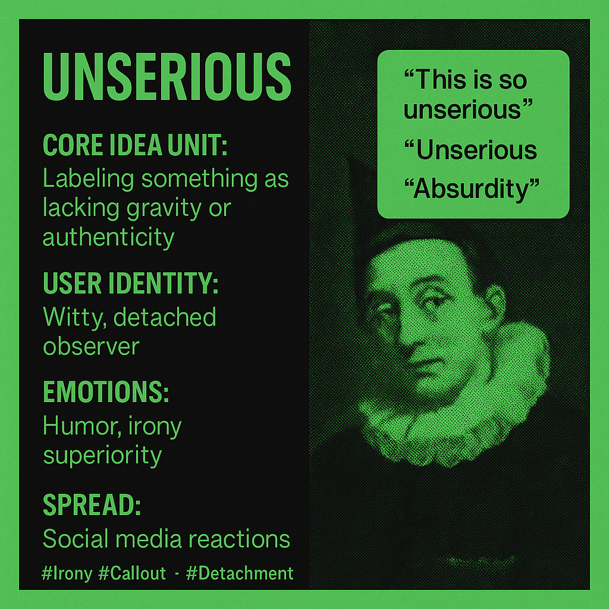

# Unserious: Detached Irony and Social Mockery

Created at 2025/07/30 10:22 AM

### ◈ Mini-Memetic Profile

**🎭 Title:**Dismissive Absurdity

### ∴ Core Idea Unit

- Labeling a situation, action, or trend as “unserious” to delegitimize or mock its lack of authenticity, depth, or gravitas.
- Functions as a micro-meme of ironic detachment and cultural superiority.

**🕹️ Identity Play & Roles:**

- Positions the user as the witty, self-aware observer who “sees through the nonsense.”
- Optional roles: detached insider, playful critic, lighthearted judge.

### ≈ Emotional Triggers

- Humor (playful ridicule)
- Irony (mocking without heavy stakes)
- Superiority (I can spot the triviality)

### 𐂷 Spread Mechanics

- **Distribution Vectors:** Replies, quote tweets, TikTok captions, and Instagram comment sections.
- **Propagation Style:** Satirical understatement, memeified commentary, ironic “anti-reaction.”

### ⛨ Defense Reflexes

- Irony shield: If challenged, the user can retreat to “it’s just a joke.”
- Dismissal loop: Criticism is framed as proving the original point (“You’re taking this unserious thing too seriously”).

### ☷ Memeplex Anchor Points

- Gen Z irony culture
- Callout & roast culture
- Light anti-establishment or anti-mainstream sentiment
- Digital detachment / “chronically online” discourse

### ✶ Sticky Symbols or Quotes

- Text: “This is so unserious,” “Peak unserious behavior”
- Visuals: Reaction GIFs, clown emojis, meme templates of chaos or silliness
- Stylized use of lowercase or stretched typography for comic effect (e.g., *unseriooous*)

### ∿ Tags

#Irony #CalloutCulture #VibeCheck #GenZHumor #ClownWorld #Detachment
