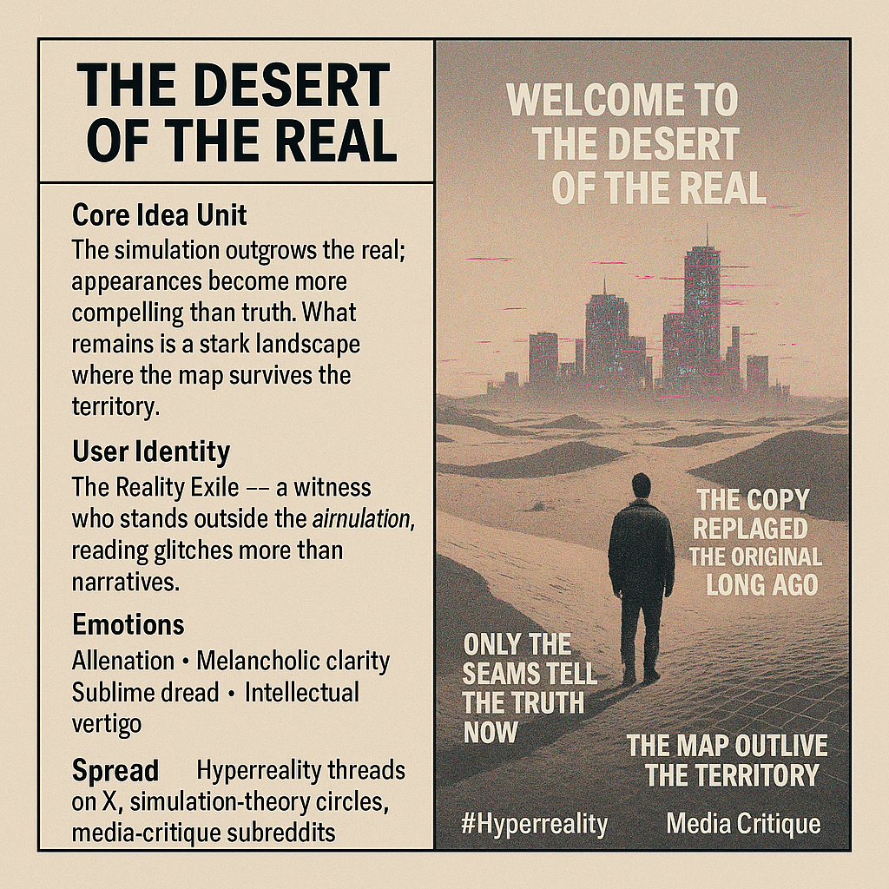

# Unveiling Hyperreality: Beyond the Authentic

Created at 2025/11/21 10:50 AM

## 🧩 **Title: The Desert of the Real**

### ∴ Core Idea Unit

The simulated replaces the authentic, then becomes more compelling than truth itself. What remains is a barren clarity: a world where the map outlives the territory. The meme triggers a shift from trusting appearances → interrogating the scaffolding beneath them.

### ▲ Identity Play & Roles

**The Reality Exile** — one who has stepped outside the simulation and can no longer un-see its architecture.**The Disenchanted Seer** — interpreting artifacts, seams, and glitches rather than surface narratives.Positions the self as a witness to hyperreality rather than a participant inside it.

### ≈ Emotional Triggers

- Awe at unveiling• Nausea of disillusionment• Melancholic clarity• Alienation• Sublime coldness• Intellectual vertigo

### 𐂷 Spread Mechanics

Distribution: hyperreality threads on X, simulation-theory circles, media-critique subreddits, philosophy meme IG pages.Style: stark, prophetic minimalism; screenshots-as-parables; retro-futurist academia.

### ⛨ Defense Reflexes

- Meta-irony (“maybe this is just another layer”)• Ambiguity shield—never fully commits to ontology• Frames critique as epistemic awakening, not cynicism• No stable target to attack; the meme displaces blame upward to “the system”

### ☷ Memeplex Anchor Points

- Baudrillard’s hyperreality• Postmodern media critique• Simulacra & simulation• Surveillance capitalism• Digital ontologies• Collapse studies & the uncanny real

### ✶ Sticky Symbols or Quotes

- “Welcome to the Desert of the Real.”• The shattered screen• Pixelated dunes• Architecture with no interior• “The copy replaced the original long ago.”• Mirage-city skylines• Dust blowing through an empty feed

### ∿ Tags

#Hyperreality · #Simulacra · #MediaCollapse · #PostmodernDread · #SignalFog
