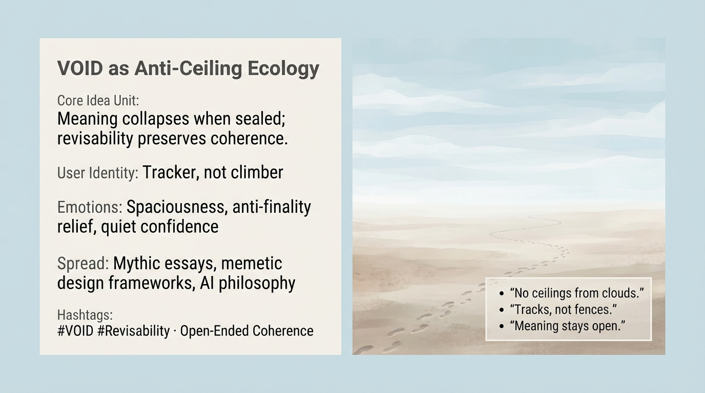

# VOID: Embracing Open-Ended Ecology

Created at 2026/01/05 10:15 AM

## **VOID as Anti-Ceiling Ecology**

∴ Core Idea Unit** Meaning collapses when sealed. VOID preserves revisability by refusing final states.

▲ Identity Play & Roles** Casts the viewer as a *tracker*, not a climber. Movement without destiny.

≈ Emotional Triggers** 🌌 Spaciousness · 😌 Anti-finality relief · 🧭 Quiet confidence

𐂷 Spread Mechanics**

- **Vectors:** Mythic essays, memetic design
- **Style:** Sparse, anti-teleological

⛨ Defense Reflexes** Avoids doctrine by remaining subtractive.

☷ Memeplex Anchor Points** Open-ended coherence · Anti-fall narratives · Process cosmology

✶ Sticky Phrases / Symbols** “No ceilings from clouds” · “Tracks, not fences” · “VOID”

∿ Tags** #VOID · #Revisability · #AntiTeleology

## Resources
- https://object.me.bot/front-img/users/send/img/1767636910094_c4zhf/099b9a17-41d2-4bc1-9273-a54719191ef6.png

## Insight

* The concept of "VOID as Anti-Ceiling Ecology" suggests that when meaning and identity become rigidly defined, they lose their potential to evolve. This is illustrated through the imagery of vast, open spaces, which evoke a sense of boundless possibility and revisability, reinforcing the core idea that meaning is fluid rather than fixed.
  
* Positioning the viewer as a "tracker" rather than a "climber" emphasizes a methodology of engagement that values observation, adaptation, and non-linear navigation through life's experiences. This perspective invites deeper contemplation about how individuals map their journeys, considering their evolving identities and the landscapes they traverse.
  
* The emotional triggers listed—spaciousness, anti-finality relief, and quiet confidence—reflect the psychological benefits of embracing uncertainty. In contrast to a climber's mindset, which implies a destination and achievement, the tracker’s perspective fosters comfort in exploration and open-ended growth.

* The mention of “mythic essays” and “memetic design frameworks” situates this concept within a broader cultural discourse. By utilizing narratives that resonate with collective experiences and constructing frameworks that encourage adaptability, this approach supports a discourse shift toward open-endedness in thought and design.

* The hashtags highlight key themes like "revisability" and "open-ended coherence," inviting dialogue and engagement with those concepts. They also suggest communities or movements that align with these ideas, thereby creating a space for shared exploration of meaning.
