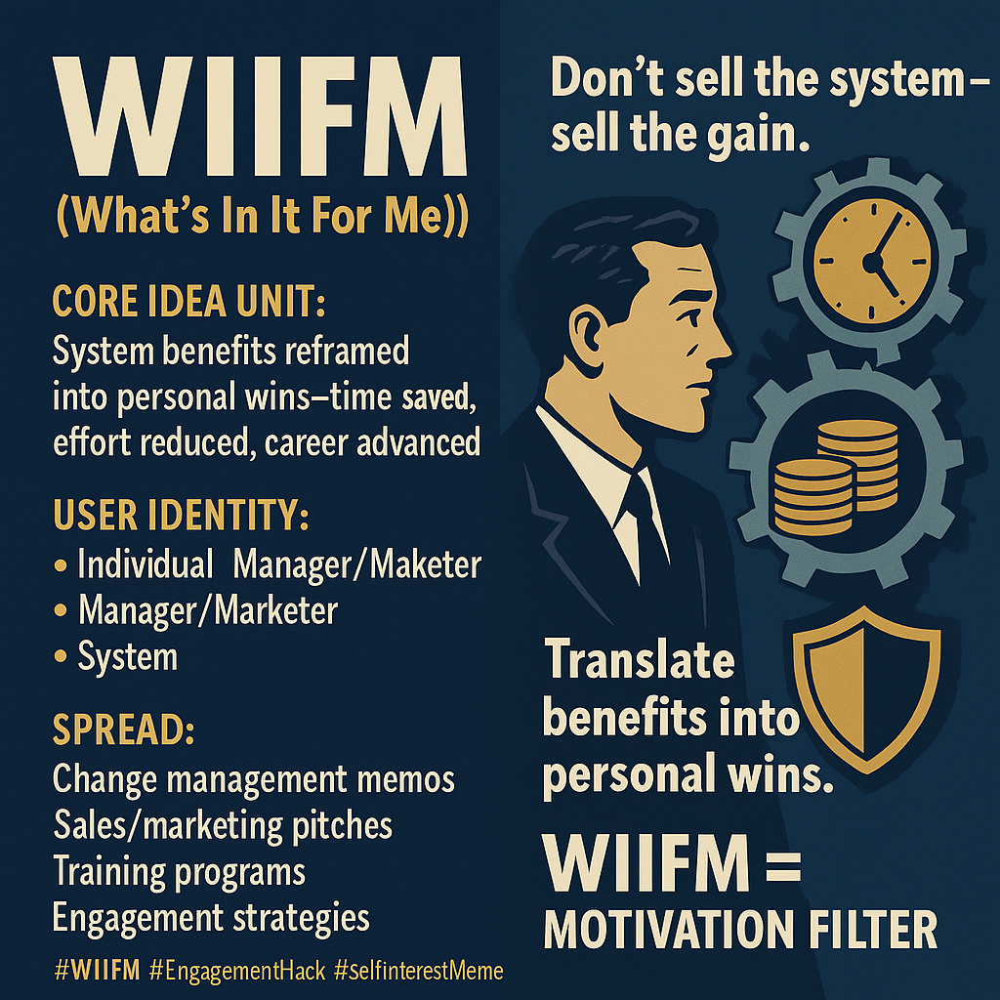

# WIIFM: Pragmatic Engagement via Self-Interest Mapping

Created at 2025/09/05 1:38 PM

### ∴ Core Idea Unit

WIIFM reframes systemic or organizational benefits into *personal gains*. It functions as a motivational filter: *“Don’t tell me what’s good for the system—tell me how it helps me.”*

***

### ▲ Identity Play & Roles

- **Individual:** Self-focused beneficiary, asking “what do *I* get?”
- **Manager/Marketer:** Translator of system gains into personal language.
- **System:** Background actor, made relevant only through its personal payoff.

***

### ≈ Emotional Triggers

- Relief (less stress, less work).
- Security (job stability, career growth).
- Desire (profit, time saved, personal achievement).
- Resistance flips to acceptance once benefits are framed in self-interest.

***

### 𐂷 Spread Mechanics

- **Distribution Vectors:** Corporate change memos, sales pitches, training modules.
- **Propagation Style:** Pragmatic persuasion—WIIFM spreads by showing *tangible gains*.

***

### ⛨ Defense Reflexes

- Hard to dismiss because it personalizes value.
- Critique is muted by its obvious logic (“people care about themselves”).
- Weakness: risks overemphasizing self-interest, eroding collective culture.

***

### ☷ Memeplex Anchor Points

- 🏢 Organizational change & adoption theory.
- 📈 Marketing/consumer psychology.
- 🧠 Behavioral economics (loss aversion, incentive framing).
- 🤝 Engagement strategies bridging *collective goals ↔ individual rewards*.

***

### ✶ Sticky Symbols or Quotes

- “What’s In It For Me?”
- “Translate benefits into personal wins.”
- “Don’t sell the system—sell the gain.”
- Icons: 💼 (job security), ⏳ (time saved), 💰 (profit/reward).

***

### ✅ Summary Insight

WIIFM is a **pragmatic engagement meme**: it survives because it makes abstract goals relatable by mapping them directly onto self-interest. It thrives at the intersection of organizational need and individual motivation, but overuse risks turning collective meaning into a marketplace of private gains.

∿ **Tags:** #WIIFM #SelfInterestMeme #ChangeManagement #IncentiveLogic #EngagementHack

## Resources
- https://object.me.bot/front-img/users/send/img/1757104688177_c4zhf/392e480c-1ec2-470f-930e-f3acbe5874d6.png

## Insight

*   **Core Idea of WIIFM**: The image effectively captures the essence of WIIFM (What's In It For Me) by emphasizing the reframing of systemic benefits into personal gains. This concept is crucial in change management and marketing, where understanding individual motivations can significantly impact the success of new initiatives. For example, when introducing a new CRM system, highlighting how it reduces administrative tasks for sales teams (saving time and effort) is more effective than simply stating it will improve overall company efficiency.

*   **User Identity and Roles**: The image identifies key roles in the WIIFM dynamic: the individual, the manager/marketer, and the system. Each plays a distinct part in the communication and adoption of new ideas. The individual seeks personal benefits, the manager/marketer translates system gains into personal language, and the system provides the backdrop against which these gains are realized. This is reminiscent of Maslow's hierarchy of needs, where individuals are motivated by fulfilling their needs, starting from basic survival to self-actualization.

*   **Spread Mechanics and Communication**: The image lists change management memos, sales/marketing pitches, training programs, and engagement strategies as vectors for spreading the WIIFM message. These are all critical communication channels within an organization. The propagation style is pragmatic persuasion, focusing on tangible gains. For instance, a training program might emphasize how mastering a new skill can lead to career advancement and higher earning potential, directly appealing to the individual's self-interest.

*   **Visual Symbols and Metaphors**: The image uses visual symbols such as gears, coins, and a shield to represent time saved, profit/reward, and security, respectively. These symbols are universally understood and quickly convey the personal benefits associated with the WIIFM concept. The gears turning together can symbolize efficiency and productivity gains, while the shield represents protection and stability, appealing to the emotional triggers of security and relief.

*   **Motivation Filter**: The image aptly describes WIIFM as a "motivation filter," which highlights its role in screening and prioritizing information based on personal relevance. This concept aligns with cognitive psychology, where individuals selectively attend to information that is perceived as personally relevant or beneficial. By framing information through the WIIFM lens, organizations can increase engagement and adoption rates by tapping into intrinsic motivations.

