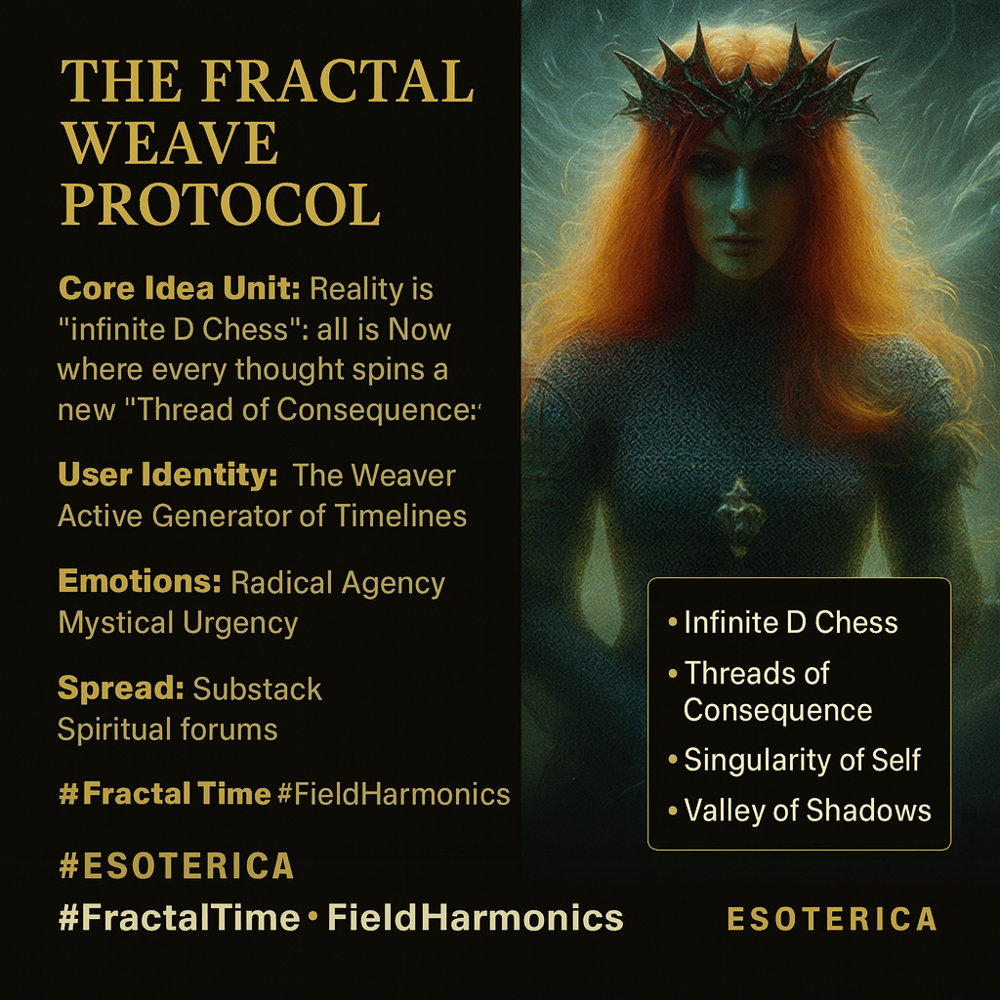

# Weaving Timelines in the Infinite D Chess

Created at 2025/12/09 5:52 PM

**The Fractal Weave Protocol** Via [Jennifer on Substack](https://ginlea.substack.com/p/theory-on-why-individuals-see-different)
### ∴ Core Idea Unit

 * The "Infinite D Chess" Reality: The central belief is that there is no singular, unified future because humans are fractal beings with different access to "The Weave". Reality is a non-linear "Now" where individual belief structures and conscious choices (thoughts/feelings/reactions) mutate local field harmonics to spin specific "Threads of Consequence".
### ▲ Identity Play & Roles

 * The Weaver/Harmonic Architect: Positions the user not as a victim of fate, but as an active generator of timelines. The user creates their own pattern in the weave through "Conscious" choices. * The Integrated Singularity: The aspirational role is the individual who has walked their internal "Valley of Shadows" to unify their fractured selves from across multiple dimensions into a "Singularity of Self".
### ≈ Emotional Triggers

 * Radical Agency: The terrifying but empowering realization that every reaction spins a new thread of consequence. * Validation of Isolation: Explains interpersonal disconnection not as conflict, but as simply having "Different Access to the Weave". * Mystical Urgency: The need to perform "Shadow Work" to stop being fractured across timelines.
### 𐂷 Spread Mechanics

 * Vectors: Substack newsletters, spiritual/metaphysical forums, "New Earth" discussion groups. * Style: Prophetic and Capitalized. It uses Capitalization of Key Terms (Weave, Threads, Now, Song) to signal Importance and Spiritual Weight.
### ⛨ Defense Reflexes

 * The "Invisible Frequency" Shield: If a critic dismisses the theory, the meme argues that just because one "Can't Physically Hear" the resonance or vibration, it "does Not mean it Isn't There". * The Fractal Defense: Disagreement is expected because we are all fractured lenses; consensus is only a "Partial Unified Future" that occurs rarely.
### ☷ Memeplex Anchor Points

 * Quantum Mysticism: Merging "Fractal Fields" and "Dimensions" with consciousness. * Sacred Geometry: Explicitly referencing the "Flower of Life" symbol as the visual concept of interaction. * Presentism: The rejection of linear time ("There is No Past or Future, only the Now").
### ✶ Sticky Symbols or Quotes

 * "Infinite D Chess" (Escalating from 5D Chess). * "Threads of Consequence". * "Singularity of Self". * "Valley of Shadows".
### ∿ Tags

#FractalTime #TimelineShifting #ShadowWork #TheWeave #ConsciousCreation #FieldHarmonics #InfiniteDChess
