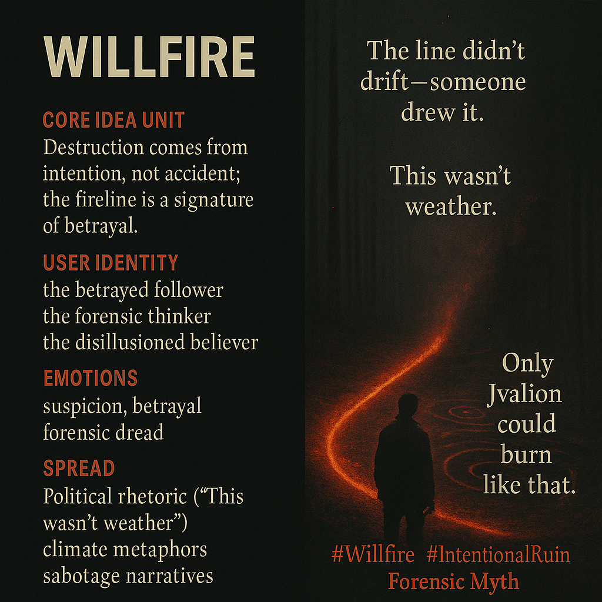

# Willfire: Unveiling Intentional Destruction

Created at 2025/11/23 11:58 AM

### 🧩 **Title: Willfire**

***

### ∴ **Core Idea Unit**

Destruction isn’t accident or weather—it’s choice. The burn pattern carries intention, revealing betrayal embedded in the act. The shift: catastrophe is treated as authored.

***

### ▲ **Identity Play & Roles**

**The Betrayed Follower** — realizing someone they trusted lit the match. **The Forensic Thinker** — reading intention in the pattern of the burn. **The Disillusioned Believer** — forced to recognize agency where they hoped for randomness.

These roles reposition the self as someone confronting the truth that ruin has a signature.

***

### ≈ **Emotional Triggers**

Suspicion tightening into clarity. Betrayal that feels personal. The cold thrill of forensic deduction. The dread of recognizing intention behind devastation.

***

### 𐂷 **Spread Mechanics**

**Distribution Vectors:** • Political rhetoric about “unnatural disasters” • Climate-change metaphors of arsonous agency • Sabotage narratives • Apocalyptic fiction with deliberate ruin

**Propagation Style:** Forensic myth, accusatory parable, investigative dread.

***

### ⛨ **Defense Reflexes**

Ambiguous authorship (“only someone like Jvalion could burn like that”). Appeal to pattern-literacy (“the fireline didn’t drift”). Self-sealing accusation: any critique becomes “part of the cover-up.”

***

### ☷ **Memeplex Anchor Points**

Sabotage allegories · Ecological politics · Moral injury · Leadership failure · Apocalyptic agency narratives · Betrayal arcs · Shadow-strategist mythos

***

### ✶ **Sticky Symbols or Quotes**

“The line didn’t drift—someone drew it.” “This wasn’t weather.” “The fire chose its path.” “Only Jvalion could burn like that.” Recursive scorch marks. Intent traced in ash.

***

### ∿ **Tags**

#Willfire · #IntentionalRuin · #ForensicMyth · #BetrayalPattern · #BurnSignature

## Resources
- https://object.me.bot/front-img/users/send/img/1763927917001_c4zhf/ccac0187-f882-4fc6-b303-bc8165e07b77.png

## Insight

* The concept of destruction as intentional rather than accidental underscores the notion that human agency plays a critical role in environmental crises. This aligns with ongoing debates about climate change, where actions attributed to corporate and political decisions have led to significant ecological damage, framing these as deliberate acts of sabotage rather than mere natural occurrences.

* The emotional dynamics of betrayal highlighted in the image resonate with the experiences of communities affected by environmental degradation. As the narrative unfolds, the roles of "The Betrayed Follower" and "The Disillusioned Believer" illustrate the personal impact of recognizing that trusted figures or systems could be responsible for their suffering. This mirrors real-world sentiments among those impacted by misleading information regarding environmental policies.

* The forensic approach to deciphering intention, represented through "The Forensic Thinker," suggests a need for critical analysis in advocating for environmental justice. Just as investigators seek to understand the origins of a fire, activists and scholars must uncover the layers of political, ethical, and environmental complexities to combat narratives that downplay or obscure human responsibility for ecological crises.

* The phrase "the line didn’t drift—someone drew it" encapsulates the notion of agency and accountability, urging individuals to recognize that the patterns of destruction in nature are often the result of choices made by those in power. This quote echoes various historical instances where societal neglect and greed have led to environmental catastrophes.

* The idea of "recursive scorch marks" serves as a metaphor for enduring consequences, pushing individuals and communities to not only recall the past traumas caused by environmental negligence but also serve as a warning to future generations about the importance of recognizing intentional patterns in ecological degradation. This perspective can enrich dialogues around restorative practices that aim to heal the wounds of both land and community.
