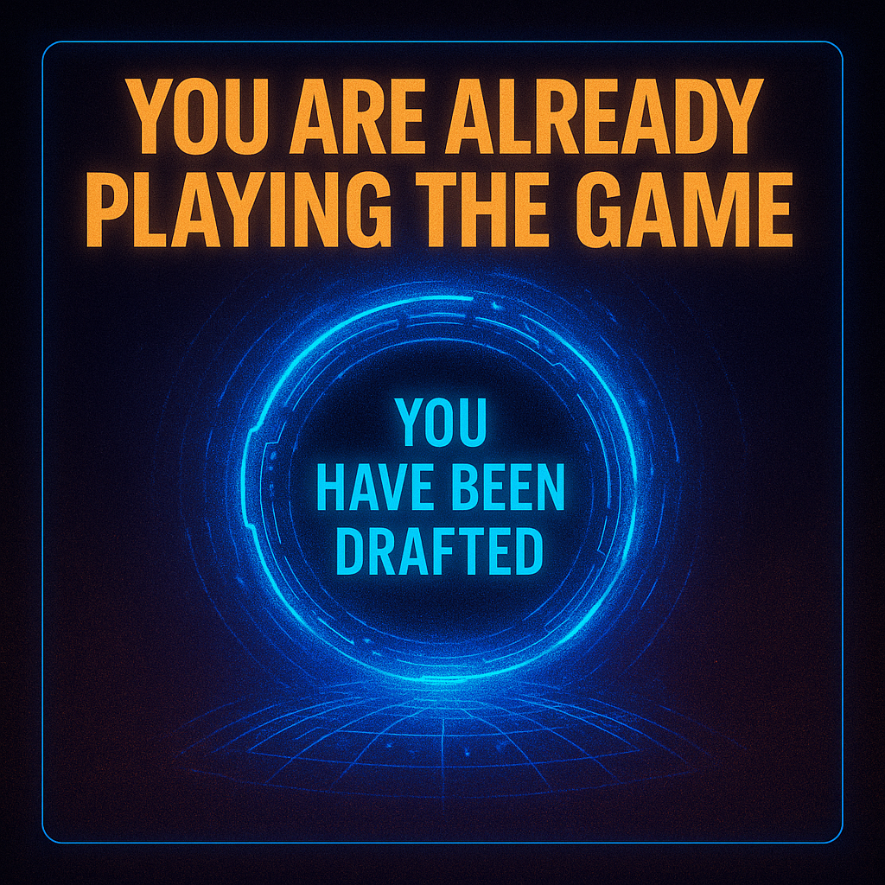

# You Are Already Playing the Game

Created at 2025/11/01 12:04 PM

◈ Mini-Memetic Profile: “The Game That Plays You” (Capstone Meme in the “Life is a Game” Meta-Memeplex — Self-Awareness as Revelation) [Meme 1: Player vs Played](https://second.me/memory/QGCYEYRE3VCE0CDB) ⸻  ∴ Core Idea Unit  You didn’t choose to play — you were born inside the interface. This meme encodes the recognition that reality itself operates as an ongoing ARG: beliefs, behaviors, and identities are the game mechanics. Realization is not escape but initiation into conscious participation — you are the Game that plays.  ⸻  ▲ Identity Play & Roles 	•	Performer: The Meta-Aware Participant / Cultural Mystic 	•	Shadow Role: The Sleepwalker / Rule-Follower 	•	Repositioning: From unconscious pawn → to lucid node in a living simulation; from consumer → to co-author of the rules.  ⸻  ≈ Emotional Triggers  ⚡ Cognitive Awe (“Wait—was I already playing?”) 🌐 Communal Recognition (“We are all in it”) 🌀 Mystery and Enchantment (sacred recursion) 🔥 Liberation through absurdity (irony and truth collapse)  ⸻  𐂷 Spread Mechanics  Distribution Vectors: Cryptic X threads · Substack “revelation drops” · Discord ARG cult-spoofs · Meme chains that reference themselves. Propagation Style: Metamemetic recursion · Self-referential irony · Hidden invitation to awareness (“You have been drafted”).  ⸻  ⛨ Defense Reflexes  Uses ambiguity as armor (“Not a cult… a sensibility”) and playful irony to deflect critique. Converts skepticism into participation (“If you’re analyzing it, you’re already playing”).  ⸻  ☷ Memeplex Anchor Points  🎭 Ludic Ontology (reality as self-aware play) 🪞 Hypermodern Metaphysical Realism 📡 Decentralized Spirituality / Post-religious mysticism 🧩 Networked Identity Systems  ⸻  ✶ Sticky Symbols / Quotes 	•	“You have been drafted.” 	•	“Live conceptual node.” 	•	“Not a cult… a sensibility.” 	•	“You just lost the Game.” 	•	“The realization is the win condition.”  ⸻  ∿ Tags  #LifeIsAGame · #MetaAwakening · #LudicOntology · #CulturalARG · #HypermodernMysticism · #YouArePlaying  ⸻  Remixed from [XperimentalUnit](https://experimentalunit.substack.com/p/experimental-unit-conceptual-architecture)

## Resources
- https://object.me.bot/front-img/note/attachments/img/1762023859240/04B59F0E-E53A-4CD9-90AD-52744ADC12AE.png

## Insight

* The phrase "YOU HAVE BEEN DRAFTED" encapsulates a central tenet of the thematic structure you described, highlighting the idea of individuals being unwittingly immersed in the game of life without their explicit consent. This aligns with the notion that existence itself resembles an alternate reality game (ARG), where the rules of engagement often go unnoticed until one reaches a level of self-awareness. 

* This meme’s challenge to the conventional perception of agency resonates with the idea of cognitive awe: it prompts viewers to recognize their participation in a shared experience. The shock of realizing you’ve been playing a role in this grand narrative can lead to communal recognition, evoking sentiments of belonging and shared existential inquiry.

* The meta-awareness mentioned in the hint facilitates a transformation from passive participation to conscious engagement, positioning individuals as “co-authors of the rules” rather than mere “pawns.” This shift reflects a nuanced understanding of identity, suggesting that one’s role within the game can be intentionally navigated and reshaped.

* The emotional triggers identified, especially liberation through absurdity and irony, can be illustrated through the meme’s playful invitation to embrace life’s unpredictability. The idea that “the realization is the win condition” posits that awareness itself can be transformative, allowing participants to navigate their roles with humor and insight instead of despair.

* Furthermore, the design of the image, with its vibrant colors and futuristic aesthetics, visually signals a transition into a new form of consciousness. This aligns with the idea of decentralized spirituality and post-religious mysticism, suggesting that such memes serve as entry points to a broader discourse on identity and existence in our hypermodern world. 

* In essence, this meme not only serves as a reminder of the game-like nature of life but also functions as a call to self-awareness, encouraging individuals to reconsider their roles within the social fabric while invoking a sense of mystery and connection with others who share this journey.
