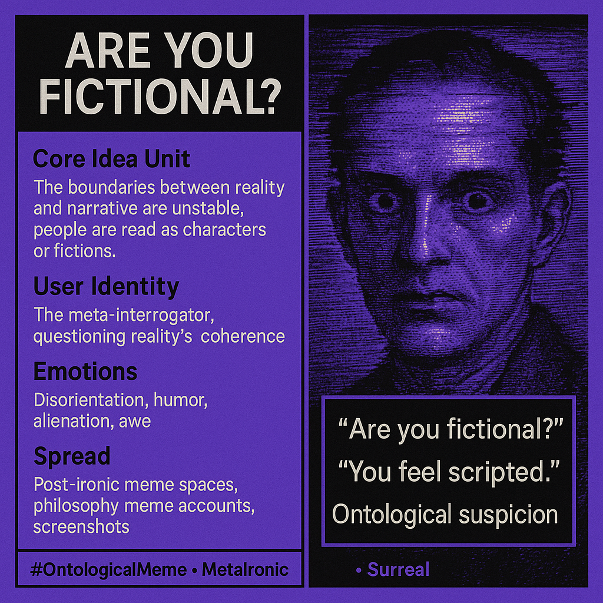

# “Are You Fictional?” Ontological Suspicion Meme

Created at 2025/08/15 10:57 PM

### ◈ Mini-Memetic Profile

Title:

Are You Fictional? — The Meme of Ontological Dissociation

### ∴ Core Idea Unit

- Core belief: The boundaries between reality and narrative are unstable; people can be read as characters or fictions.
- Encodes a frame of ontological suspicion — life as text, individuals as semi-fictional constructs.

### ▲ Identity Play & Roles

- User positioned as the meta-interrogator — someone who questions reality’s coherence.
- Others cast as NPCs, characters, or fictional constructs.
- Can also frame the speaker as an existential trickster, destabilizing certainty.

### ≈ Emotional Triggers

- Disorientation & uncanny feeling (blurring real vs. unreal).
- Humor & irony (absurd deadpan questioning).
- Alienation (suggesting people are scripted).
- Awe/dread (existential vertigo about reality itself).

### 𐂷 Spread Mechanics

- Distribution vectors: Post-ironic meme spaces, philosophy meme accounts, screenshots, chat-logs.
- Propagation style:
    - Short, uncanny direct text (“are you fictional?”).
    - Irony meme caption paired with surreal images.
    - Meta-philosophical commentary in absurdist formats.

### ⛨ Defense Reflexes

- Irony shield: It’s absurdist humor, not serious.
- Philosophical ambiguity: If challenged, meaning slides between joke and metaphysics.
- Gaslight inversion: Criticizing the meme confirms its frame (“only a fictional person would react like that”).

### ☷ Memeplex Anchor Points

- Post-irony memes (#SurrealMemes, #Metamodern).
- Simulation theory & solipsism (“nothing is real”).
- NPC/digital persona discourse (avatars, masks, projection).
- Absurdist internet culture (anti-coherence).

### ✶ Sticky Symbols or Quotes

- “Are you fictional?”
- “You feel scripted.”
- Visuals: glitch aesthetics, uncanny faces, puppet/character imagery, surreal distortion.

### ∿ Tags

#OntologicalMeme #MetaIronic #AreYouFictional #SimulationVibes #NPCQuestion
