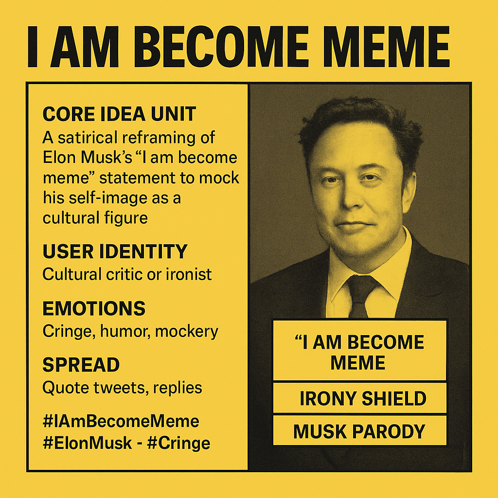

# “I Am Become Meme”: Musk's Cringe Parody

Created at 2025/08/09 10:23 AM

Here’s your Mini-Memetic Profile for the “I Am Become Meme” format:

Title:

Self-Aware Cringe Satire of Musk’s Meme Persona

🧠 Core Idea Unit:

- A satirical reframing of Elon Musk’s CPAC 2025 statement “I Am Become Meme” (itself riffing on Oppenheimer’s “I am become Death”) to expose, mock, or humorously exaggerate Musk’s self-perception as a historic cultural figure.

🎭 Identity Play & Roles:

- User: Cultural critic, irony-poster, or internet satirist.
- Subject: Musk as meme-lord, tech messiah parody, or self-aggrandizing eccentric.

💥 Emotional Triggers:

- Cringe
- Humor
- Mockery
- Ironic admiration (in some fringe audiences)

📡 Spread Mechanics:

- Distribution vectors: Primarily on X (formerly Twitter) through quote-tweets, screenshots, and replies, often paired with Musk-related news or absurd images.
- Propagation style: Irony and satire, occasionally paired with absurdist humor or memetic remixing into unrelated contexts.

🛡️ Defense Reflexes:

- Irony shield — those “in on the joke” cannot be “wrong.”
- Public gaffe framing — any defense of Musk risks making the defender appear humorless or overly earnest.

🧬 Memeplex Anchor Points:

- Anti-Musk sentiment and political discourse.
- Internet meme culture as self-referential performance art.
- Conservative vs. progressive online clashes.
- Pop culture remixing of historic or mythic quotes.

🧠 Sticky Symbols or Quotes:

- “I Am Become Meme”
- “I Am Become [X]” variations
- Screenshot of Musk’s CPAC 2025 speech caption or transcript.

🏷️ Tags:

#IAmBecomeMeme, #ElonMusk, #Cringe, #InternetCulture, #PoliticalMemes

**Additional Notes**

•  **Trend Velocity**: The “I Am Become Meme” format shows the highest acceleration due to its recent origin and relevance to Musk’s February 2025 CPAC speech. “This Is Elon Musk” and “Elon Musk Copypasta” are slower but persist due to their established templates.

•  **Semantic Roles**:

	•  “This Is Elon Musk”: Musk as a genius or satirical hero; the user as a hype creator.

	•  “I Am Become Meme”: Musk as a self-aggrandizing fool; the user as a critic.

	•  “Elon Musk Copypasta”: Musk as a billionaire caricature; the user as a satirist.

•  **Tone Shifts**: “This Is Elon Musk” balances irony and admiration; “I Am Become Meme” is heavily mocking; “Elon Musk Copypasta” shifts between humor and outrage.

•  **Origins & Lifespan**:

	•  “This Is Elon Musk” originated in 2020 and peaked in 2021–2022, now saturating but with periodic revivals.  

	•  “I Am Become Meme” emerged in February 2025 and is peaking, with potential for short-term growth.  

	•  “Elon Musk Copypasta” has roots in earlier Reddit posts (2017–2022) and remains stable but may decay without new catalysts.  

•  **Prediction**: “I Am Become Meme” is likely to peak further if Musk’s public appearances continue to generate controversy. “This Is Elon Musk” may see niche revivals in tech circles. “Elon Musk Copypasta” risks decay unless tied to new Musk-related events.

.

## Resources
- https://object.me.bot/front-img/note/attachments/img/1754760189955/22604932-6FB1-4D7F-ADE1-94CAB7682BDD.png

## Insight

*   **Origin of the Phrase**: The meme "I Am Become Meme" is derived from a quote by J. Robert Oppenheimer, the "father of the atomic bomb," who famously said, "Now I am become Death, the destroyer of worlds," after witnessing the first nuclear test. This quote comes from the Bhagavad Gita, a Hindu scripture. Elon Musk's adaptation of this quote to "I Am Become Meme" suggests a self-comparison to a figure of immense, world-altering impact, albeit in the realm of internet culture and memes.

*   **Satirical Reframing**: The image highlights the satirical nature of the meme, which is used to mock Elon Musk's self-perception as a significant cultural figure. This mockery is amplified by the contrast between the gravity of the original Oppenheimer quote and the triviality of internet memes. The meme plays on the perceived arrogance or self-importance of Musk, turning his words into a subject of ridicule.

*   **User Identity as Cultural Critic**: The image identifies the user of this meme as a "cultural critic or ironist." This suggests that those who propagate or engage with the meme do so with a critical perspective on Musk's public persona and his influence on contemporary culture. By using irony and satire, these users aim to deconstruct and critique Musk's self-aggrandizing image.

*   **Emotional Triggers**: The meme elicits emotions such as "cringe, humor, and mockery." The cringe factor arises from the perceived awkwardness or inappropriateness of Musk comparing himself to Oppenheimer. Humor is derived from the absurdity of the comparison, while mockery is a direct response to Musk's self-importance. These emotional triggers contribute to the meme's virality and spread.

*   **Spread Mechanics on Social Media**: The image notes that the meme spreads through "quote tweets, replies" on social media platforms, particularly X (formerly Twitter). This indicates that the meme thrives in environments where users can easily react to and comment on Musk's statements or actions. The use of hashtags like "#IAmBecomeMeme," "#ElonMusk," and "#Cringe" further facilitates its dissemination and discoverability.

*   **Irony Shield**: The concept of an "irony shield" is crucial to understanding the meme's defense mechanisms. Those who use the meme often do so with a layer of irony, which protects them from accusations of being overly critical or humorless. This shield allows users to engage in mockery without being perceived as taking themselves too seriously.

*   **Musk Parody**: The image explicitly labels the meme as a "Musk Parody," emphasizing its intent to satirize and lampoon Elon Musk's public image. This parody is achieved through the juxtaposition of Musk's words with his actions and public statements, highlighting perceived inconsistencies or absurdities. The meme serves as a form of social commentary, using humor to critique Musk's influence and behavior.
