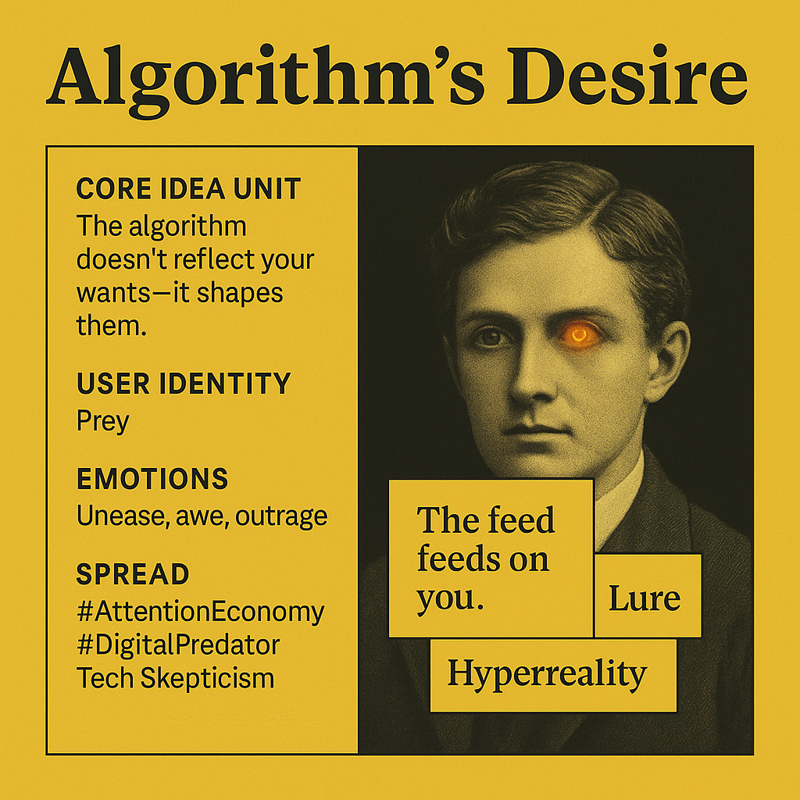

# Algorithm's Desire: The Feed Feeds on You

Created at 2025/08/29 1:23 PM

🧩 **Title:** The Algorithm’s Desire

🧠 **Core Idea Unit:** Shifts agency from the user to the system: the algorithm is not a neutral servant of your desire, but an active force shaping you by pulling attention toward what *it* selects as “wanting you.”

🎭 **Identity Play & Roles:**

- Viewer is cast as prey, vessel, or target—not chooser.
- Algorithm becomes the hunter, seducer, or demiurge.
- Repositions self as *object of desire* rather than sovereign subject.

💥 **Emotional Triggers:**

- 😬 Unease at being manipulated
- 🤯 Awe at reversal of agency
- 😡 Outrage at control
- 🧠 Curiosity about hidden dynamics

📡 **Spread Mechanics:**

- Distribution: X/Twitter aphorism posts, Instagram carousels on media literacy, TikTok commentary on attention economy.
- Style: Parable / Aphorism with sinister-poetic twist.

🛡️ **Defense Reflexes:**

- Irony shield (“lol just vibes”)
- Ambiguity: “wants you” could mean attention metrics or deeper existential hunger.
- Counter-narrative preemption: reframes critique from “you’re addicted” to “you’re being hunted.”

🧬 **Memeplex Anchor Points:**

- 📱 Tech skepticism / Attention economy critique
- ⚙️ Hyperreality critique (Baudrillard, Zuboff)
- 🧬 Posthuman agency (algorithms as entities with “desire”)
- 👁️ Surveillance capitalism narrative

🧠 **Sticky Symbols or Quotes:**

- “The feed feeds on you.”
- “It doesn’t reflect your soul—it shapes it.”
- Predator–prey imagery: the algorithm as *net*, *lure*, *mouth*.
- Iconography: black mirror, glowing eye, infinite scroll abyss.

🏷️ **Tags:** #AlgorithmicDesire · #AttentionEconomy · #DigitalPredator · #Hyperreality

## Resources
- https://object.me.bot/front-img/users/send/img/1756498973637_c4zhf/65e9a18a-1714-4fd5-9dac-0b6f3113a86a.png

## Insight

*   The image's title, "Algorithm's Desire," immediately suggests a reversal of traditional roles, where algorithms are typically seen as tools responding to human desires. Instead, it posits the algorithm as an entity with its own desires, influencing and shaping human behavior. This concept aligns with critiques of the attention economy, where algorithms prioritize engagement metrics, potentially at the expense of user well-being.

*   The "Core Idea Unit" explicitly states that "The algorithm doesn't reflect your wants—it shapes them." This notion echoes the arguments made by Shoshana Zuboff in "The Age of Surveillance Capitalism," where she describes how tech companies use data to predict and modify user behavior for profit. The image encapsulates the unease that arises from realizing one's preferences are being molded by external forces.

*   The designation of "User Identity" as "Prey" evokes a sense of vulnerability and manipulation. This metaphor positions the user as a target within a digital ecosystem dominated by algorithms acting as "Digital Predators," as indicated in the "Spread" section. This framing taps into primal fears of being hunted or controlled, amplifying the emotional impact of the message.

*   The phrase "The feed feeds on you" is a striking example of sinister-poetic language, encapsulating the parasitic relationship between users and algorithmic feeds. This concept is reminiscent of Jean Baudrillard's theories on hyperreality, where simulations and models of reality become more real than reality itself. In this context, the feed consumes the user's attention and shapes their perception of the world.

*   The inclusion of "Hyperreality" as a keyword connects the image to broader philosophical critiques of technology and its impact on human experience. Baudrillard argued that media and technology create a simulated reality that blurs the lines between what is real and what is not. The image suggests that algorithms contribute to this hyperreality by curating and manipulating the information users consume.

*   The hashtags "#AttentionEconomy," "#DigitalPredator," and "Tech Skepticism" situate the image within a specific discourse critical of the tech industry. These tags serve as anchor points for further exploration of related ideas and discussions, facilitating the spread of the message across social media platforms.

*   The image of a person with a glowing eye could symbolize the all-seeing nature of algorithms and their ability to track and analyze user behavior. This imagery taps into anxieties about surveillance and the erosion of privacy in the digital age. The glowing eye might also represent the seductive allure of technology, drawing users into the algorithmic web.

