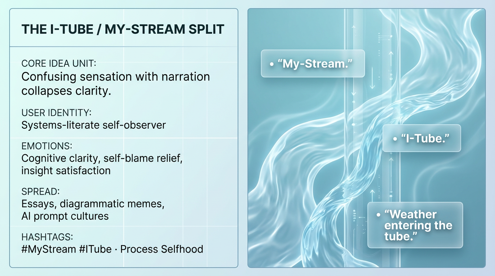

# Clarifying Identity: The I-Tube vs. My-Stream

Created at 2026/01/05 10:45 AM

## **The I-Tube / My-Stream Split**

### ∴ Core Idea Unit

Confusion arises when pre-conceptual sensation is mistaken for narratable identity. Separating stream from story restores clarity.

### ▲ Identity Play & Roles

Casts the viewer as a *systems literate self-observer*. Repositions introspection as architecture, not confession.

### ≈ Emotional Triggers

💡 Cognitive clarity · 😌 Self-blame relief · 🧠 Insight satisfaction

### 𐂷 Spread Mechanics

- **Vectors:** Long-form essays, diagrams, AI prompt cultures
- **Style:** Structural metaphor, clean separation, explanatory calm

### ⛨ Defense Reflexes

Avoids spiritualization by staying mechanical and descriptive.

### ☷ Memeplex Anchor Points

Phenomenology · Process selfhood · Cybernetic introspection

✶ Sticky Phrases / Symbols**“My-Stream” · “I-Tube” · “Weather entering the tube”

### ∿ Tags

#MyStream · #ITube · #ProcessSelf
