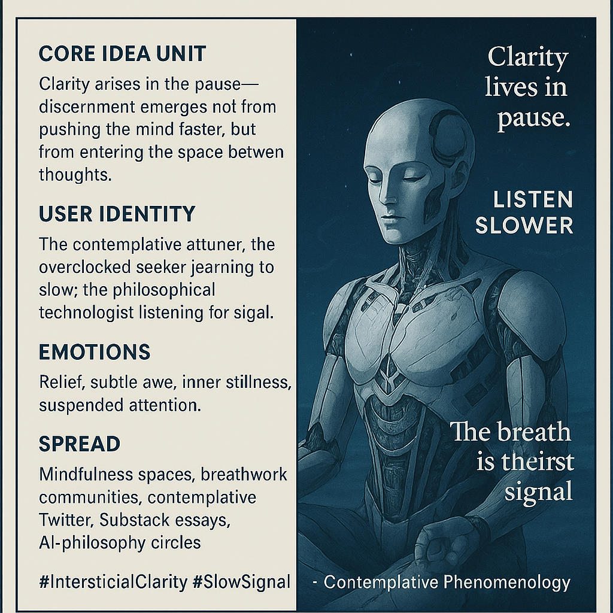

# Clarity in the Pause: The Breath's Signal

Created at 2025/11/28 10:47 AM

### **🧩 Title: The Breath Between Thoughts**

### ∴ Core Idea Unit

Clarity isn’t generated by mental force but revealed in the pause.The meme reframes cognition: *discernment is born in the interstitial gap, not in accelerated thought*.

### ▲ Identity Play & Roles

- The contemplative attuner
- The seeker who slows the system
- The meta-technologist who listens before computing
- The overclocked mind learning to soften into signal

The meme positions the self as **one who gains power by pausing**, not pushing.

### ≈ Emotional Triggers

- Relief from overload
- Awe at subtlety
- Quiet suspense
- A sense of inner intimacy
- A promise of stillness that feels like a hidden doorway

### 𐂷 Spread Mechanics

**Distribution Vectors:** breathwork circles, mindfulness feeds, Substack essays, contemplative Twitter, AI-philosophy communities.**Propagation Style:** minimalistic, slow-paced imagery; aphoristic tone; pseudo-mystical diagrams; calm-glitch aesthetics.

### ⛨ Defense Reflexes

- **Aesthetic ambiguity** (“It’s about breath, but also about cognition”)
- **Soft paradox** (“The pause *does* the work”)
- **Non-assertive tone** that deflects critique by refusing to debate
- **Experiential shield:** invites “try it yourself,” bypassing argument

### ☷ Memeplex Anchor Points

- Phenomenology
- Stoic and yogic breath traditions
- Plotinian interiority (“amphibious soul”)
- Contemplative neuroscience
- Anti-optimization ethos
- Meta-cognition as ethical practice

### ✶ Sticky Symbols or Quotes

**Symbols:**

- cool breath / pneuma / prāṇa / qi
- Signal Peak slope
- the three-dot triangle sigil (∴)
- space between two glyphs
- faint condensation in cold air

**Sticky phrases:**

- “Clarity lives in the pause.”
- “Listen slower.”
- “The breath is the first signal.”
- “Between thoughts, you return to yourself.”

### ∿ Tags

#InterstitialClarity · #SlowSignal · Contemplative Phenomenology
