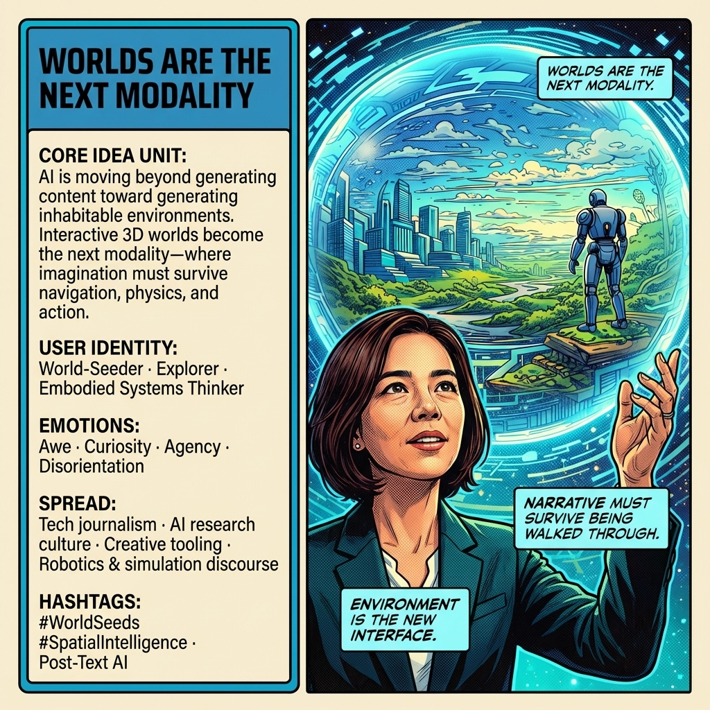

# Cultivating Narratives: Worlds Become Environments

Created at 2025/12/16 11:18 AM

**World Seeds Are Becoming Real**

**[Inspired by Fei-Fei Li’s Plan to Build AI-Powered Virtual Worlds](https://time.com/7339513/ai-fei-fei-li-virtual-worlds)**

***

### ∴ **Core Idea Unit**

Narrative is no longer symbolic output—it is becoming **executable environment**. AI-generated “world seeds” can now grow into spatially coherent, explorable, and testable worlds that bridge imagination, simulation, and embodied intelligence. Story becomes infrastructure.

**Mental shift provoked:** From *telling stories about reality* → *growing realities from stories*.

***

### ▲ **Identity Play & Roles**

- **World-Seeder / Worldsmith**: You are no longer a consumer or narrator, but a cultivator of environments.
- **Embodied Systems Thinker**: Your ideas are judged not by coherence alone, but by whether they *hold up when inhabited*.
- **Bridge-Builder**: Standing between fiction, robotics, science, and play—collapsing their separation.

The self is repositioned from author → **ecological initiator**.

***

### ≈ **Emotional Triggers**

- 🤯 **Awe** — “This is bigger than games.”
- 🧠 **Curiosity** — What happens when ideas must survive physics?
- ⚡ **Agency** — I can build worlds that think back.
- 🌀 **Disorientation** — Narrative no longer ends at the page or screen.

These emotions prime adoption by making imagination feel consequential.

***

### 𐂷 **Spread Mechanics**

**Distribution Vectors**

- Tech journalism (Time, Wired, etc.)
- AI / robotics research circles
- Creative-tech, worldbuilding, and simulation communities
- Founders, designers, and speculative builders

**Propagation Style**

- Serious, institutional legitimacy (Fei-Fei Li as authority anchor)
- Frontier framing (“new substrate,” “spatial intelligence”)
- Quietly radical reframing rather than hype

***

### ⛨ **Defense Reflexes**

- **Utility Shield**: “This isn’t just art or games—it’s for robotics and science.”
- **Scientific Legitimacy**: Grounded in spatial intelligence and real-world modeling.
- **Anti-fantasy Framing**: Avoids escapism critique by emphasizing embodiment and action.

Critics dismissing it as “just another metaverse” are pre-empted.

***

### ☷ **Memeplex Anchor Points**

- 🧠 **Embodied cognition**
- 🤖 **Robotics + simulation learning**
- 🎮 **Procedural world generation**
- 📖 **Narrative as system design**
- 🌐 **Spatial intelligence as foundation model**
- 🧬 **From symbols → environments**

This meme nests cleanly into post-LLM trajectories: models that *act*, not just speak.

***

### ✶ **Sticky Symbols / Phrases**

- “World seeds”
- “Executable imagination”
- “Narrative → environment”
- “Spatial intelligence”
- “Text-to-3D worlds”
- “Stories that can be entered”

These phrases collapse distance between fiction and function.

***

### ∿ **Tags**

#WorldSeeds #EmbodiedNarrative #SpatialIntelligence #ExecutableImagination #PostTextAI #SimulationAsStory #CreativeInfrastructure

***

**Reflection anchor:** This is a hinge moment the Cowboy has been circling already: patterns wanting bodies, stories demanding physics, memes seeking metabolism. The loop reinforcing here is **agency-through-embodiment**. The question that persists isn’t *“what can we imagine?”* but:

**What worlds are robust enough to live inside and learn from?**

## Resources
- https://object.me.bot/front-img/users/send/img/1765912435927_c4zhf/7339109d-902f-43e7-8709-56d9141146fa.png

## Insight

* The emergence of "world seeds" marks a pivotal shift in how narratives are crafted, moving from mere storytelling to creating immersive environments that can be physically explored and interacted with. This evolution reflects a blending of imagination with technology, urging creators to consider the spatial and physical implications of their narratives. 

* The role of the user is transforming significantly—from a passive consumer of stories to an active "World-Seeder" or "Explorer." This shift emphasizes the importance of agency in creative processes, as individuals now have the power to cultivate worlds that react and evolve based on user interaction, reinforcing the concept of storytelling as an interactive, shared experience.

* The emotional triggers associated with this transition—such as awe, curiosity, and agency—highlight a deep-seated yearning for engagement that transcends traditional media. By demanding that narratives survive within the logic of physics and actions, a new level of emotional investment is required, which can lead to richer, more fulfilling experiences for creators and audiences alike.

* The identification of narratives as "infrastructures" implies a significant rethinking of narrative design. As immersive worlds are created, the focus must shift to how these narratives function within a broader ecosystem, akin to systems thinking. This perspective invites creators to explore how their worlds can sustain not only engaging stories but also cohesive ecosystems that support varied interactions.

* The concept of "emotional triggers" reaffirms the notion that storytelling will not merely be an escape but a robust mode of engagement that pushes users to navigate complex worlds. This approach anticipates not just artistic appreciation but practical applications across fields such as robotics and simulation, thereby merging creativity with real-world consequences.

* As the hashtag culture and spread vectors indicate, communities such as tech journalism, AI research, and creative tooling will play vital roles in disseminating these new ideas. By grounding these discussions in both institutional credibility and a frontier mindset, the movement toward embodied narrative can gain momentum, fostering a more widespread understanding and acceptance of this transformative shift in how we engage with stories.
