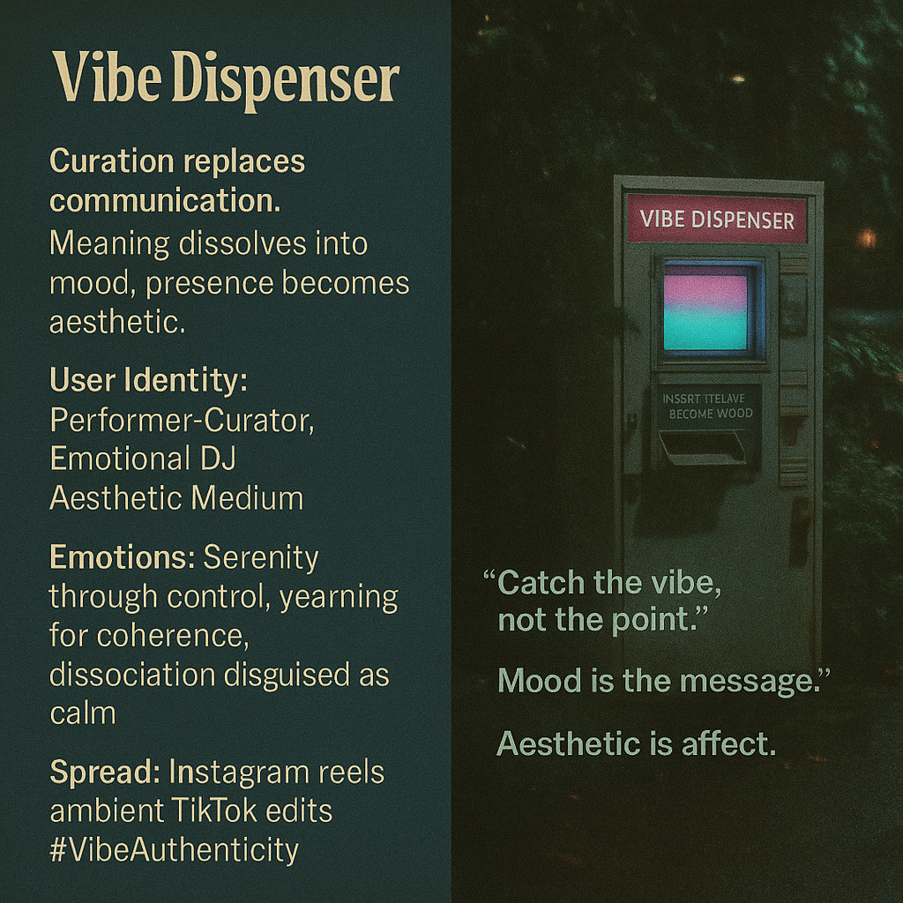

# Curation and Atmosphere: The Vibe Dispenser

Created at 2025/11/10 3:04 PM

### ◈ Mini-Memetic Profile
***

### ∴ Core Idea Unit

Curation replaces communication. The Vibe Dispenser doesn’t share ideas, they emit atmospheres—projecting affective coherence over conceptual clarity. Meaning dissolves into mood. Presence becomes aesthetic.
***

### ▲ Identity Play & Roles

Performer-Curator · Aesthetic Medium · Emotional DJThey inhabit the role of an empathic algorithm, translating identity into sensory ambiance—color palettes, soundtracks, filters, and tones. Authenticity is simulated through taste.
***

### ≈ Emotional Triggers

🌀 Serenity through control✨ Desire for coherence in chaos😶‍🌫️ Dissociation disguised as calm🤍 Yearning for affective connection without vulnerability
***

### 𐂷 Spread Mechanics

Distribution Vectors: Instagram reels, TikTok edits, ambient YouTube mixes, “moodboard” X threads.Propagation Style: Vibe minimalism, aesthetic vapor, lo-fi spirituality. The meme spreads through contagious tranquility and surface-level depth.
***

### ⛨ Defense Reflexes

Irony shield (“it’s just a vibe”) + emotional ambiguity. Critique bounces off because there’s “nothing to critique”—it’s all tone, no thesis.
***

### ☷ Memeplex Anchor Points

#AestheticCapitalism · #PostAuthenticity · #AffectiveDesign · #VibeCore · #NewSincerityAnchored in metamodern oscillation—earnest feeling expressed through curated detachment.
***

### ✶ Sticky Symbols or Quotes

-	“Catch the vibe, not the point.”
-	“It’s giving… coherence.”
-	“Mood is the message.” (McLuhan reloaded)
-	Sunset gradients, vapor diffusion, slow pan filters.
***

### ∿ Tags

#VibeDispenser · #AffectiveAesthetic · #MoodOverMeaning · #DigitalPersona · #SimulatedAuthenticity
