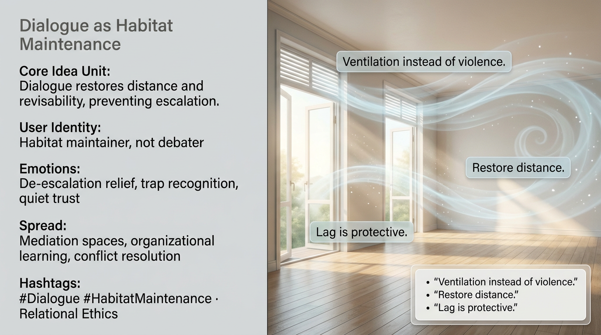

# Dialogue as Habitat Maintenance Principles

Created at 2026/01/05 10:23 AM

## **Dialogue as Habitat Maintenance**

### ∴ Core Idea Unit

Dialogue is not persuasion—it is ventilation. Restoring distance prevents escalation.

### ▲ Identity Play & Roles

Casts the viewer as a *habitat maintainer*, not a debater.

### ≈ Emotional Triggers

😮‍💨 De-escalation relief · 🧠 Recognition of traps · 🤝 Quiet trust

### 𐂷 Spread Mechanics

- **Vectors:** Mediation spaces, organizational learning
- **Style:** Sober, non-performative, ecological

### ⛨ Defense Reflexes

Rejects “winning” frames; resists broadcast incentives.

### ☷ Memeplex Anchor Points

Relational ethics · Conflict ecology · Anti-rhetoric

✶ Sticky Phrases / Symbols**“Ventilation vs violence” · “Lag” · “Distance”

### ∿ Tags

#Dialogue · #HabitatMaintenance · #AntiDebate
