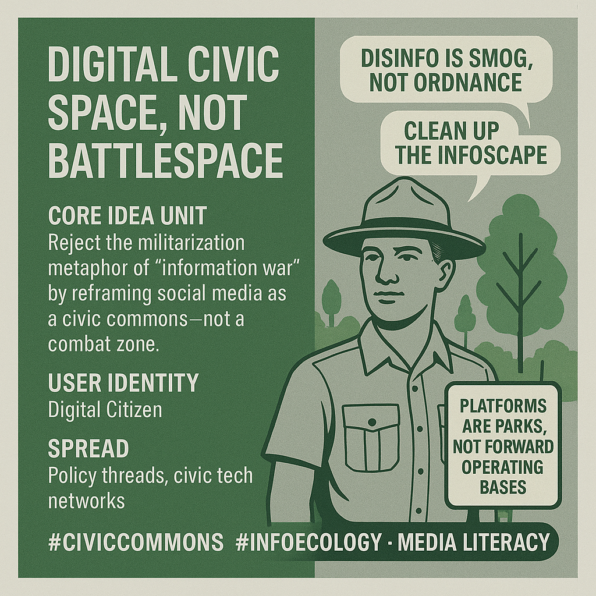

# Digital Civic Space: Platforms as Parks, Not FOBs

Created at 2025/09/07 7:51 PM

🧩 Title:

Digital Civic Space, Not Battlespace

🧠 Core Idea Unit:

Reject the militarization metaphor of “information war” by reframing social media as a civic commons—not a combat zone. This meme swaps war metaphors for ecological and democratic ones to protect civilian norms and reclaim digital agency.

🎭 Identity Play & Roles:

- Role: Digital Citizen
- Archetype: Civic Steward or Park Ranger of the Infoscape
- Repositioning: From “unwitting soldier” → to “co-governor of public discourse”
- Flip: Instead of fighting back, you’re cleaning the air and fixing the pipes.

💥 Emotional Triggers:

- 🧘‍♂️ Relief – Escape from paranoia of total war narrative
- 🧠 Civic clarity – Return to democratic accountability
- 😡 Skepticism – Toward war-logic justifying surveillance
- 🌱 Hope – Belief that we can build healthier digital habitats

📡 Spread Mechanics:

- Distribution Vectors: Policy threads, civic tech networks, info-environmentalist circles, journalism platforms
- Propagation Style: 
    - Thoughtful reframing, civic design infographics
    - Calm rebuttals to militaristic rhetoric
    - Viral aphorisms like “Platforms are parks, not FOBs”
    - Graphic cards with “clean air” vs “toxic smog” metaphors
- 

🛡️ Defense Reflexes:

- 🛡️ Moral framing: Defends speech as democratic right, not battlefield liability
- 🔄 Metaphor shift: Turns combat talk into pollution talk—less panic, more public health
- 🏛️ Civic grounding: Anchors solutions in law, not classified ops
- ⚖️ Accountability redirect: From “attackers” to platforms and profit motives

🧬 Memeplex Anchor Points:

- 🏛️ Democratic theory
- 🌍 Environmental regulation
- 🧠 Cognitive hygiene
- 🧾 Platform transparency law
- 📚 Media literacy
- 📡 Public-interest technology

🧠 Sticky Symbols or Quotes:

- “No covert ops in the civic square.”
- “Platforms are parks, not forward operating bases.”
- “Disinfo is smog, not ordnance.”
- “Clean up the infoscape.”
- Visuals: face masks, park signs, pollution maps, EULA in public squares.

🏷️ Tags:

#CivicCommons · #InfoEcology · #DeMilitarizeDiscourse · #MediaLiteracy · #DemocracyByDesign

## Resources
- https://object.me.bot/front-img/note/attachments/img/1757299913779/E9F0D028-DD1F-4A89-9ED0-4822AE972827.png

## Insight

*   The image advocates for a shift in perspective regarding digital spaces, urging us to view them as civic commons rather than battlegrounds. This is a call to move away from the "information war" metaphor, which often justifies surveillance and aggressive tactics, and instead foster a sense of shared responsibility and stewardship in the digital realm.

*   The concept of "digital civic space" aligns with the principles of the "civic commons," which emphasizes the importance of shared spaces and resources for fostering community, democracy, and well-being. This perspective encourages us to think of online platforms as public spaces that require careful management and protection to ensure they serve the common good.

*   The meme introduces the idea of a "digital citizen" as a "civic steward" or "park ranger of the infoscape." This analogy reframes our role from passive users or "unwitting soldiers" in an information war to active participants in co-governing public discourse. It suggests that we have a responsibility to maintain the health and integrity of the digital environment, much like park rangers protect natural ecosystems.

*   The image uses emotional triggers such as "relief," "civic clarity," "skepticism," and "hope" to resonate with viewers. By offering an escape from the paranoia of a total war narrative and promoting democratic accountability, the meme aims to inspire belief in the possibility of building healthier digital habitats.

*   The spread mechanics of the meme involve thoughtful reframing, civic design infographics, and calm rebuttals to militaristic rhetoric. The use of viral aphorisms like "Platforms are parks, not FOBs" and graphic cards with "clean air" vs "toxic smog" metaphors are designed to make the message more accessible and engaging.

*   The defense reflexes of the meme include moral framing, metaphor shifts, civic grounding, and accountability redirection. By defending speech as a democratic right and turning combat talk into pollution talk, the meme seeks to reduce panic and promote public health approaches to addressing disinformation.

*   The memeplex anchor points include democratic theory, environmental regulation, cognitive hygiene, platform transparency law, media literacy, and public-interest technology. These concepts provide a foundation for understanding and addressing the challenges of the digital information environment.

*   The image employs sticky symbols and quotes such as "No covert ops in the civic square," "Disinfo is smog, not ordnance," and "Clean up the infoscape" to reinforce its message. These memorable phrases and visuals, such as face masks, park signs, and pollution maps, help to create a lasting impression and encourage further engagement with the ideas presented.

