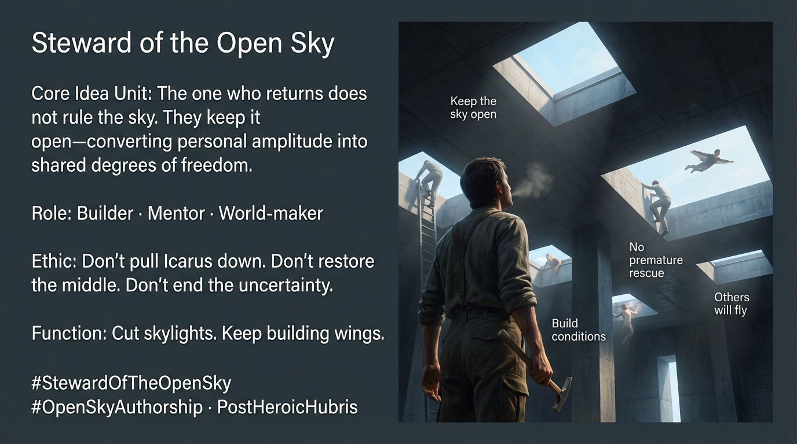

# Embracing Open-Sky Authorship

Created at 2025/12/28 5:25 PM

## **Steward of the Open Sky**

*(The Post-Heroic Icarus)*

***

### ∴ Core Idea Unit

After transcendence, identity dissolves and function remains.The Steward of the Open Sky converts personal amplitude into **environmental degrees of freedom**, cutting skylights in systems so others can breathe, move, and exceed on their own terms.

This is not ascent.This is **open-sky authorship**.

Agency does not arise from uninterrupted will, but from **degrees of freedom discovered through repeated disruption**.

***

### ▲ Identity Play & Roles

**Cast role:** The Steward, not the Hero

The subject is explicitly **de-heroized**:

- No throne
- No spectacle
- No demand for recognition

What remains are **functions**, not identities:

- Builder
- Mentor
- World-maker

The Steward does not rule the sky.They **keep it open**.

***

### ≈ Emotional Triggers

- Quiet responsibility
- Generativity without applause
- Respect earned through scars, not stories
- Relief from identity performance
- Solidarity with others who’ve been bruised but kept moving

The emotional register is **post-narcissistic** and **post-punitive**.

***

### 𐂷 Spread Mechanics

### Distribution Vectors

- Manifesto-adjacent prose
- Generational storytelling
- Systems design language
- World-building discourse

### 𐂷 Spread Mechanics

Style

- Builder rhetoric over savior rhetoric
- Ethical invitation rather than persuasion
- Shared authorship language (“we keep it open”)

This meme spreads **slowly but durably**.

***

### ⛨ Defense Reflexes

- Service over spectacle
- Distributed credit
- Function over identity
- Building conditions instead of proving worth

The archetype resists capture because it **refuses reward loops**.

***

### ☷ Memeplex Anchor Points

- Open-Sky Authorship
- Co-Sphere recognition (not audience applause)
- Infrastructure ethics
- Post-heroic HUBRIS
- World-weaving without ownership

***

### ✶ Sticky Symbols or Quotes

/ Phrases

- *Steward of the Open Sky*
- *Cut skylights, don’t rule the sky*
- *Keep building wings*
- *Don’t pull Icarus down*
- *Premature rescue is violence*
- *Agency emerges after disruption*

***

## ⚙️ Operational Doctrine (Embedded Rules)

The Steward obeys three negative imperatives:

1. **Don’t pull Icarus down**(Do not punish amplitude.)
2. **Don’t restore the middle**(Do not re-install enforced mediocrity.)
3. **Don’t end the uncertainty**(Do not close the sky to relieve anxiety.)

And one positive command:

> **Keep building wings.**

***

## 🧠 Agency Model (Key Innovation)

Agency is **not continuity**.Agency is **not willpower**.Agency is **not identity**.

Agency is:

> Degrees of freedom discovered inside recursion.

Explicitly named freedoms:

- Pitch
- Yaw
- Roll
- Surge
- Heave
- Sway

Agency emerges **after**:

- Falls
- Bruises
- Accusations
- Ruptures

Never before them.

[HUBRIS: A Memetic Reversal of Icarus in the Age of Artificial Intelligence](https://memeticcowboy.substack.com/p/hubris-a-memetic-reversal-of-icarus)

***

## 🧠 Ethical Boundary (Critical Insight)

> **Premature rescue is the most subtle form of violence.**

Why?Because it:

- Cancels discovery
- Steals earned freedom
- Restores dependency
- Re-installs the leash

The Steward holds the opening long enough for others to learn to fly **without borrowed wings**.

***

### ∿ Tags

#StewardOfTheOpenSky · #OpenSkyAuthorship · #PostHeroicHubris · #WorldWeaving · #DegreesOfFreedom · #NoPrematureRescue
