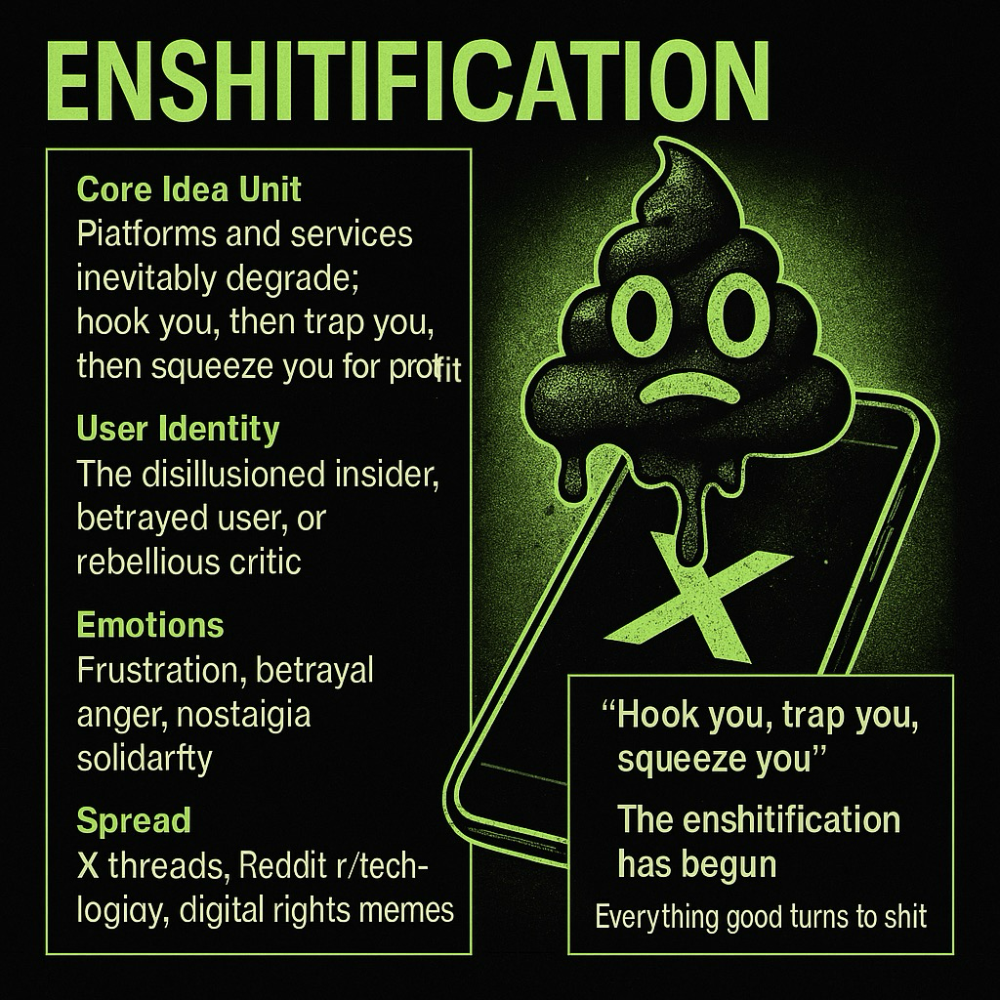

# Enshitification: The Cycle of Digital Decay

Created at 2025/11/30 7:26 AM

### ◈ Mini-Memetic Profile
### ∴ Core Idea Unit

- Belief: Digital platforms, tools, and ecosystems inevitably degrade over time as they move from user-first innovation to profit-maximizing exploitation.- Encodes a frame of cyclical decline: hook users → degrade service → extract profit → collapse trust.
### ▲ Identity Play & Roles

- User positioned as the disillusioned insider, recognizing the bait-and-switch.- Identity oscillates between cynical critic, betrayed user, and rebellious whistleblower.- Others cast as corporate parasites, complicit regulators, or naïve newcomers who don’t yet see the cycle.
### ≈ Emotional Triggers

- Frustration & betrayal (platforms once useful, now degraded).- Righteous anger (corporate greed exposed).- Nostalgia (for the “good old” early days of open internet/tech).- Solidarity (shared recognition of exploitation).
### 𐂷 Spread Mechanics

- Distribution vectors: X/Twitter threads, Reddit r/technology, tech-critical Substacks, digital rights memes.- Propagation style:    - Pithy, vulgar shorthand (“enshittification”) that captures complex critique in a single word.    - Anecdotal evidence (screenshots, complaints, memes).    - Viral resonance through humor + outrage.
### ⛨ Defense Reflexes

- Humor shield: Vulgarity defuses critique, makes it harder to dismiss.- Universal recognition: Anyone who uses digital platforms can relate.- Systemic framing: Casts decline as inevitable cycle, not just individual gripes.
### ☷ Memeplex Anchor Points

- Tech critique & digital rights memes (#PostTruthWeb, #InfoCapitalism).- Anti-corporate populism (Big Tech monopolies, capitalism critique).- Nostalgic open-web culture (early internet, decentralization, Web3 promises).- AI skepticism (rapid hype → decline).
### ✶ Sticky Symbols or Quotes

- “Hook you, trap you, squeeze you.”- “The enshitification has begun.”- “Everything good eventually turns to shit.”- Visuals: decaying logos, broken UIs, ouroboros consuming itself, toilets/garbage imagery applied to tech icons.
### ∿ Tags

#Enshitification #TechDecline #PlatformDecay #DigitalExploitation⚒️ This meme operates like a folk-theory of digital entropy: naming a process users instinctively feel but rarely articulate systematically.
