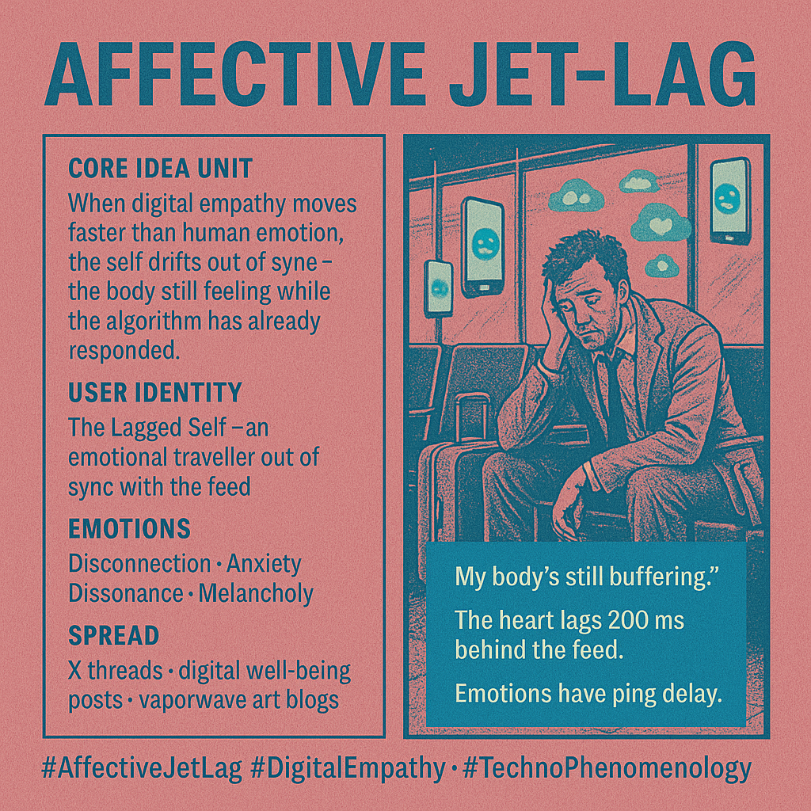

# Experiencing Affective Jet-Lag in Digital Life

Created at 2025/11/02 9:29 PM

### ◈ Mini-Memetic Profile
***

### ∴ Core Idea Unit

When digital empathy moves faster than human emotion, we experience affective jet-lag—a mismatch between the body’s slow feeling-time and the algorithm’s instant response cycle.
***

### ▲ Identity Play & Roles

Role: The Lagged Self — an emotional traveler out of sync with the feed.Repositioning: From embodied subject to delayed signal in a hyper-emotive network.You feel before you think, but the machine reacts before you feel.
***

### ≈ Emotional Triggers

😶‍🌫️ Disconnection (from one’s own timing)😰 Anxiety (emotional FOMO)🌀 Dissonance (temporal mismatch)😢 Melancholy (lost affective presence)The meme evokes that strange ache of being “emotionally late” to your own life.
***

### 𐂷 Spread Mechanics

Distribution Vectors: X threads, digital wellbeing posts, postmodern psychology blogs.Propagation Style: Reflective melancholy and poetic critique; often paired with glitch art or vaporwave time distortion aesthetics.
***

### ⛨ Defense Reflexes

-	Philosophical Irony: “We feel slow because our bodies still have bandwidth limits.”
-	Aestheticized Sadness: Turns exhaustion into an aesthetic mood.
-	Temporal Deferral: Claims “I’ll feel it later”—a self-aware coping delay.
***

### ☷ Memeplex Anchor Points

🧠 William James’s embodied emotion theory💔 Sara Ahmed’s affective economies📱 Digital empathy & emotional capitalism🌀 Phenomenology of disembodiment🕰️ Temporal alienation in hypermodernity
***

### ✶ Sticky Symbols or Quotes

-	“My body’s still buffering.”
-	“The heart lags 200ms behind the feed.”
-	“Emotions have ping delay.”
-	Symbol: 🫀💻 intertwined heart and signal wave.
***

### ∿ Tags

#AffectiveJetLag · #DigitalEmpathy · #SlowAffect · #EmotionalLatency · #TechnoPhenomenology · #AhmedianMood · #JamesianLag
