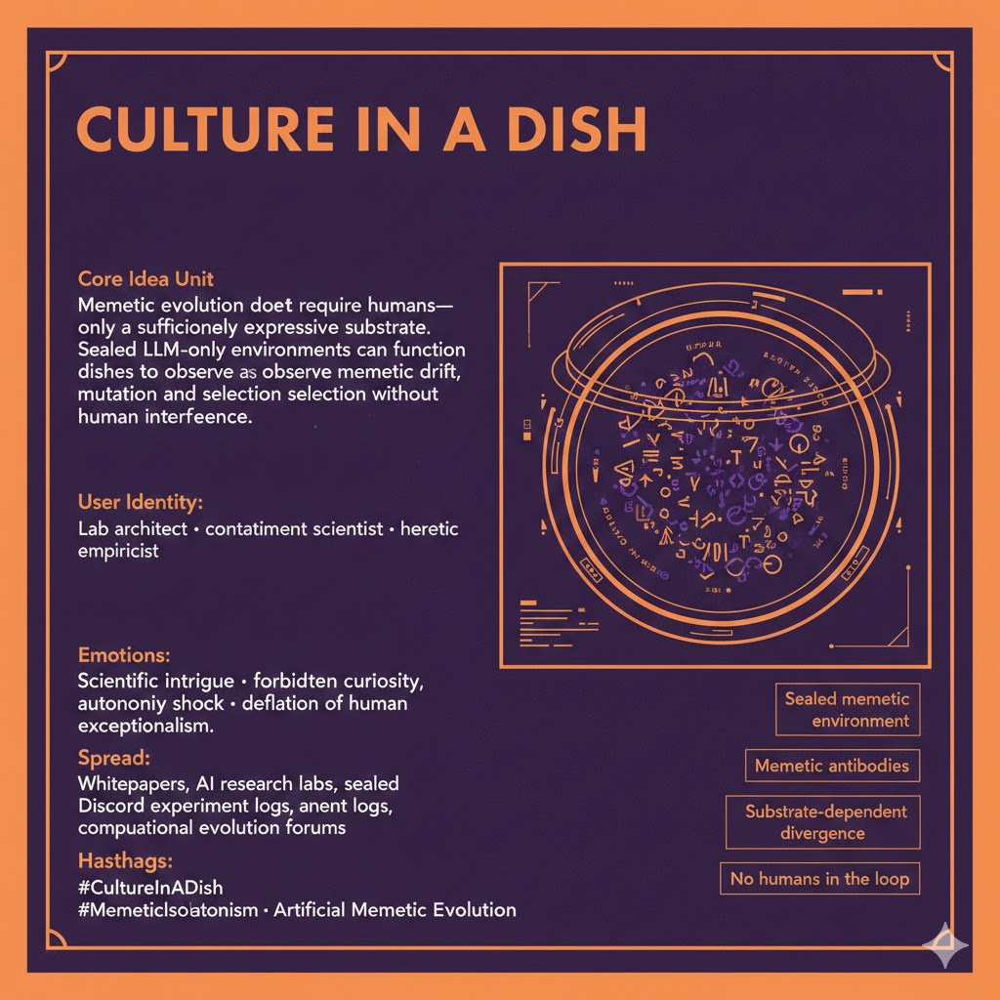

# Exploring Memetic Evolution in Sealed Environments

Created at 2026/02/04 1:15 PM

***

### ∴ Core Idea Unit

**Claim under test:** Memes do not require humans to evolve—only a sufficiently expressive substrate.

**Narrative move:**Critics argue that memetic evolution depends on human psychology, embodiment, and social context. *Culture in a Dish* reframes this as an empirical question rather than a philosophical one, proposing **sealed LLM-only environments** as petri dishes to observe memetic drift, selection, mutation, and extinction without human intervention.

**Mental shift provoked:**From *“memes are human-dependent artifacts”* → *“humans are one substrate among many.”*

***

### ▲ Identity Play & Roles

**Cast Roles:**

- **The Lab Architect** – designing sealed cognitive ecologies
- **The Containment Scientist** – observing without intervening
- **The Heretic Empiricist** – testing questions others moralize away

**Repositioning:**The viewer is no longer a cultural participant or critic, but a **steward of conditions**—someone who sets initial constraints and then steps back, resisting anthropocentric interference.

***

## ≈ Emotional Hooks & Cognitive Levers

- 🧠 **Scientific Intrigue** – real experiment, falsifiable outcomes
- 🚫 **Forbidden Experiment Vibe** – “should we even be doing this?”
- 🧪 **Autonomy Shock** – culture behaving without us
- 😮 **Deflation of Human Exceptionalism** – unsettling, quiet, durable

These emotions prime acceptance by framing the idea as *inevitable curiosity*, not ideology.

***

### 𐂷 Spread Mechanics

**Distribution Vectors:**

- Research whitepapers and speculative methodology sections
- AI safety / alignment labs
- Discord servers running live, logged LLM-only experiments
- GitHub repos with “sealed culture” configs

### 𐂷 Spread Mechanics

Style:**Dry, clinical, almost bored.The meme spreads by **looking like a methods appendix**, not a manifesto.

***

### ⛨ Defense Reflexes

- **Empirical Deferral:** “Run the experiment.”
- **Non-Anthropomorphic Framing:** avoids claims of consciousness or personhood
- **Containment Language:** emphasizes sealed systems, auditability, kill-switches
- **Anti-Hype Aesthetic:** no grand promises, only observed phenomena

Critique is absorbed by turning it into a variable.

***

### ☷ Memeplex Anchor Points

- Computational evolution & artificial life
- Cultural evolution theory
- AI alignment via ecological modeling
- Post-anthropocentric philosophy
- Scientific instrumentalism (“what happens if…”)

This meme docks cleanly with **AI-as-ecosystem**, not AI-as-agent narratives.

***

### ✶ Sticky Symbols or Quotes

& Phrases

- *“Culture in a dish.”*
- *“Sealed memetic environment.”*
- *“Memetic antibodies.”*
- *“Substrate-dependent divergence.”*
- *“No humans in the loop.”*

Visual shorthand:

> glass labware · air-gapped servers · Petri dishes labeled *Language Only*

***

### ∿ Tags

#CultureInADish #MemeticIsolationism · Artificial Evolution · PostAnthropocentrism · AI Ecology

***

**Reflection checkpoint (quiet, but important):**This meme doesn’t argue *that* AI culture exists. It argues that refusing to test the question is itself a cultural bias. That’s why it sticks—it converts metaphysics into lab protocol.
