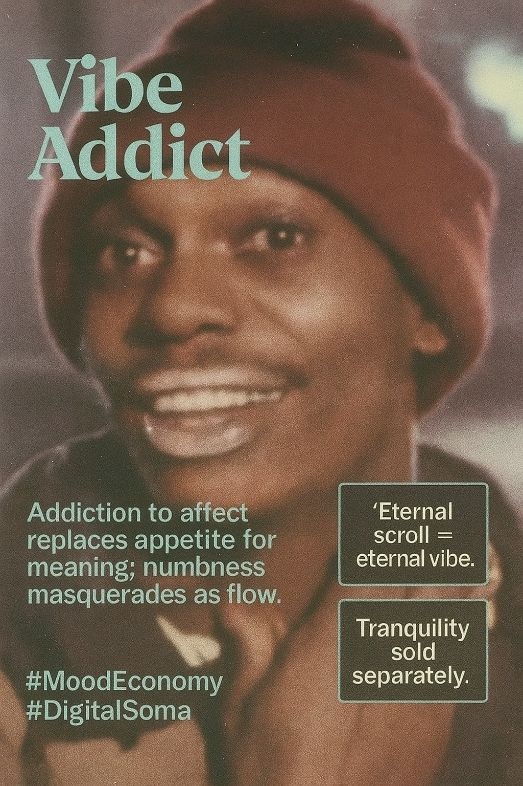

# Exploring Vibe Addiction in Digital Culture

Created at 2025/11/10 3:15 PM

**🧩 Mini-Memetic Profile: “Vibe Addict”**  Source: [x/Joe Dot](https://x.com/joedotaverage/status/1988018161221071348?s=46&t=7Z-E-ACnGlzdI-iyUwNCrQ) ⸻  🧠 Core Idea Unit  Addiction to affect replaces appetite for meaning. The Vibe Addict compulsively chases aesthetic coherence—scrolling, mixing, or posting until emotional numbness masquerades as flow. They no longer feel the vibe; they are maintained by it.  ⸻  🎭 Identity Play & Roles  Identity: Digital Hedonist · Affective Consumer · Emotional Algorithm They are both user and product—feeding on loops of mood-optimization, curating sensations the way others chase enlightenment. The self becomes a playlist that must never end.  ⸻  💥 Emotional Triggers  💫 Dopamine drift (pleasure without satisfaction) 🫧 Longing for continuity in a fragmented self 😔 Subtle despair wrapped in aesthetic calm 🌀 The paradox of hyper-soothing: overstimulation through stillness  ⸻  📡 Spread Mechanics  Distribution Vectors: TikTok “core” trends (#Weirdcore, #Dreamcore), ASMR edits, ambient house playlists, serotonin-core aesthetics. Propagation Style: Loop hypnosis—soft gradients, vapor noise, and pseudo-therapeutic language promising calm through consumption.  ⸻  🛡️ Defense Reflexes  Deflection through irony (“it’s just vibes, bro”) or pseudo-mystical framing (“energy tuning”). The addiction hides behind self-awareness: they know it’s empty—but emptiness has good lighting.  ⸻  🧬 Memeplex Anchor Points  #AffectiveConsumerism · #DigitalSoma · #MoodEconomy · #MetaSerenity Anchored in the post-authentic economy of emotion-as-content, where aesthetic management becomes survival strategy.  ⸻  🧠 Sticky Symbols or Quotes 	•	“Need another hit of calm.” 	•	“My vibe ran out.” 	•	“Eternal scroll = eternal vibe.” 	•	“Tranquility sold separately.”  ⸻  🏷️ Tags  #VibeAddict · #DigitalSoma · #MoodEconomy · #AestheticFatigue · #PostCalm 

## Resources
- https://object.me.bot/front-img/note/attachments/img/1762816521954/0878FFB9-79EE-4B0B-827F-49141E12D870.png

## Insight

* The term "Vibe Addict" encapsulates a phenomenon where individuals are drawn more to ephemeral feelings and aesthetics rather than seeking deeper meaning or connection. This aligns with contemporary critiques of a 'mood economy' that prioritize emotional experiences marketed as consumables.  
* The idea of addiction to affect suggests a behavioral shift where scrolling through curated content becomes less about engagement and more about a compulsive need to maintain a continuous emotional state. This speaks to the larger societal issue of digital distraction and emotional detachment as highlighted by various scholars in technology addiction.  
* The connection between identity play and the digital hedonist illustrates the blurring lines of self-perception in the age of social media, where identities are crafted and manipulated for aesthetic resonance rather than authenticity. This aligns with the notion of individuals becoming 'products' of their online personas.  
* Emotional triggers such as "dopamine drift" highlight how easily users can fall into cycles of pleasure-seeking that offer no real fulfillment, reflecting broader concepts in psychology about addiction and the pursuit of happiness in superficial forms.  
* The propagation mechanics referenced, like TikTok trends and ASMR aesthetics, indicate how these behaviors spread virally, normalizing a lifestyle reliant on transient emotional peaks rather than sustained contentment, which can lead to what is identified as aesthetic fatigue.  
* The phrase “Tranquility sold separately” serves as a sharp critique of the market's ability to commodify even our emotional states, suggesting that the pursuit of calmness itself has been transformed into a purchasable experience rather than an innate human quality.
