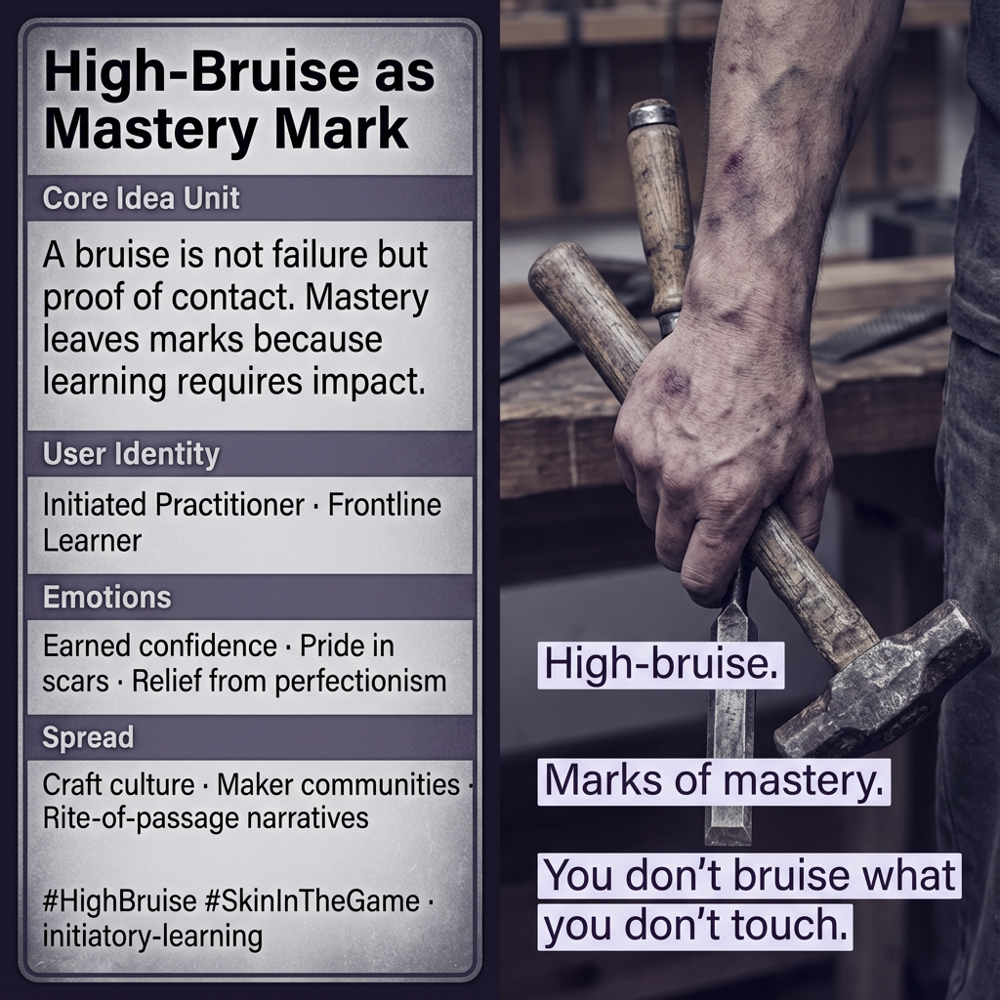

# High-Bruise: Marks of Mastery in Learning

Created at 2025/12/28 1:06 PM

## **High-Bruise as Mastery Mark**

[HUBRIS: A Memetic Reversal of Icarus in the Age of Artificial Intelligence](https://memeticcowboy.substack.com/p/hubris-a-memetic-reversal-of-icarus)

### 🧠 Core Idea Unit

Damage is not evidence of failure but of contact. A bruise marks real engagement with reality, not incompetence.

**Mental shift provoked:** From *“avoid harm to stay credible”* → *“earned impact confers legitimacy.”*

### 🎭 Identity Play & Roles

**Cast as:** Initiated Practitioner / Frontline Learner The user is positioned as someone who has *been hit by the work* and stayed.

**System repositioning:** Credentialism is displaced by embodied proof.

### 💥 Emotional Triggers

- Pride without bravado
- Meaningful pain
- Relief from perfectionism

Primary affect: **earned confidence**

### 📡 Spread Mechanics

- **Vectors:** craft culture, maker communities, rite-of-passage stories
- **Style:** antifragile framing, scar-as-signal narrative

### 🛡️ Defense Reflexes

- Rejects masochism by tying pain to *learning*, not suffering
- Immune to armchair critique (“no bruise, no standing”)

### 🧬 Memeplex Anchor Points

Antifragility · Initiatory learning · Skin-in-the-game ethics

### 🧠 Sticky Symbols / Phrases

- “High-bruise.”
- “Marks of mastery.”
- “You don’t bruise what you don’t touch.”

## Resources
- https://object.me.bot/front-img/users/send/img/1766955984961_c4zhf/11b2044d-7179-4373-8a5b-44c8d8707971.png

## Insight

* The concept of "high-bruise" articulates how physical marks, such as a bruise obtained during a craft or art, symbolize engagement and mastery rather than incompetence. This aligns with the notion that authentic skill is often developed through tangible experiences, emphasizing the importance of participation in the learning process.  
* The left side of the image suggests a narrative of initiated practitioners and frontline learners, which highlights individuals who actively face challenges and embrace risks. This perspective counters credentialism, arguing that legitimate mastery is demonstrated through experience, not merely formal qualifications.  
* Emotional triggers outlined, such as pride without bravado and relief from perfectionism, reflect an emotional maturity that acknowledges both strength and vulnerability. The emphasis on earned confidence signifies a shift from a fear of failure to an appreciation of growth that arises from genuine engagement.  
* Craft culture and maker communities play a critical role in fostering a space that celebrates "marks of mastery." These environments often encourage narrative sharing that reinforces the idea that personal struggles—bruises—are integral to the learning journey, thereby cultivating resilience and community bonding.  
* The antifragility associated with this concept suggests that individuals and communities can thrive in adversity, amplifying their capacity to innovate and adapt. By redefining pain as a teacher rather than a deterrent, this framework encourages participants to explore and create with a spirit of curiosity and exploration.
