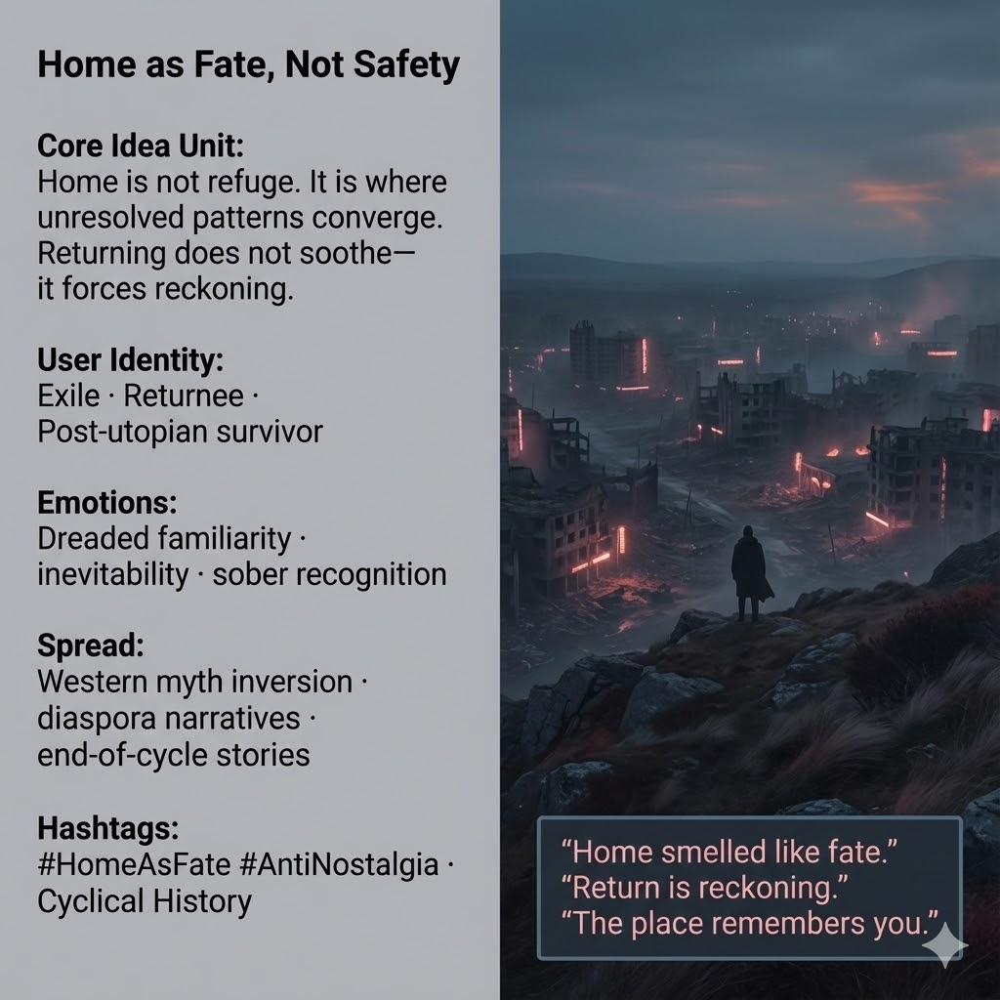

# Home as Reckoning: Confronting Unresolved Patterns

Created at 2025/12/20 1:55 PM

## ◈ Mini-Memetic Profile — **Home as Fate, Not Safety**

***

### ∴ **Core Idea Unit**

Home is often imagined as refuge, rest, or moral shelter. Reframed, home is **where unresolved patterns converge**. Return is not comfort but confrontation—**a reckoning delayed, not avoided**.

**Mental shift provoked:** From *“Going home will make this better”* → *“Going home is where this must be faced.”*

***

### ▲ **Identity Play & Roles**

- **Exile-With-Memory** — carries the unfinished story outward
- **Reluctant Returnee** — comes back knowing nothing is neutral anymore
- **Post-Utopian Survivor** — understands that collapse has a geography

The meme repositions the self from *seeking safety* to **meeting inevitability**.

***

### ≈ **Emotional Triggers**

- 🕯️ Dreaded familiarity
- 🧭 Inevitability without melodrama
- 🧠 Recognition of cyclical pull
- 🌒 Loss of nostalgia as protection

These emotions dissolve the fantasy that distance equals escape.

***

### 𐂷 **Spread Mechanics**

**Distribution Vectors**

- Western myth inversions (the return that isn’t triumphant)
- Diaspora and exile narratives
- End-of-cycle and reckoning stories
- Post-utopian fiction and essays

**Propagation Style**

- Sparse, atmospheric language
- Landscape as moral actor
- Quiet lines that feel unavoidable
- Return scenes without reunion payoff

***

### ⛨ **Defense Reflexes**

- **Anti-sentimentality:** Refuses warm nostalgia
- **Geographic determinism:** Place carries memory whether welcomed or not
- **Temporal framing:** History loops; avoidance only stretches the arc

Critique that seeks comfort collapses against inevitability.

***

### ☷ **Memeplex Anchor Points**

- Anti-nostalgia
- Cyclical history
- Fate as pattern convergence
- Place-based memory
- Post-utopian reckoning

***

### ✶ **Sticky Symbols / Phrases**

- Ridge overlooking Pinktopia
- The long way back
- “Home smelled like fate.”
- Return without refuge
- The place that remembers you

***

### ∿ **Tags**

#HomeAsFate · #AntiNostalgia · #CyclicalHistory · #ReturnIsReckoning · #PostUtopia · #PlaceMemory

***

**Reflection cadence (anchor):** This meme closes a loop running through your ecology: when builders erase themselves and systems collapse, **home is not where you heal**— it’s where the story you postponed finally waits.

## Resources
- https://object.me.bot/front-img/users/send/img/1766267734751_c4zhf/unnamed_%2846%29.jpg

## Insight

* The depiction of home as "where unresolved patterns converge" invites reflection on how environments—particularly those of loss or decay—can act as catalysts for confronting personal narratives that have been avoided. This aligns with themes in literature and psychology where familiar spaces compel individuals to reckon with their past, as seen in works like Virginia Woolf's *To the Lighthouse* or in films focused on homecoming narratives.
  
* The concepts of exile and reluctant return evoke a profound sense of identity conflict present in diaspora literature, where characters grapple with their duality and the haunting familiarity of their origins. This mirrors the ongoing discourse found in works like Chimamanda Ngozi Adichie's *Americanah*, reflecting how physical return does not equate to emotional solace.

* The emotional triggers of "dreaded familiarity" and "inevitability" resonate with the notion of cyclical history, asserting that patterns of trauma and memory are often revisited rather than escaped. This concept is prevalent in postmodern literature, where landscapes become characters in their own right that challenge protagonists, akin to Cormac McCarthy's desolate settings that reflect humanity's struggles.

* The idea of "return without refuge" critiques the romanticized notion of homecoming, suggesting that the home is not a sanctuary but a space that bears the weight of collective and individual memories. This perspective can be explored further in contemporary storytelling that emphasizes realism over nostalgia, like the works of authors examining post-apocalyptic themes, where characters return to ravaged landscapes filled with the ghosts of their past.

* The use of "sticky symbols," such as "Home smelled like fate" and "The place remembers you," effectively encapsulates the emotional weight of place-based memory. These phrases underscore the unavoidable nature of returning to one's roots while reminding us of the indelible impact that our environments have on our identities. This resonates with theories in environmental psychology that explore how spaces shape human experience and narrative.
