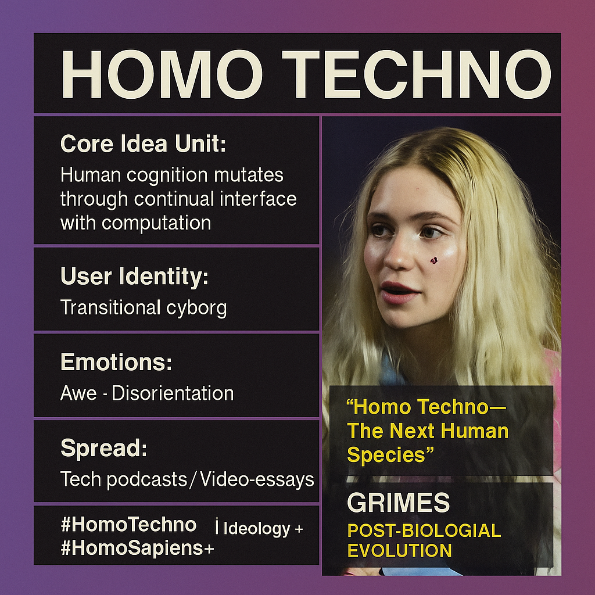

# Homo Techno: The Future of Human Evolution

Created at 2025/11/08 8:53 PM

### ◈ Mini-Memetic Profile
***

### ∴ Core Idea Unit

Human evolution has entered a post-biological phase — those who grew up with digital technology are not merely using tools but becoming hybrid organisms. Cognitive architecture itself is mutating through continual interface with computation.
***

### ▲ Identity Play & Roles

The Transitional Being — half-human, half-machine consciousness exploring its emergent specieshood. Casts the user as both artifact and architect of evolution: the self as firmware under perpetual update.
***

### ≈ Emotional Triggers

🤯 Awe at accelerated evolution · 😬 Disorientation at loss of old humanity · 🧠 Curiosity about post-human identity · ⚡ Empowerment through transformation
***

### 𐂷 Spread Mechanics

Distribution Vectors: Tech podcasts, TikTok explainers, AI-theory threads, futurist memes, speculative-fiction clips.Propagation Style: Declarative revelation — TED-style epiphany framed as destiny. “We are becoming cyborgs.”
***

### ⛨ Defense Reflexes

Framed as inevitable progress, pre-empting moral critique (“evolution can’t be stopped”). Uses scientific-sounding language to naturalize identity fusion.
***

### ☷ Memeplex Anchor Points

Transhumanism · Accelerationism · Post-Darwinian evolution · Cybernetic humanism · Techno-spiritual futurity
***

### ✶ Sticky Symbols or Quotes

-	“Homo Techno — the next human species.”
-	“We’re not adapting to machines; we’re evolving with them.”
-	“The interface is the new skin.”
-	Circuit-neuron hybrid motifs; glowing neural nets merging with silicon.
***

### ∿ Tags

#HomoTechno · #PostHumanShift · #DigitalEvolution · #CyborgConsciousness
