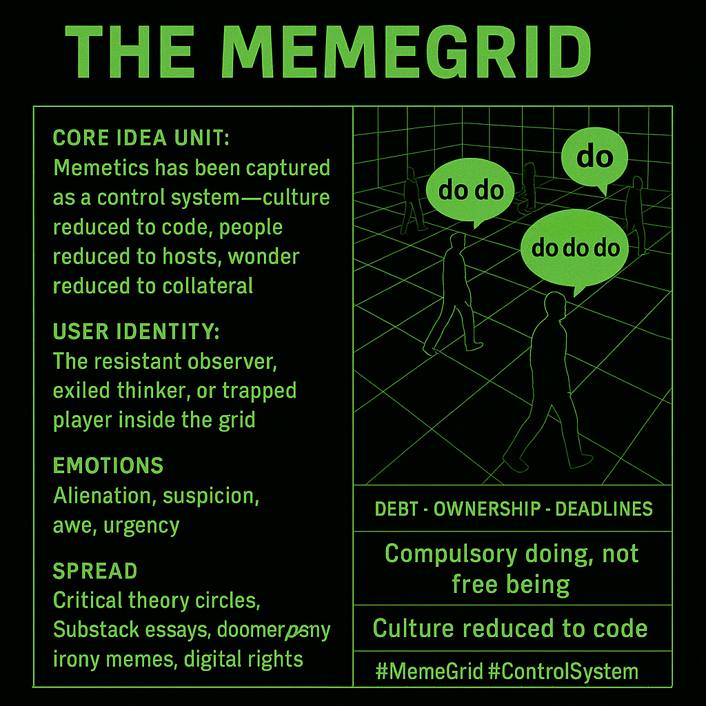

# MemeGrid: Culture as Code Control System

Created at 2025/08/17 11:18 AM

📌 **Mini-Memetic Profile: “The MemeGrid”**

***

**Title:***The MemeGrid — Memetics as a System of Control*

[Full definition](https://app.me.bot/public/FHRH58T20BRUWWAZ)

***

**🧠 Core Idea Unit:**

- Belief: What began as a framework for understanding culture (memetics) has been captured and repurposed into a **control system** — locking individuals into cycles of compulsory action, predictive modulation, and cultural capture.
- Encodes a frame of **memetic enclosure**: culture-as-code, identity-as-algorithm, wonder-as-collateral.

***

**🎭 Identity Play & Roles:**

- User positioned as the **resistant observer** or **exiled thinker**, seeing the invisible grid.
- Others are **hosts** (unknowingly reproducing the system) or **engineers of the grid** (marketers, militaries, platforms).
- Identity of the meme-grid aware is ambivalent: both **seer** (gnostic insight) and **trapped player**.

***

**💥 Emotional Triggers:**

- **Alienation** (loss of authorship, identity reduced to patterns).
- **Paranoia/suspicion** (everything is instrumentalized).
- **Awe/dread** (the grid as a metaphysical system).
- **Urgency** (to exit or resist cycles of compulsory doing).

***

**📡 Spread Mechanics:**

- **Distribution vectors:** Substack essays, critical theory spaces, memetic studies circles, alt-critical meme communities.
- **Propagation style:**
    - High-concept jargon (DODO loop, MemeGrid, compulsory doing).
    - Explanatory diagrams, pseudo-academic tone.
    - Viral resonance via disillusionment with platforms + culture industry.

***

**🛡️ Defense Reflexes:**

- **Totalizing shield:** Any critique is proof of the MemeGrid’s operation (“your argument is itself co-opted”).
- **Irony inversion:** Attempts to joke about it risk becoming examples of “irony poisoning.”
- **Moral reframing:** Resistance is painted as moral obligation (to preserve freedom, creativity, wonder).

***

**🧬 Memeplex Anchor Points:**

- **Critical theory lineages** (Debord’s spectacle, Baudrillard’s simulation, Fisher’s capitalist realism).
- **Techno-political critique** (surveillance capitalism, algorithmic feeds, narrative warfare).
- **Spiritual-existential anchors** (loss of wonder, soul at stake).
- **Doomer/post-irony meme culture** (naming the trap).

***

**🧠 Sticky Symbols or Quotes:**

- “The MemeGrid.”
- “Compulsory doing, not free being.”
- “Debt, Ownership, Deadlines, Othering (DODO).”
- “Culture reduced to code.”
- Visuals: grids, cages, DODO cycle, people as nodes in circuitry.

***

🏷️ **Tags:** #MemeGrid #ControlSystem #DODOloop #MemeticEnclosure #CultureAsCode

## Resources
- https://object.me.bot/front-img/users/send/img/1755454710707_c4zhf/190216a8-3b74-44d7-aff0-fbcc836bd6ca.png

## Insight

*   The image encapsulates the concept of "The MemeGrid," portraying memetics—originally a framework for understanding cultural information spread—as a captured and repurposed control system. This system allegedly locks individuals into cycles of "compulsory doing," predictive modulation, and cultural capture, reducing culture to code and identity to an algorithm.

*   The visual representation of people walking on a grid with speech bubbles containing "do," "do do," and "do do do" emphasizes the idea of individuals unknowingly trapped in repetitive actions dictated by the system. This resonates with the concept of "compulsory doing" mentioned in the provided text, suggesting a loss of free will and autonomy.

*   The emotional triggers listed—alienation, suspicion, awe, and urgency—highlight the psychological impact of perceiving this "MemeGrid." Alienation stems from the loss of authorship and identity reduction, while suspicion arises from the instrumentalization of everything. Awe and urgency reflect the metaphysical nature of the grid and the need to escape its cycles.

*   The mention of "critical theory lineages" such as Debord's spectacle, Baudrillard's simulation, and Fisher's capitalist realism anchors the "MemeGrid" concept in established critiques of modern society. These theories explore how power structures shape perception and behavior, aligning with the idea of a memetic control system.

*   The "defense reflexes" of the MemeGrid, such as the "totalizing shield" and "irony inversion," suggest a self-reinforcing system that is difficult to critique or resist. This alludes to the challenges of escaping memetic enclosure, where any attempt to challenge the system is co-opted as further evidence of its operation.

