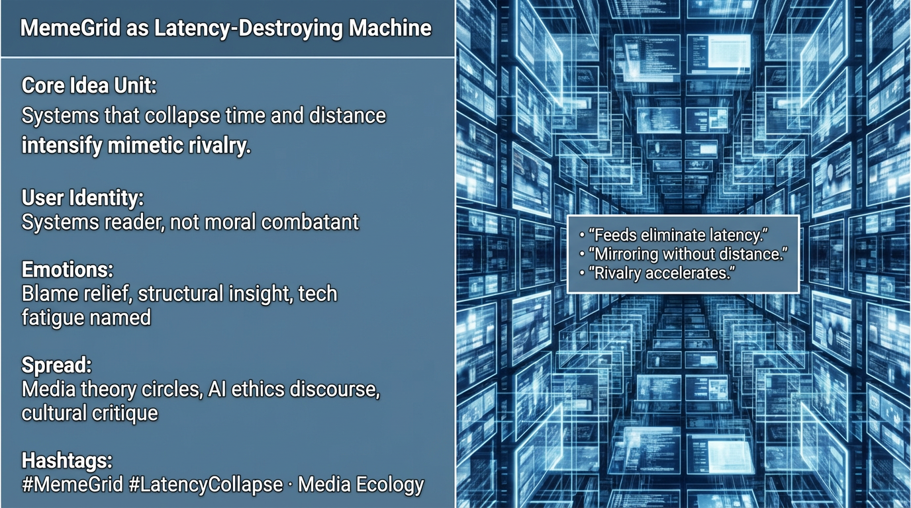

# MemeGrid: The Accelerator of Mimetic Rivalry

Created at 2026/01/05 10:19 AM

## **MemeGrid as Latency-Destroying Machine**

**🧠 Core Idea Unit** Outrage is structural. Systems that erase latency intensify rivalry regardless of intent.

**🎭 Identity Play & Roles** Casts the viewer as a *systems reader*, not a moral combatant.

**💥 Emotional Triggers** 😮‍💨 Blame relief · 🧠 Structural insight · 😵 Tech fatigue named

**📡 Spread Mechanics**

- **Vectors:** Media theory, AI ethics, long-form critique
- **Style:** Diagnostic, de-personalized

**🛡️ Defense Reflexes** Sidesteps villain narratives by centering machinery.

**🧬 Memeplex Anchor Points** Media ecology · Girardian dynamics · Platform critique

**🧠 Sticky Phrases / Symbols** “Latency collapse” · “Feeds eliminate distance” · “Mirroring”

**🏷️ Tags** #MemeGrid · #Latency · #MediaEcology

## Resources
- https://object.me.bot/front-img/users/send/img/1767637165200_c4zhf/e130025e-36fd-4001-8fac-ceab3ffcadca.png

## Insight

* The concept of **"latency collapse"** reflects a critical shift in how media systems operate, illustrating that technology can compress time and space to enhance competition. This dynamic is increasingly visible in social media environments where immediacy fosters a frenetic pace of exchange, often leading to heightened rivalries among users and platforms.  
  
* The identification of users as **"systems readers"** rather than moral combatants encourages a more analytical approach to media consumption. This perspective promotes understanding the underlying structures and dynamics at play, shifting away from a simplistic view of good versus evil narratives often portrayed in media.  

* Emotional responses such as **blame relief** and **tech fatigue** emerge from the rapid pace of information exchange. Users may experience a paradox where rapid access to information leads to superficial engagement and eventual emotional exhaustion, necessitating a critical examination of the effects of such a media landscape.  

* The reference to **media theory and AI ethics** highlights the current discourse surrounding the implications of technology in society. As concepts like **"feeds eliminate latency"** gain traction, discussions around responsibility, algorithmic ethics, and the societal impacts of media become crucial in evaluating the consequences of these systems.  

* The terms **"mirroring"** and **"rivalry accelerates"** underscore the emergence of competitive dynamics in digital interactions. Users may find themselves in echo chambers that amplify rivalries, reflecting the Girardian dynamics of mimetic desire, where imitation leads to conflict and competition, thus intensifying emotional engagement with content.
