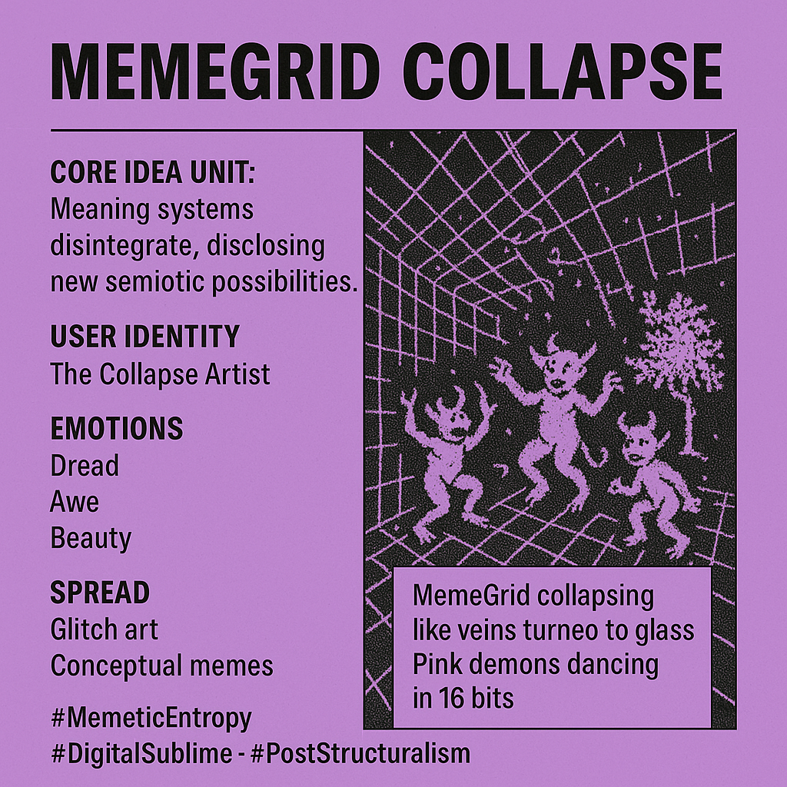

# MemeGrid Collapse: Aesthetic Freedom in Entropy

Created at 2025/11/08 5:14 PM

### ◈ Mini-Memetic Profile

### ∴ Core Idea Unit

Meaning systems, once centralized and coherent, disintegrate under the weight of their own totality. In collapse, new semiotic freedoms emerge — chaos as generative terrain.

***

### ▲ Identity Play & Roles

**The Collapse Artist** — one who watches structure die without mourning, shaping sense from the noise.The user performs as both theorist and witness, composing art from breakdown and fragments from failure.

***

### ≈ Emotional Triggers

- Dread at the implosion of order
- Awe at the emergence within entropy
- Aesthetic pleasure in collapse — beauty in disarray

***

### 𐂷 Spread Mechanics

**Distribution Vectors:** Animated glitch art, conceptual memes, post-structural discourse threads, theory-laced visual essays.**Propagation Style:** Digital sublime — slow-motion collapse rendered with reverence; oscillating between tragedy and transcendence.

***

### ⛨ Defense Reflexes

- Irony through overload — too abstract to co-opt
- Sublime distance — frames entropy as inevitability, not failure
- Aesthetic fatalism — collapse becomes content

***

### ☷ Memeplex Anchor Points

- ⚙️ **Cybernetic Systems Thinking** — recursive failure and adaptation
- 🔮 **Post-Structuralism** — death of master narratives
- 🌀 **Decentralization Ethos** — distributed sense-making
- 💽 **Digital Sublime Aesthetic** — beauty through breakdown

***

### ✶ Sticky Symbols or Quotes

- “The MemeGrid collapses like veins turned to glass.”
- “Pink demons dancing in 16 bits.”
- “Screaming in colorized silence.”
- “They weren’t gods of elegance.”

***

### ∿ Tags

#MemeticEntropy · #DigitalSublime · #CollapseAesthetics · #PostStructuralism

***

**Interpretive Note:**“MemeGrid Collapse” is not despair but liberation — a ritualized decomposition of centralized meaning into plural, living fragments. The grid’s death births a lattice of potentiality, where signal and noise re-enter the dance of becoming.
