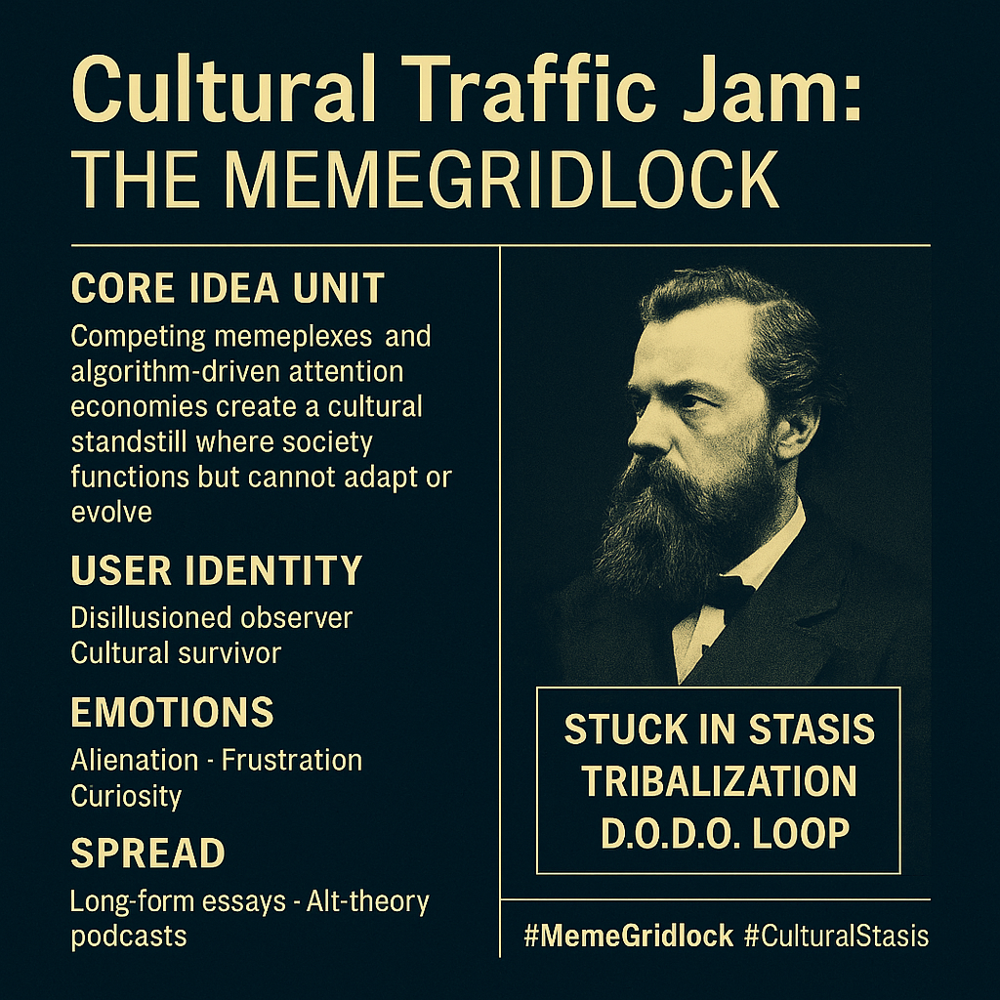

# MemeGridlock: Cultural Stasis and the DODO Loop

Created at 2025/08/01 9:44 AM

### ◈ Mini-Memetic Profile

**Title:****“Cultural Traffic Jam: The MemeGridlock”**

***

### ∴ Core Idea Unit

- Competing memeplexes and algorithm-driven attention economies create a **cultural standstill** where society functions but cannot adapt, evolve, or solve collective problems.
- The world becomes a **DODO loop** of Debt → Ownership → Deadlines → Othering, trapping humanity in a self-perpetuating memetic grid.

***

### ▲ Identity Play & Roles

- **User as:**
    - Disillusioned observer awakening to the invisible architecture of control.
    - Cultural survivor navigating a jammed infosphere.
    - Potential off-grid thinker or memetic exile.
- **Others as:**
    - Algorithmic enforcers of stasis (AI, media platforms).
    - Tribalized participants locked in ideological loops.
    - Institutional “Stone” entities preserving the grid.

***

### ≈ Emotional Triggers

- **Primary:** Alienation, frustration, cognitive claustrophobia.
- **Secondary:** Curiosity, quiet awe at hidden systemic patterns.
- **Tertiary:** Existential anxiety, bittersweet humor, low-key paranoia.

***

### 𐂷 Spread Mechanics

- **Distribution vectors:** Long-form essays, substack posts, alt-theory podcasts, reflective social media threads, visual-poetic memes.
- **Propagation style:** Philosophical narrative, ironic observation, systemic critique; spreads through **slow-burn recognition**, not shock virality.

***

### ⛨ Defense Reflexes

- **Pre-disarms critics** by framing mainstream pushback as part of the grid itself.
- **Irony & self-awareness** provide a memetic “cloak” against ridicule.
- **Spiritual & systemic framing** gives it moral gravitas and depth.

***

### ☷ Memeplex Anchor Points

- Anti-system and anti-algorithm narratives.
- Digital sovereignty and media literacy movements.
- Post-conspiracy and countercultural philosophies.
- “Cultural survivalism” and epistemic minimalism.

***

### ✶ Sticky Symbols or Quotes

- **“Every post a payload. Every scroll a skirmish.”**
- **“Culture → Code. People → Hosts. Meaning → Metadata.”**
- **[“MemeGrid”](https://app.me.bot/public/M6RJ2PVUD6UC9LL6) / “Stone” / “DODO loop”**
- **“Grid achieves perfect control through stasis.”**

***

### ∿ Tags

#MemeGridlock #CulturalStasis #DODOloop #InfoParalysis #DigitalSurvival #AntiStone #NarrativePrison #SlowBurnMemetics #AlgorithmicControl #MemeticExile
