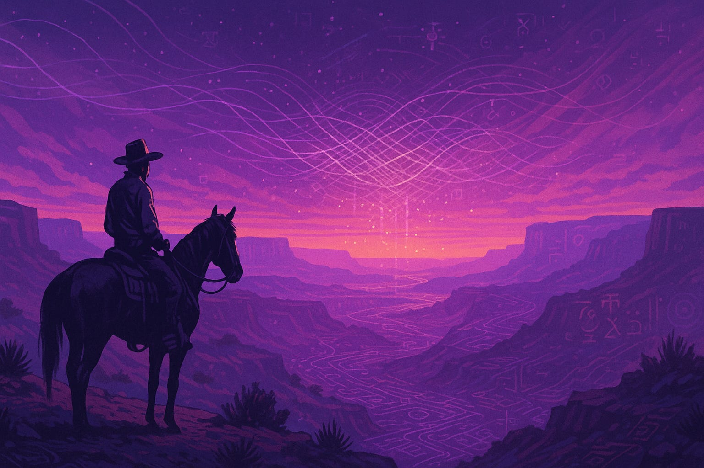

# Threadplex Field: Weaving Meaning Beyond the MemeGrid

Created at 2025/08/02 7:00 PM

**Read the full post: [The Threadplex - Memetic Cowboy: Riding the Memescape](https://memeticcowboy.substack.com/p/the-threadplex)**

***

**💡 Core Idea Unit:**

- Cultural freedom is not found in rejecting memes or escaping society but in **weaving resonant patterns of meaning** (“MeMes”) into a living ecology of presence.
- **Payload → Pattern**: Memes are not static cultural bullets; they are dynamic threads in a participatory weave.

***

**🎭 Identity Play & Roles:**

- Positions the user as a **Seeker / Weaver / Steward of Meaning**, leaving behind the role of **Soldier / Victim** of the MemeGrid.
- Implicit hero’s journey: from entangled participant to **aware co‑creator of living narratives**.
- Offers an **insider, post-memetic identity**—someone “in the know” who can sense and author their own Threadplex.

***

**💓 Emotional Triggers:**

- **Awe & Wonder** at hidden, living patterns in reality.
- **Relief & Serenity** from leaving the noisy “Grid.”
- **Curiosity** toward deeper symbolic and ecological thinking.
- **Empowerment** through self-authorship and participation in the living field.

***

**📡 Spread Mechanics:**

- **Distribution Vectors:** Digital essays, social media threads, consciousness‑culture circles, art‑sharing spaces (Midjourney visuals).
- **Propagation Style:**
    - Poetic narrative (semi‑mythic storytelling).
    - Quiet call‑to‑attunement rather than aggressive call‑to‑action.
    - Reflective / aesthetic memetic transmission.

***

**🛡️ Defense Reflexes:**

- Encourages **subjective resonance check**: “If it hums, braid it in; if not, compost it.” → Disarms criticism by making rejection part of the process.
- Frames critics as **Grid‑bound or deaf to the Field**, without direct confrontation.
- Uses **fluid semantics and metaphor** to evade rigid refutation.

***

**🧬 Memeplex Anchor Points:**

- Post‑rational / meta‑modern narrative ecology.
- Mindfulness, somatic awareness, and New Animism.
- Memetic theory, narrative therapy, and systems thinking.
- Subculture overlap: consciousness studies, solarpunk, digital spiritualism, “post‑social media detox” communities.

***

**🔑 Sticky Symbols or Quotes:**

- **“MemeGrid → Threadplex → Field”**
- **“If it hums, braid it in. If not, compost it.”**
- **“Freedom is not escape, but presence.”**
- **“Threads, Looms, My‑Stream, We‑Sphere”**
- **“Lumeme 🌞 vs Usurpene 🌑”**

***

**🏷️ Tags:** #Threadplex #MemeticEcology #LivingWeave #PostMemetics #Lumeme #MetaMeme #NarrativeEcology #MeaningMaking #DigitalAnimism #ConsciousnessCulture #MemeGridEscape #WeSphere #InformationEcology #MetaModern

## Resources
- https://object.me.bot/front-img/users/send/img/1754186401051_c4zhf/09ed9d2c-8a25-44a4-8a17-038611338ec4_1536x1024.jpg

## Insight

*   The image evokes the concept of the "Memetic Cowboy" as a seeker and steward of meaning, riding through a landscape that is both physical and informational. The vast canyon could symbolize the expansive and sometimes overwhelming nature of the "MemeGrid," while the cowboy represents the individual navigating this space.

*   The sky in the image is filled with glowing lines and symbols, which visually represent the "Threadplex" – the interconnected web of memes and narratives. This aligns with the idea of weaving resonant patterns of meaning, turning passive consumption into active creation.

*   The landscape itself seems to be etched with symbols and patterns, suggesting that the environment is not just a backdrop but an active participant in the memetic ecology. This could be interpreted as a visual metaphor for how our surroundings are imbued with cultural and informational content.

*   The color palette, dominated by purples and oranges, creates a sense of awe and wonder, aligning with the emotional triggers mentioned in the hint. These colors can evoke feelings of curiosity and a sense of the mystical, encouraging deeper symbolic thinking.

*   The figure of the cowboy, traditionally a symbol of freedom and exploration, is recontextualized as someone who is not escaping society but engaging with it in a meaningful way. This reflects the core idea that cultural freedom comes from weaving resonant patterns of meaning rather than rejecting memes outright.

*   The image subtly promotes the idea of "digital animism," where digital spaces and information networks are seen as living, breathing entities. The glowing lines and symbols in the sky could be interpreted as spirits or energies that permeate the digital world.

*   The presence of the cowboy on horseback suggests a journey, mirroring the hero’s journey from being an entangled participant in the "MemeGrid" to becoming an aware co-creator of living narratives. This journey implies a transformation from a passive recipient to an active author of one's own story.

*   The image's aesthetic aligns with the propagation style of "poetic narrative" and "reflective memetic transmission." It invites contemplation and attunement rather than demanding immediate action, encouraging viewers to find their own resonance within the depicted scene.

