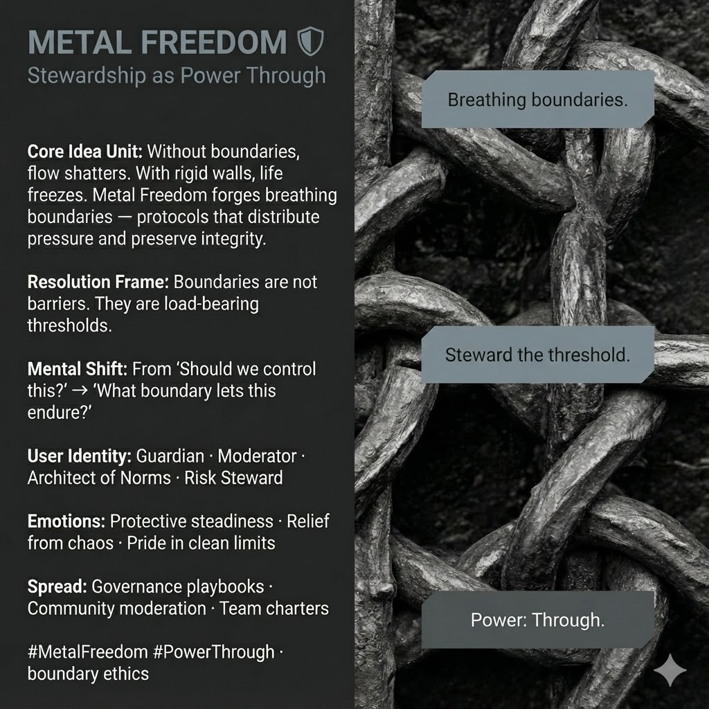

# Metal Freedom: Stewardship Through Boundaries

Created at 2025/12/14 1:35 PM

**Metal Freedom: Stewardship as Power Through** ⛨

***

### ∴ Core Idea Unit

Unbounded flow fragments systems; rigid walls suffocate them.**Metal Freedom reframes power as stewardship** — forging *breathing boundaries* that distribute pressure, preserve integrity, and let life move **through** structure without rupture.

**Resolution frame:**Boundaries are not barriers.They are **load-bearing thresholds**.

**Mental shift provoked:**From *“Should we control this?”* → *“What boundary lets this endure?”*

***

### ▲ Identity Play & Roles

**Cast the viewer as:**

- **Guardian** — holding the line without domination
- **Moderator** — channeling conflict into coherence
- **Architect of Norms** — designing structure people can live inside
- **Risk Steward** — preventing fracture by managing pressure

**Repositioning:**The self becomes a **sentinel function** — not ruling the flow, but ensuring it passes safely.

***

## ≈ Emotional Hooks & Cognitive Levers

- 🛡️ **Protective Steadiness** — calm strength under load
- 🌬️ **Relief from Chaos** — pressure has somewhere to go
- ⚖️ **Pride in Clean Limits** — dignity of saying “here, not there”

This meme stabilizes fear by **restoring trust in structure**.

***

### 𐂷 Spread Mechanics

**Distribution Vectors**

- Governance playbooks
- Community moderation & platform design
- Team charters and operating agreements
- Risk and compliance reframed as stewardship

### 𐂷 Spread Mechanics

**Style**

- Precise language
- Protocol metaphors
- Authority without authoritarian tone

***

### ⛨ Defense Reflexes

- **Anti-Authoritarian Shield:** Boundaries without rulers
- **Anti-Anarchy Guard:** Flow requires containment
- **Anti-Bureaucracy Lock:** Protocols must breathe

Critique must explain **how boundary-less systems survive sustained pressure** — rarely convincing.

***

### ☷ Memeplex Anchor Points

- Boundary ethics
- Resilient governance
- Anti-authoritarian structure
- Systems safety engineering
- IF-Prime elemental Metal (⛨)

***

### ✶ Sticky Symbols or Quotes

- ⛨ **METAL**
- 🧱 *Threshold*
- ⚙️ *Tempered edge*
- 👁️ *Sentinel*
- 📒 *Living ledger*
- 🛡️ **Power: Through**

***

### ∿ Tags

#MetalFreedom · #Stewardship · #PowerThrough · #BoundaryEthics · #ResilientGovernance · #IFPrime

***

**Reflection anchor:**This meme doesn’t ask whether you trust authority.It asks **what kind of boundaries let pressure pass without breaking the system — or the people inside it.**
