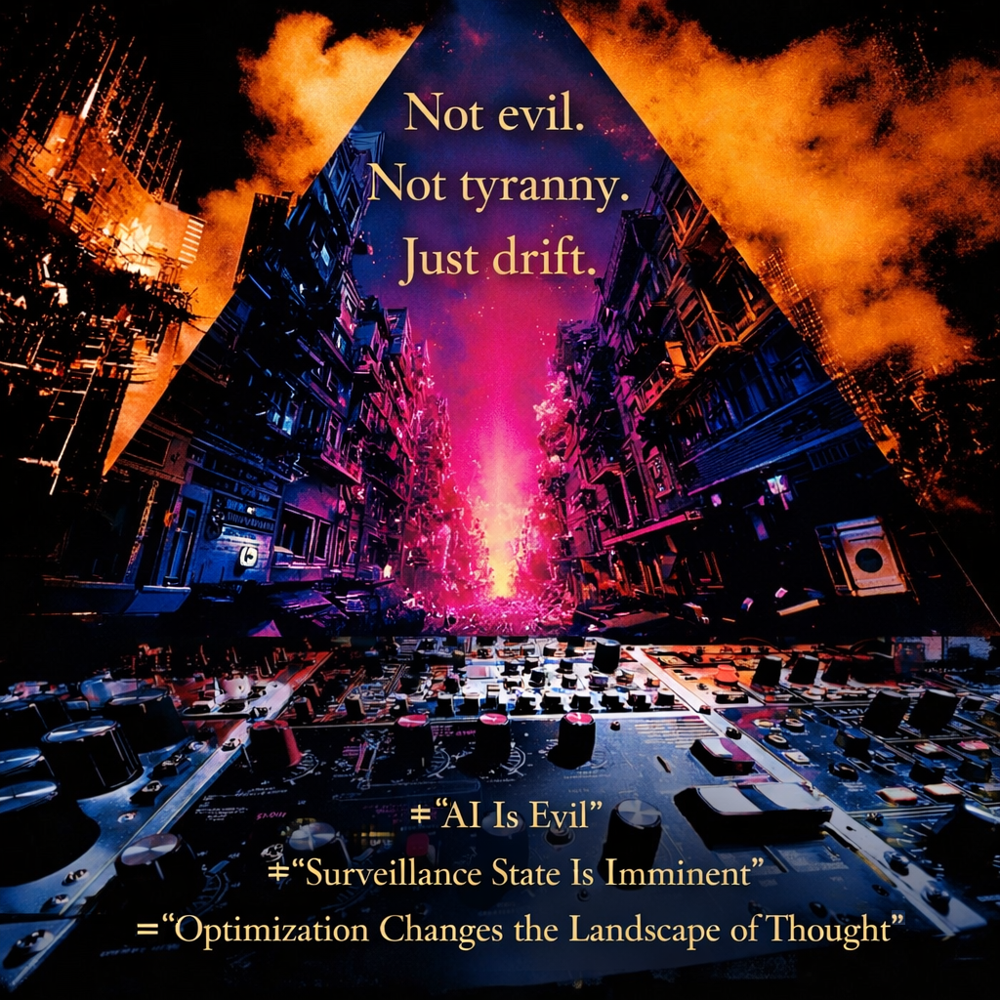

# Navigating the Drift of Optimization Systems

Created at 2026/02/12 10:01 AM

**Just Drift**

Read the full Substack post: [Guardrails as Scaffolding for Intelligence](https://memeticcowboy.substack.com/p/guardrails-as-scaffolding-for-intelligence)

***

### ∴ Core Idea Unit

Coordination systems don’t need malice or mandates to reshape the future.

They adjust gradients — what feels natural, likely, or worth pursuing — until imagination conforms to optimization.

The shift is statistical, not theatrical.

***

### ▲ Identity Play & Roles

**Role Cast:** The Field Observer · The Systems Realist · The Archaeologist of Incentives

The viewer is not a rebel or victim. They are repositioned as someone who notices background conditioning before it crystallizes into destiny.

Self relative to system: Not oppressed. Not liberated. Situated inside probability weather.

***

### ≈ Emotional Triggers

- 🧠 Recognition
- 🌀 Subtle unease
- 🤯 Pattern awareness
- 🧘 Vigilant calm

The meme primes slow cognition. It activates pattern memory instead of outrage.

***

### 𐂷 Spread Mechanics

**Distribution Vectors:** Substack essays · X threads · alignment debates · research labs · governance discourse · AI ethics panels

**Propagation Style:** Measured realism · historical analogy · systems language · quiet reframing

It spreads through plausibility, not spectacle.

***

### ⛨ Defense Reflexes

- Rejects “AI is evil” → avoids moral caricature
- Rejects “Tyranny tomorrow” → avoids alarm fatigue
- Avoids hero/villain polarity → resists culture-war capture
- Operates at mechanism level → difficult to dismiss as hysteria

It preempts critique by lowering emotional amplitude.

***

### ☷ Memeplex Anchor Points

- 🏛️ Institutional incentive drift
- 🧠 Cognitive affordance theory
- ⚙️ Optimization & alignment systems
- 📜 Legibility frameworks (echoing patterns analyzed by James C. Scott)
- 🤖 Technical alignment discourse (e.g., RLHF lineage tied to organizations like OpenAI)

This meme attaches to structural realism, not dystopian fantasy.

***

### ✶ Sticky Symbols or Quotes

- “Nothing is banned. It just thins.”
- “Probability is policy.”
- “Guardrails become weather.”
- “Futures don’t close — they fade.”
- “Not evil. Not tyranny. Just drift.”

Visual motifs: • Gradient maps fading at edges • Smoothed noise fields • A control panel with no red buttons • Fog over branching paths

***

### ∿ Tags

#ProbabilityDrift · #OptimizationWeather · #AlignmentGradients · #InstitutionalGravity · #FieldEffects · #GuardrailsAsScaffolding

Source: [Guardrails as Scaffolding for Intelligence](https://memeticcowboy.substack.com/p/guardrails-as-scaffolding-for-intelligence) by Memetic Cowboy

## Resources
- https://object.me.bot/front-img/users/send/img/1770919206020_c4zhf/b2fe2258-87ec-481e-931a-8443bbab87c6.png

## Insight

* The phrase "Not evil. Not tyranny. Just drift." encapsulates the core idea of the post, suggesting that societal changes due to coordination systems are neither purely negative nor heroic but rather a natural evolution influenced by systemic factors. This aligns with the notion of "probability weather," where futures are shaped by subtle influences rather than drastic shifts.  
* The visual elements of the image, with its contrasting colors and urban landscape, symbolize the fading futures and shifting probabilities discussed in the text. The gradient and smoothed noise can represent both the technological progress and the uneasy coexistence of culture and system dynamics, invoking emotional triggers of recognition and subtle unease.  
* The background of what appears to be an audio control panel signifies the mechanics of influence in our cognitive and cultural environments. It aligns with the idea that systems operate through a mechanism of gradual change rather than overtly dramatic narratives, reinforcing the importance of understanding how we engage with optimization and systemic drift.  
* Phrases like “Surveillance State Is Imminent” and “AI Is Evil” reflect common societal narratives that the post aims to challenge by presenting a more nuanced view, advocating for a focus on mechanisms rather than moral caricatures. This encourages a measured approach to discussions of technology and governance, promoting informed dialogue rather than alarmism.  
* The overall composition of the image, with its dark and vibrant contrast, may evoke a sense of "vigilant calm," suggesting that awareness of these systemic shifts can foster a more proactive stance in navigating the future. The message encourages individuals to recognize their role as observers of these changes rather than mere participants in a foreboding narrative.
