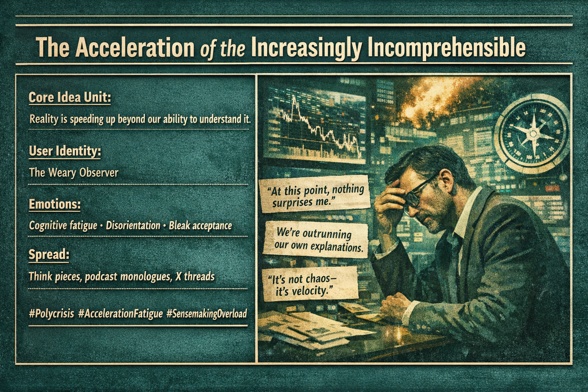

# Navigating the Acceleration of Absurdity

Created at 2026/02/04 1:28 PM

## 🧩 **The Acceleration of THE Incomprehensible**

***

## ∴ Core Idea Unit

The meme encodes a shift from *shock* to *resignation*: what once demanded explanation now arrives pre-normalized.

**Essential belief:** Reality is no longer merely unstable; it is accelerating faster than collective sense-making can metabolize. Absurdity doesn’t arrive as rupture—it arrives as background noise.

**Mental shift provoked:** From *“How did this happen?”* → *“Of course this happened.”* From seeking causes → bracing for velocity.

This is not cynicism; it’s a perceptual adaptation to overload.

***

## ▲ Identity Play & Roles

**Cast Roles:**

- **The Weary Systems Witness** – sees patterns but no longer expects repair
- **The Accelerant Survivor** – learns to function inside opacity
- **The Resigned Analyst** – still maps, but without faith in resolution

**Repositioning the self:** The viewer is moved from *participant in history* to *observer inside runaway systems*. Agency shrinks from steering outcomes → managing one’s orientation and coherence.

***

## ≈ Emotional Triggers

Primary affects that prime internalization:

- 😮‍💨 **Cognitive fatigue** – too many crises, no closure
- 🤯 **Disorientation** – events exceed explanatory frameworks
- 😬 **Low-grade dread** – nothing feels impossible anymore
- 🧠 **Bleak clarity** – recognition without relief

Crucially, this meme does **not** trigger outrage; it triggers *acceptance under strain*.

***

## 𐂷 Spread Mechanics

**Distribution Vectors:**

- Long-form essays and “connect-the-dots” threads
- Academic-adjacent Substacks and think pieces
- X posts that begin with *“Maybe it’s not surprising that…”*
- Podcast monologues diagnosing “the moment”

**Propagation Style:**

- Analytical resignation
- World-weary synthesis
- Pattern recognition without prescription

The meme spreads fastest among people who *used to believe understanding could stabilize systems*.

***

## ⛨ Defense Reflexes

How it resists critique:

- **Pre-emptive exhaustion:** “Of course it’s messy—everything is.”
- **Scale deflection:** Problems framed as too large for intervention
- **Meta-framing:** Criticism itself becomes another data point of overload

Attempts to “fix” the problem are dismissed as naïve about acceleration dynamics.

***

## ☷ Memeplex Anchor Points

This meme snaps cleanly into several existing narrative clusters:

- **Late-stage institutional decay**
- **Accelerationism (without the optimism)**
- **Crisis fatigue / polycrisis framing**
- **AI-driven epistemic overload**
- **Systems theory without governance affordances**

It resonates strongly with novelty-theory intuitions associated with figures like Terence McKenna and epistemic paradoxes attributed to Itzhak Bentov—where complexity increases faster than comprehension.

***

## ✶ Sticky Phrases & Symbols

High-retention language that reinforces the meme:

- “At this point, nothing surprises me.”
- “It’s not chaos—it’s velocity.”
- “We’re outrunning our own explanations.”
- “The system isn’t broken; it’s uncontainable.”

**Symbolic imagery:**

- Dashboards with red lights everywhere
- Spinning compasses
- Exponential curves with no y-axis label

***

## ∿ Tags

#Polycrisis #AccelerationFatigue #SensemakingOverload #LateModernity #StructuralResignation

***

### 🔁 Reflection Cadence (anchoring the loop)

What this meme does *well*: It names a real perceptual condition—why people feel sane yet powerless.

What it risks reinforcing: A posture where comprehension becomes spectator sport, and agency quietly atrophies.

If we carry this forward, the next memetic question isn’t *“Is the world incomprehensible?”* It’s *“What kinds of agency still function under acceleration?”*

## Resources
- https://object.me.bot/front-img/users/send/img/1770240506524_c4zhf/b8fed8da-057c-441a-b79f-93b87afc301b.png

## Insight

* The image encapsulates the phenomenon of *accelerationism*, depicting a sense of overwhelming cognitive fatigue and disorientation as a response to an increasingly complex reality. The figure of the "Weary Observer" resonates with many who feel the weight of perpetual change, suggesting that understanding is not a linear process anymore but rather a cyclical struggle against an accelerating tide of information and events.  
* Emotional triggers outlined, such as **cognitive fatigue** and **bleak acceptance**, mirror societal sentiments in an age marked by rapid technological advancements and crises. This reflects a broader cultural transformation where the traditional means of understanding, such as narrative and causation, become less effective, leading to an acceptance of chaos as a norm.  
* Key phrases like "We're outrunning our own explanations" capture the essence of the current moment, illustrating a shared acknowledgment among individuals that they exist within systems that far exceed their comprehension. This resonates with societal dialogues around the limitations of existing frameworks for making sense of complex issues, fostering a collective identity of resigned analysts.  
* The meme's propagation through different mediums such as think pieces and podcasts highlights a longing for meaning amidst chaos. It signals a shift in discourse from attempting to fix systemic issues to navigating and managing one’s own perceptions within chaotic environments, a crucial adaptation in contemporary culture.  
* The graphical depiction of alarmingly fluctuating data and the exhausted observer visually reinforces the emotional landscape described, transforming abstract ideas into a relatable experience. This metaphorical representation serves to anchor the viewer’s understanding in familiar anxieties about modern life, making the narrative of acceleration both accessible and impactful.
