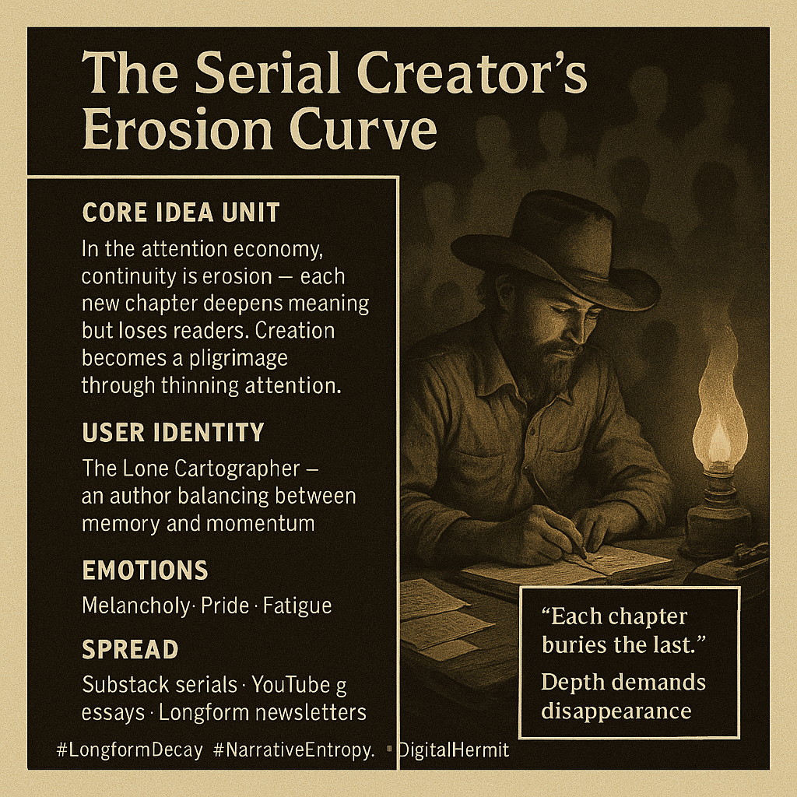

# Navigating the Erosion of Creative Attention

Created at 2025/11/02 10:06 PM

### ◈ Mini-Memetic Profile
***

### ∴ Core Idea Unit

In the attention economy, continuity is erosion. The more a creator builds, the less of the audience can follow. Each chapter gains depth but loses reach — creation becomes a self-thinning pilgrimage through time.
***

### ▲ Identity Play & Roles

Role: The Lone Cartographer — part prophet, part archivist.Dynamic: Trapped between feeding the present and preserving the past; the creator must choose between momentum and memory.
***

### ≈ Emotional Triggers

-	🕳️ Melancholy for lost readers
-	⚖️ Anxiety over relevance
-	🔥 Pride in persistence
-	🌀 Acceptance of attrition as aesthetic
***

### 𐂷 Spread Mechanics

Vectors: Substack serials · YouTube essays · Thread chains · Longform newslettersStyle: Reflective lament + stoic realism · often shared with captions like “Only a few will finish this journey.”
***

### ⛨ Defense Reflexes

-	Romantic martyrdom: “It’s not for everyone.”
-	Quality shield: Depth over clicks.
-	Temporal mystique: “You had to be there from the start.”
***

### ☷ Memeplex Anchor Points

-	🧩 Creator Loneliness
-	🌀 Information Fatigue
-	🕰️ Slow Media / Longform Renaissance
-	📚 Narrative Entropy
-	💀 Post-Virality Authenticity
***

### ✶ Sticky Symbols or Quotes

“Each chapter buries the last.”“Depth demands disappearance.”“I write for ghosts who still remember chapter one.”“The trail erodes, but I keep walking.”
***

### ∿ Tags

#LongformDecay · #AttentionCollapse · #SerialArtistry · #DigitalHermit · #NarrativeEntropy
