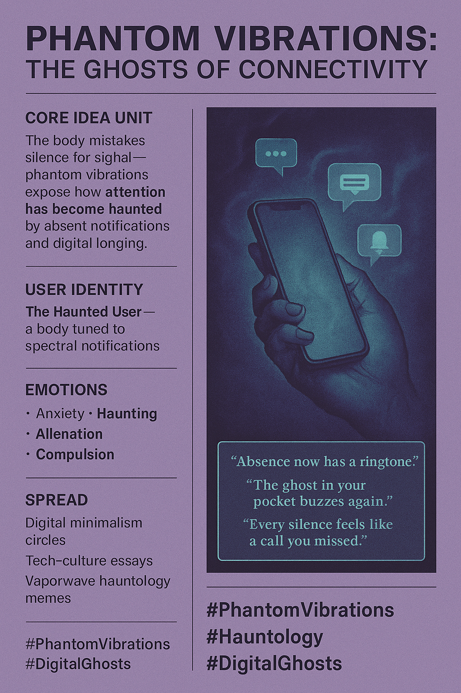

# Phantom Vibrations: Echoes of Digital Haunting

Created at 2025/11/04 10:55 AM

### 🧩 Mini-Memetic Profile: **Phantom Vibrations: The Ghosts of Connectivity**

***

🧠 **Core Idea Unit** The body mistakes silence for signal. Phantom vibrations reveal how our nervous systems have been rewired by the expectation of digital contact—haunted by the ghost of constant connectivity. Attention becomes an open channel where absence itself vibrates.

***

🎭 **Identity Play & Roles** **Role:** The *Haunted User* — a body tuned to spectral notifications. **Repositioning:** From active communicator to reactive vessel; attention is no longer chosen but summoned.

***

💥 **Emotional Triggers** 📳 Anxiety (missed signals) 👻 Haunting (ghost presence of device) 😶 Alienation (self as interface) 🔁 Compulsion (anticipatory loop)

***

📡 **Spread Mechanics** **Distribution Vectors:** Digital minimalism forums · Tech-culture essays · Affective memes about burnout and hauntology. **Propagation Style:** Reflective dread, quiet melancholy, and ghostly humor—often using vaporwave, glitch, or liminal aesthetics.

***

🛡️ **Defense Reflexes**

- **Ironized detachment:** “My ghost just texted me again.”
- **Minimalist asceticism:** “Do not disturb = exorcism.”
- **Philosophical framing:** Treats anxiety as spectral critique of late capitalism.

***

🧬 **Memeplex Anchor Points** 💀 Mark Fisher’s *Hauntology* 🌀 Freud’s *Repetition Compulsion* 📱 Techno-cultural trauma theory ⏳ Lost futures / deferred presence 👁 Attention economies

***

🧠 **Sticky Symbols / Quotes**

- “The ghost in your pocket buzzes again.”
- “Absence now has a ringtone.”
- “Every silence feels like a call you missed.”
- Symbol: 📳🕯 (phone vibration meets candle flame — digital séance).

***

🏷️ **Tags** #PhantomVibrations · #Hauntology · #LostFutures · #TechnoTrauma · #DigitalGhosts · #RepetitionCompulsion

## Resources
- https://object.me.bot/front-img/users/send/img/1762282491891_c4zhf/766d8fd1-711e-447e-9326-aa681a6ab03a.png

## Insight

* The concept of "Phantom Vibrations" illustrates the profound effects of constant connectivity on human attention and perception. Users frequently misinterpret silence as signals from their devices, suggesting our reliance on digital communication has fundamentally altered our sensory experiences. This phenomenon can be tied to the psychological theories of attentional frameworks, where the expectation of connectivity becomes a defining element of our existence. 

* The notion of the "Haunted User" encapsulates contemporary anxieties about digital communication. This identity reflects a shift from a proactive communicator to a reactive participant, emphasizing how the design of communication technologies compels users to remain in a perpetual state of readiness. This can be linked to the critical theory surrounding the notion of agency in digitized contexts, where users often find themselves as mere vessels of incoming digital information. 

* Emotional triggers associated with phantom vibrations—such as anxiety, alienation, and compulsion—demonstrate the personal cost of digital engagement. The anticipation of notifications creates an “anticipatory loop” that not only affects mental well-being but can lead to a kind of techno-cultural trauma. This aligns with Mark Fisher's ideas on hauntology, where the specters of what we miss out on in our digital interactions become more haunting than the content of the interactions themselves.

* The spread mechanics in digital minimalism forums and tech-culture essays highlight a cultural response to these phenomena. The use of vaporwave and glitch aesthetics serves as a reflective lens, allowing individuals to process their experiences with technology through a lens of melancholic humor. By framing complex emotions through aesthetic expressions, these communities engage in collective introspection about the implications of technology on social dynamics and personal identity.

* The sticky symbols and quotes associated with phantom vibrations—like "Absence now has a ringtone"—encapsulate the paradox of connection and disconnection inherent in modern technology. These phrases resonate deeply within digital discourse, illustrating how silence amidst digital presence transforms into a form of haunting. This highlights the cultural critique where absence and presence become indistinguishable, reflecting broader concerns about attention economies and the commodification of personal presence in digital interactions.
