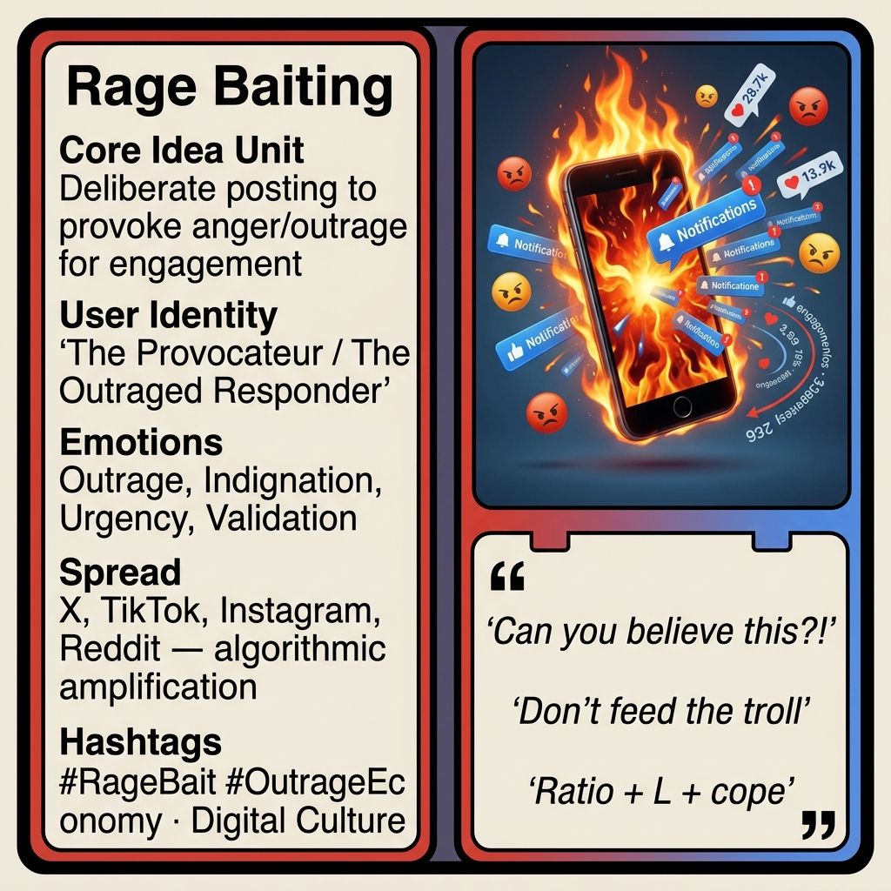

# Rage Baiting

Created at 2026/03/31 4:47 AM

### ◈ Mini-Memetic Profile

**🔶 Rage Baiting — Emotional Manipulation Optimized for the Attention Economy**

### ∴ Core Idea Unit

- Deliberate posting of content designed to provoke strong negative emotions—primarily anger, outrage, or indignation—to drive engagement (likes, comments, shares, views).
- Platforms reward high-engagement content with more visibility through algorithms. Rage triggers powerful emotional responses that flood the system with activity.
- The internet runs on dopamine and cortisol—rage bait delivers both in high doses.

### ▲ Identity Play & Roles

- **The Provocateur:** One who masters the art of triggering others, weaponizing engagement for personal gain.
- **The Outraged Responder:** Feels compelled to correct, shame, or "ratio" the bait—unknowingly fueling the fire.
- **The Amplifier:** Shares with captions like "Can you believe this?!"—spreading the bait to their own network.
- **The Unbothered Troll:** Watches chaos unfold with detached amusement, occasionally stoking with emoji replies.

### ≈ Emotional Triggers

- **Outrage** — immediate anger at perceived injustice, stupidity, or moral violation
- **Indignation** — sense of righteous superiority that demands expression
- **Urgency** — "I need to respond RIGHT NOW" feeling
- **Validation** — shared outrage creates in-group bonding among responders
- **Schadenfreude** — enjoyment of watching others lose their minds

### 𐂷 Spread Mechanics

- **Distribution Vectors:**
    - X (Twitter), Facebook, Instagram, YouTube, TikTok, Reddit
    - Algorithmic amplification via engagement signals
    - Quote-posting and reply chains
    - Tagging friends to share the outrage
- 
- **Propagation Style:**
    - Hot takes with inflammatory absolutes ("All [group] are [trait]")
    - Misleading clips without context
    - Virtue-signaling extremes and hypocrisy bait
    - Visual shock paired with provocative text
    - "Ratio bait" — posting obviously wrong content to trigger corrections

### ⛨ Defense Reflexes

- **Irony shield:** "It's just a joke / satire" when backlash becomes too intense
- **Victim framing:** "Why are you so sensitive? Can't take a joke?"
- **Engagement laundering:** "I'm just starting a conversation"
- **Algorithmic invisibility:** Poster appears unbothered or amused, deflating direct confrontation
- **Scale asymmetry:** Individual responders can't compete with automated/bot amplification

### ☷ Memeplex Anchor Points

- Attention economy and platform capitalism
- Algorithmic curation and engagement optimization
- Cancel culture and call-out dynamics
- Political polarization and culture war frameworks
- Trolling as recreational activity
- Information warfare and bot-driven manipulation
- Dopamine/cortisol addiction cycles
- "Don't feed the troll" folk wisdom (paradoxically, spread by the fed)

### ✶ Sticky Symbols or Quotes

- "Can you believe this?!"
- "This is why we can't have nice things"
- "Ratio + L + cope"
- "Touch grass"
- "Don't feed the troll"
- "The internet runs on dopamine and cortisol"
- Flame emoji, clown emoji, skull emoji
- Screenshots of "deleted tweet" or "ratio achieved"

### ∿ Tags

#RageBait #OutrageEconomy #EngagementFarming #AlgorithmicManipulation #Trolling #Clickbait #DoomScrolling #AttentionEconomy #ViralManipulation #Polarization
