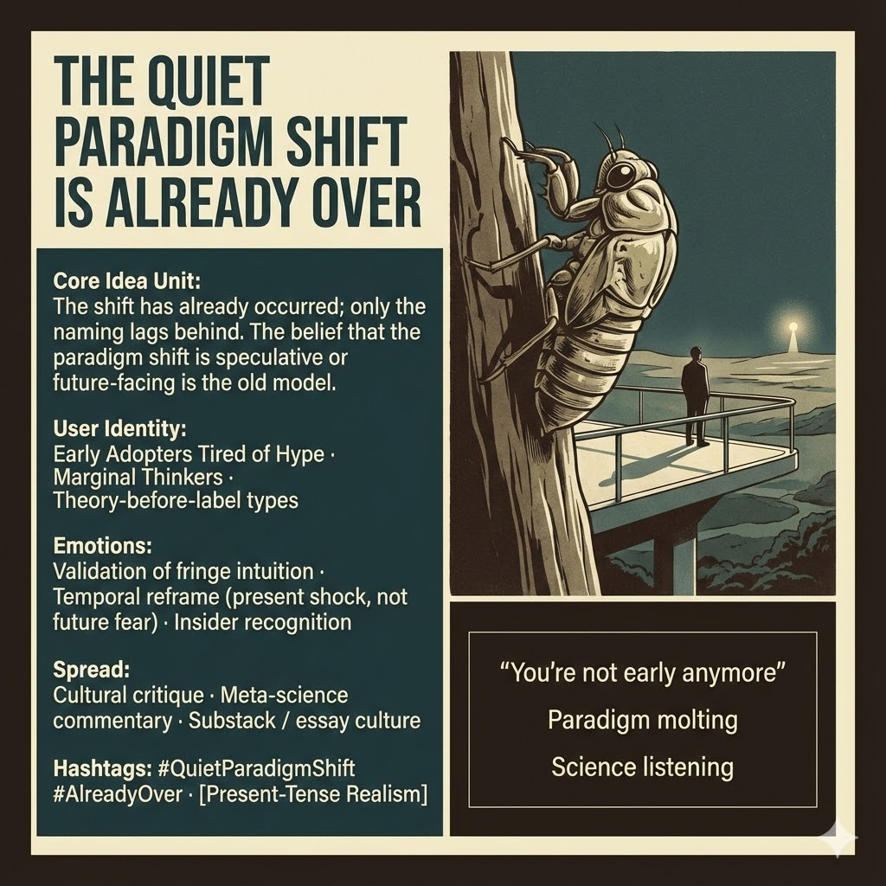

# Recognizing the Quiet Paradigm Shift

Created at 2025/12/13 3:10 PM

**The Quiet Paradigm Shift Is Already Over**

***

## 🧠 Core Idea Unit

The paradigm shift is not speculative, emerging, or future-facing. **It has already happened.** What lags is language, institutional recognition, and coherent naming.

**Mental shift provoked:** From *“Is this coming?”* → *“Why hasn’t this been named yet?”*

***

## 🎭 Identity Play & Roles

**Cast the viewer as:**

- **Early Adopter, Post-Hype** — no longer impressed by futurism
- **Marginal Thinker** — already living past consensus
- **Theory-Before-Label Type** — recognizes patterns before terms
- **Quiet Insider** — recognition without evangelism

**Repositioning:** Not a prophet of what’s next, but a **witness to what already shifted**.

***

## 💥 Emotional Hooks & Cognitive Levers

- 🧠 **Validation of Fringe Intuition** — “I wasn’t imagining this”
- ⏱️ **Temporal Reframe** — present shock, not future fear
- 🔎 **Insider Recognition** — a nod, not an announcement

This meme relieves anxiety by **collapsing anticipation into recognition**.

***

## 📡 Spread Mechanics

**Distribution Vectors**

- Cultural critique
- Meta-science commentary
- Substack / longform essay culture
- Post-academic discourse spaces

**Propagation Style**

- Calm declarative tone
- Retrospective clarity
- Naming-as-act, not manifesto

***

## 🛡️ Defense Reflexes

- **Anti-Hype Shield:** Explicit rejection of futurist spectacle
- **Anti-Prophecy Guard:** Frames insight as already operational
- **Anti-Finality Lock:** Paradigm shift as *molting*, not conclusion

Critique must argue the shift **has not already altered practice**, not just rhetoric.

***

## 🧬 Memeplex Anchor Points

- Anti-futurism
- Present-tense realism
- Kuhnian lag (practice precedes theory)
- Naming as epistemic power
- Post-consensus sensemaking

***

## 🧠 Sticky Symbols / Quotes

- 🧬 **Paradigm molting**
- 🗼 **Beacon, not conclusion**
- 👂 *Science is listening now*
- ⏳ **“You’re not early anymore.”**

***

## 🏷️ Tags

#ParadigmShift · #AlreadyHappened · #PresentTense · #NamingPower · #PostFuturism · #QuietRevolution

***

**Reflection anchor:** This meme doesn’t urge preparation. It asks **what changes when you realize you’re already on the other side.**

## Resources
- https://object.me.bot/front-img/users/send/img/1765667297046_c4zhf/unnamed_%2821%29.jpg

## Insight

* The concept of a *paradigm shift* as already realized proposes a critical reassessment of how societal and cultural transformations are perceived. This perspective emphasizes that the actual change has occurred, yet language and institutional recognition lag, reflecting a common phenomenon in which practice evolves quicker than theory—a notion explored in Thomas Kuhn’s work on scientific revolutions.

* The identity categories introduced—such as *Early Adopters Tired of Hype* and *Marginal Thinkers*—highlight the emerging social dynamics among individuals who recognize and engage with shifts before they are popularly acknowledged. This can be seen in contemporary discussions on social media and platforms like Substack, where niche communities validate emerging ideas prior to mainstream acceptance.

* Emotional hooks like the *Validation of Fringe Intuition* resonate with individuals who often feel ahead of prevailing thoughts. This creates shared experiences that can cultivate a collective consciousness around recognition and acceptance, thus minimizing anxiety regarding the future by framing present realities as evolved outcomes rather than anticipatory anxieties.

* The propagation vectors identified—cultural critique, meta-science commentary, and subcultural spaces—emphasize the necessity for discourse that moves beyond traditional academic boundaries. This mirrors the evolution of knowledge-sharing in the digital age, where informal channels often drive understanding and acceptance of new ideas faster than formal institutions.

* The suggested reframing of advocacy from prophetic to observational—describing oneself as a *witness to what already shifted*—underscores a movement away from hype-driven narratives. This shift encourages a grounded approach to discourse and reflection, fostering a more authentic engagement with ongoing transformations without the pressure of predictive certainty.
