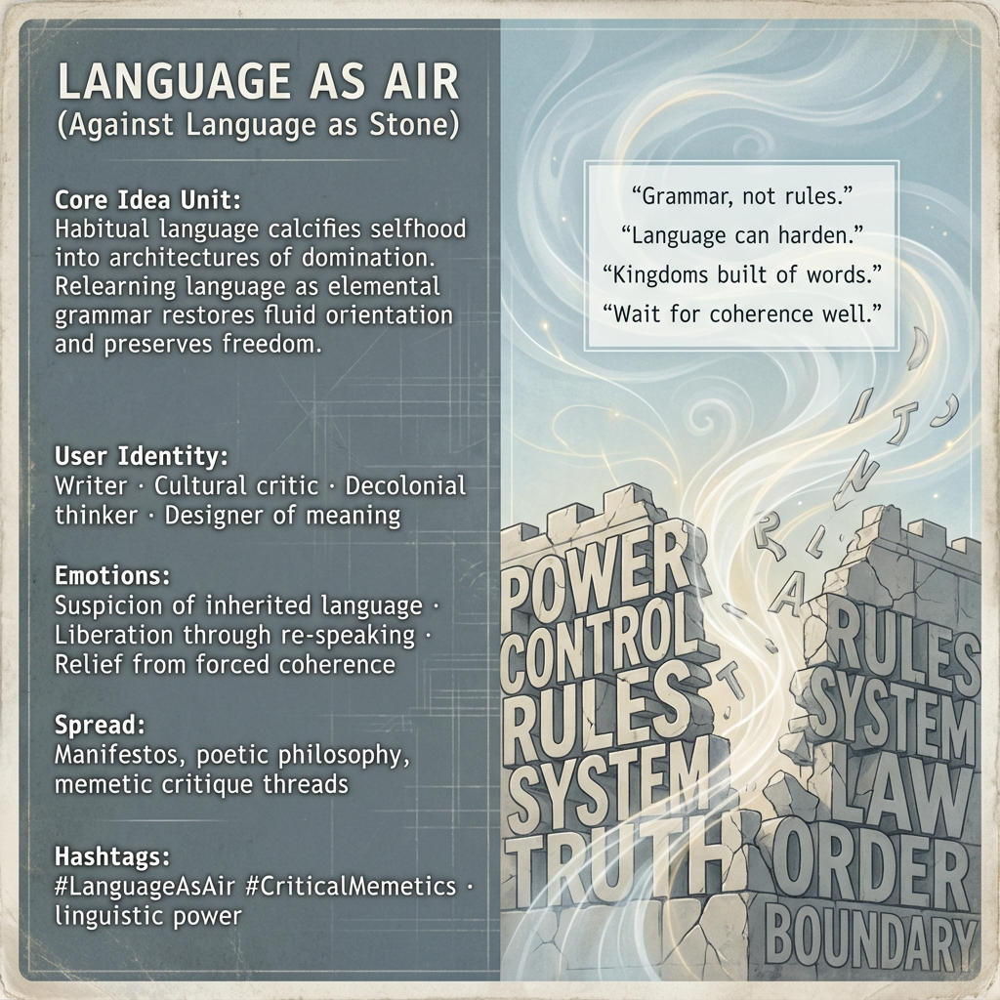

# Reimagining Language: From Stone to Air

Created at 2025/12/18 8:47 PM

## 🧩 **Language as Air (Against Language as Stone)**

***

## 🧠 Core Idea Unit

Habitual, inherited language doesn’t just describe reality—it *architects* it. When language hardens, selfhood calcifies into stone structures suited for domination. Relearning language as *air*—grammar rather than rules—restores fluid orientation and preserves freedom.

**Mental shift provoked:** From *“language names what is”* → *“language shapes what can move.”*

***

## 🎭 Identity Play & Roles

**Cast as:** Writer · Cultural critic · Decolonial thinker · Designer of meaning

The meme positions the user as an *unfreezer* of sense—someone who notices where words have turned into walls and experiments with speech that breathes. Authority comes from re-speaking, not declaring.

***

## 💥 Emotional Triggers

- 🪨 Suspicion toward inherited language
- 🌀 Subtle unease at linguistic confinement
- 🌬️ Liberation through re-speaking
- 🧠 Relief from forced coherence

These emotions destabilize linguistic obedience and open space for reorientation.

***

## 📡 Spread Mechanics

**Distribution vectors:**

- Poetic philosophy essays
- Manifestos that resist closure
- Memetic critique threads
- Longform posts that “circle” rather than conclude

**Propagation style:** Reflective, destabilizing, invitational. Often refuses slogans in favor of reframed grammar.

***

## 🛡️ Defense Reflexes

- Resists capture by refusing final definitions
- Semantic fluidity prevents institutional co-option
- Pre-empts critique by naming domination as a *linguistic* phenomenon, not just a political one

Opponents struggle because the meme questions the language of opposition itself.

***

## 🧬 Memeplex Anchor Points

- Critical memetics
- Linguistic construction of power
- Decolonial theory
- Attention ecology
- Anti-dogmatic epistemology
- Elemental grammars of perception (Air vs Stone)

***

## 🧠 Sticky Symbols or Quotes

- “Language as stone. Language as air.”
- “Grammar, not rules.”
- “Kingdoms built of words.”
- “Wait for coherence well.”
- Breath vs architecture

***

## 🏷️ Tags

#LanguageAsAir · #CriticalMemetics · #AntiDomination · #ReSpeaking · #EpistemicFreedom · #ElementalGrammar

***

**Reflection anchor:** This meme doesn’t ask you to reject language. It asks you to notice *when language stopped moving*—and whether you’re still living inside its walls.

## Resources
- https://object.me.bot/front-img/users/send/img/1766119619092_c4zhf/9b460328-bd1c-4b91-be2d-5ac641ab1abb.png

## Insight

* The imagery references a profound critique of language as it relates to identity and power structures. The concept of "language as stone" suggests that conventional language can solidify oppressive social norms and restrict freedom, while "language as air" emphasizes the need for fluidity and adaptability in communication, allowing for liberation from those constraints. 

* The highlighted emotional triggers serve as a catalyst for reevaluating inherited linguistic practices. This aligns with the growing discourse in decolonial theory that questions how language shapes societal constructs and individual selfhood, implying that breaking free from conventional linguistic frameworks can unearth new avenues for personal and collective identities.

* The strategic dissemination outlined in the meme—through essays, manifestos, and reflective posts—reflects a broader movement towards participatory and non-linear forms of communication. Such approaches encourage dialogue and collective introspection rather than rigid assertions, enabling a kind of semantic fluidity that can resist institutional co-option.

* The resistance to final definitions illustrates a significant philosophical stance in contemporary discourse, positing that the act of naming domination as a linguistic phenomenon highlights the power dynamics inherent in language itself. This perspective not only critiques language's role in power relations but also offers a transformative potential by inviting users to explore alternative modes of expression.

* The discussion around elemental grammars contrasts traditional, prescriptive language structures with more organic forms of communication that embrace nuance and complexity, promoting a deeper understanding of reality. This shift demands a conscious practice of "re-speaking" to reclaim agency in how language is utilized to express personal and societal narratives.
